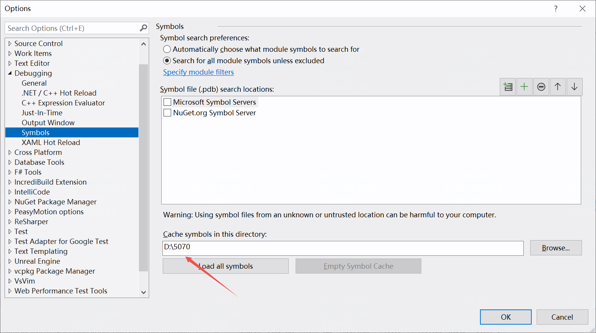

在windows上，先从该路径找到core文件（.dmp后缀），看时间和log是否匹配。04/07/25 20:25


以下为崩溃的log，包含调用栈信息，但无法具体查看。04/07/25 20:24:22

```
[2025.04.07-12.24.19:951][484]LogWindows: Error: === Critical error: ===
[2025.04.07-12.24.19:951][484]LogWindows: Error: 
[2025.04.07-12.24.19:951][484]LogWindows: Error: Unhandled Exception: EXCEPTION_ACCESS_VIOLATION reading address 0x0000020af600ff50
[2025.04.07-12.24.19:951][484]LogWindows: Error: 
[2025.04.07-12.24.19:951][484]LogWindows: Error: [Callstack] 0x00007ff692ca4cb1 ZhuxianClient.exe!UnknownFunction []
[2025.04.07-12.24.19:951][484]LogWindows: Error: [Callstack] 0x00007ff68f8f4ec9 ZhuxianClient.exe!UnknownFunction []
[2025.04.07-12.24.19:951][484]LogWindows: Error: [Callstack] 0x00007ff69251dc3b ZhuxianClient.exe!UnknownFunction []
[2025.04.07-12.24.19:951][484]LogWindows: Error: [Callstack] 0x00007ff69251e28e ZhuxianClient.exe!UnknownFunction []
[2025.04.07-12.24.19:951][484]LogWindows: Error: [Callstack] 0x00007ff68bd0a918 ZhuxianClient.exe!UnknownFunction []
[2025.04.07-12.24.19:951][484]LogWindows: Error: [Callstack] 0x00007ff68bd0b697 ZhuxianClient.exe!UnknownFunction []
[2025.04.07-12.24.19:952][484]LogWindows: Error: [Callstack] 0x00007ff68bd0b6ea ZhuxianClient.exe!UnknownFunction []
[2025.04.07-12.24.19:952][484]LogWindows: Error: [Callstack] 0x00007ff68bd0e6e5 ZhuxianClient.exe!UnknownFunction []
[2025.04.07-12.24.19:952][484]LogWindows: Error: [Callstack] 0x00007ff68bd1fc34 ZhuxianClient.exe!UnknownFunction []
[2025.04.07-12.24.19:952][484]LogWindows: Error: [Callstack] 0x00007ff69a9f2bda ZhuxianClient.exe!UnknownFunction []
[2025.04.07-12.24.19:952][484]LogWindows: Error: [Callstack] 0x00007ffa22217374 KERNEL32.DLL!UnknownFunction []
[2025.04.07-12.24.19:952][484]LogWindows: Error: [Callstack] 0x00007ffa22a3cc91 ntdll.dll!UnknownFunction []
[2025.04.07-12.24.19:952][484]LogWindows: Error: 
[2025.04.07-12.24.22:796][484]Log file closed, 04/07/25 20:24:22
```

找到服务器上，该版本5070对应的符号库，拷贝到本地。


将准备数据放到同一个本地文件夹内。


将.dmp文件用vs2022打开，将路径设为D:\\5070。




Debug运行得到最终调用栈结果。

