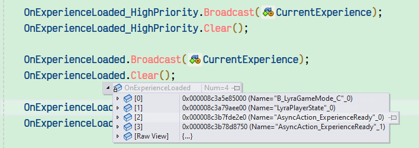
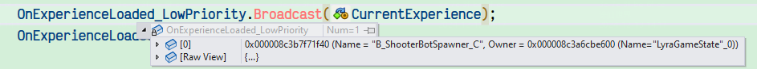
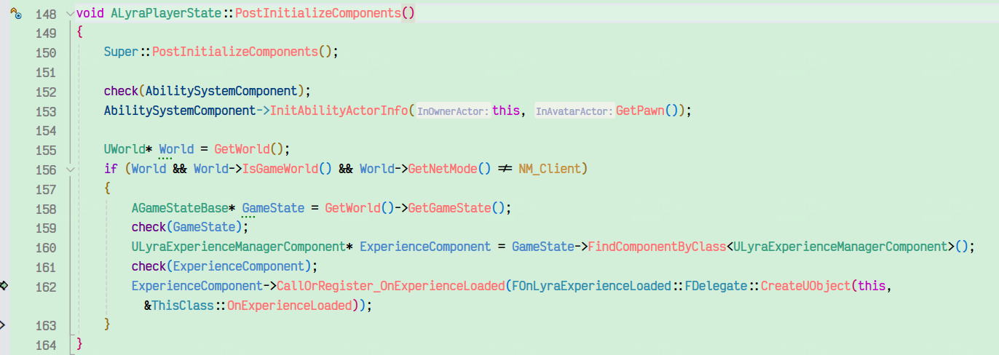

- 书接上回，eliminate淘汰赛模式正式开始，从FrontEnd最后通过common user加载l_expand_map后
- l_expand_map的worldsetting里存着新的experience，即B_ShooterGame_Elimination
- 加载B_ShooterGame_Elimination资源，会调用里面存着的所有资源的CDO，此时lyracharacter的CDO会多次被加载
- 然后会正式加载B_ShooterGame_Elimination资源，当ULyraExperienceManagerComponent::OnExperienceLoadComplete()后
- 会执行UGameFeaturesSubsystem::Get().LoadAndActivateGameFeaturePlugin(PluginURL, FGameFeaturePluginLoadComplete::CreateUObject(this, &ThisClass::OnGameFeaturePluginLoadComplete));来加载file:../../../Samples/Lyra/Plugins/GameFeatures/ShooterCore/ShooterCore.uplugin
- 然后从LyraExperienceManagerComponent调用到GameFeaturesSubsystem里，去加载这个plugin（ShooterCore.uplugin），但没有看出来这个uplugin有多大的必要性，感觉没有experience作用大
- 当完成后ULyraExperienceManagerComponent::OnExperienceFullLoadCompleted()，会播这几个重要的委托

```
	OnExperienceLoaded_HighPriority.Broadcast(CurrentExperience);
	OnExperienceLoaded_HighPriority.Clear();

	OnExperienceLoaded.Broadcast(CurrentExperience);
	OnExperienceLoaded.Clear();

	OnExperienceLoaded_LowPriority.Broadcast(CurrentExperience);
	OnExperienceLoaded_LowPriority.Clear();
```





- 可见，lyragamemode和lyraplayerstate是在中优先级，bot是低优先级，他们会分别去走创建流程。
- ALyraGameMode::OnExperienceLoaded会调到AGameModeBase::RestartPlayer，通过 SpawnDefaultPawnFor(NewPlayer, StartSpot);创建主角，然后通过首次非CDO的形式，走到ALyraCharacter::ALyraCharacter的构造
- 然后会去执行PawnExtComponent的构造，然后是根据它，去走其他比如HeroComponent的初始化/数据准备等流程，有一个状态机
- botcomponent（通过gf添加到lyragamestate的）创建bot，同样是通过AGameModeBase::RestartPlayer，根据controller创建bot
- playerstate的OnExperienceLoaded，会去读B_ShooterGame_Elimination里的DefaultPawn的AbilitySets数据，把11个GA（包括jump，melee，death那些行为）和1个GE（is_player）都赋到ASC上
- 此外，除了主角，在创建bot的过程中，都会去创建AI_bot_controller，在里面创建bot的playerstate，然后也会调用playerstate的OnExperienceLoaded

- 对于主角character和3个bot，都会进行pawn component, hero component, asc, health component等一堆组件的数据初始化流程，都是按照状态机，按时机和依赖顺序去创建


在4个player及相关组件都创建好后，会开始执行游戏GamePhase有3个阶段：phase warmup、phase playing、phase post