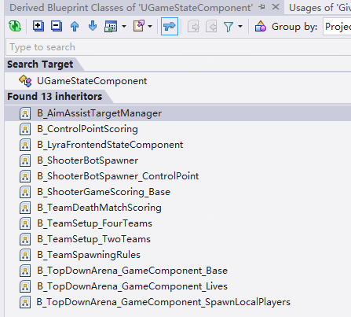
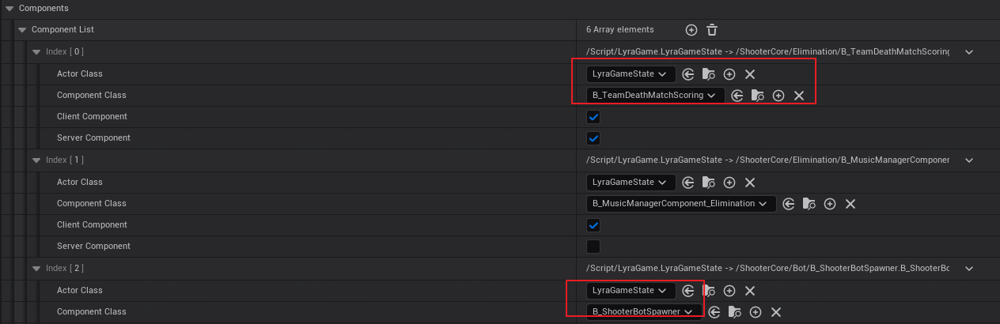
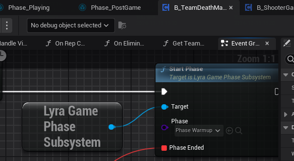
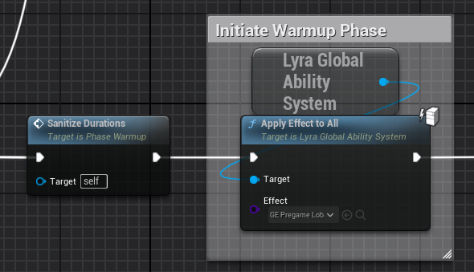
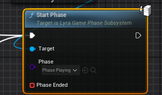
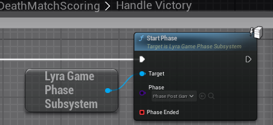
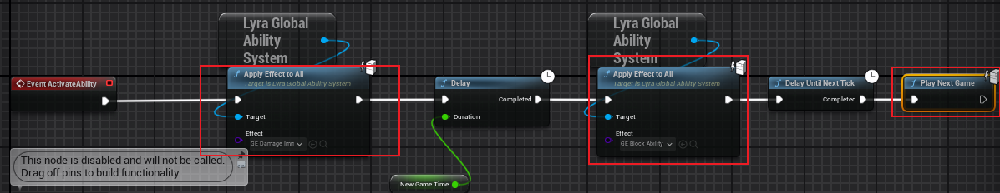
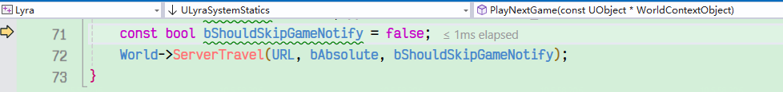

- 书接上回，在4个player及相关组件都创建好后，会开始执行游戏GamePhase有3个阶段：phase warmup、phase playing、phase post
- 
- 首先注意一个类UGameStateComponent，也是UE自己实现的游戏框架里的类（Plugins\Experimental\ModularGameplay）
- 比较熟悉的  B_LyraFrontendStateComponent（其次启动创建UI相关）、  B_ShooterBotSpawner（创建bot相关），他们都是UGameStateComponent子类，相当于是通过game feature添加到game state里的，负责增加游戏阶段运行状态功能的类
- 
- 这次需要关注的类是，  B_TeamDeathMatchScoring，这个类里，会正式开始phase warmup
- 
- phase warmup里做2件事，一是全玩家禁止伤害，而是倒计时30秒，结束全部客户端收到通知，然后开始phase playing
- 
- 
- phase playing里，没有什么特殊的逻辑，就正常开始游戏。游戏具体统计分数等巩固走，在这个类B_TeamDeathMatchScoring里，管理了不少和正式游戏开始相关的工作。
- 在phase warmup结束时，B_TeamDeathMatchScoring会执行一系列游戏逻辑。
- 会将所有玩家重置位置（Reset all players to spawn locations）
- 会根据玩家数量，决定游戏时常，countdowntime=720s=12min，如果玩家在6人以上，则1200s
- 倒计时定时器，每秒进行countdown，当时间到时，处理两队分数，HandleVictory，然后切换到phase postgame

- phase postgame的GA里，会禁用伤害、禁用输入、进行下一场游戏，仍然会执行L_expanse_map
- 