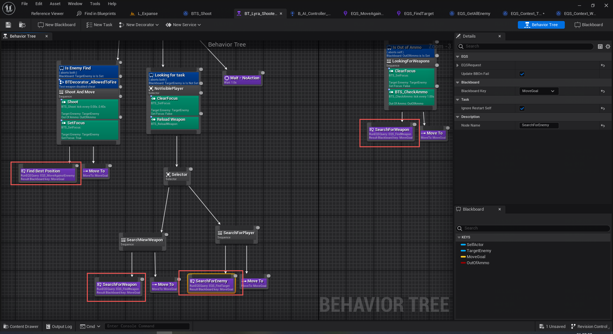
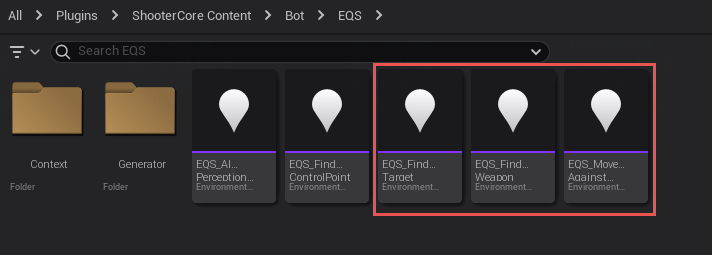
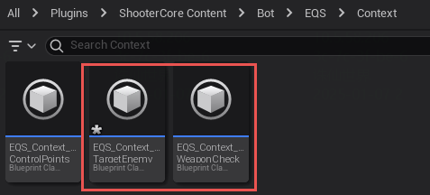
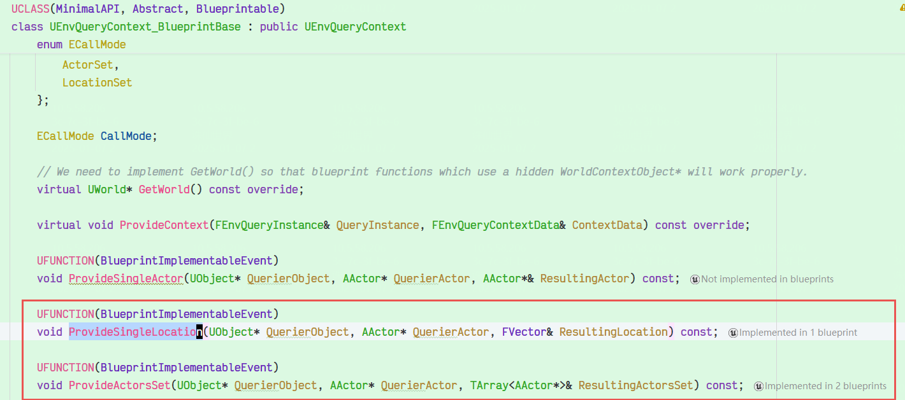
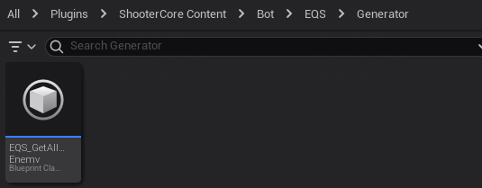
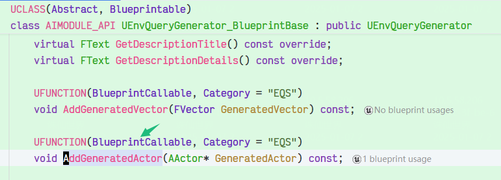

对于消除战役，主要是这3个EQS，评估返回的是距离最优的敌方玩家位置，类似的数据，然后通过MoveTo移动。

这是context，返回的也是位置ProvideActorsSet，ProvideSingleLocation这种，要么提供敌方玩家位置，要么提供武器生成点。

这是Generator，往里添加全部的敌方玩家Actor。

在 Unreal Engine 的 **环境查询系统（Environment Query System, EQS）** 中，**Test Purpose** 是一个重要的设置选项，用于定义测试（Test）的作用。你提到的三个选项 **Score Only**、**Filter Only** 和 **Score + Filter** 分别表示测试的不同用途。以下是对这三个选项的详细解释：

------

### 1. **Score Only（仅评分）**

- **作用**：
  - 测试仅用于 **评分**，不会过滤掉任何项目。
  - 每个项目会根据测试的结果得到一个评分，最终查询结果会根据评分进行排序。
- **适用场景**：
  - 当你希望保留所有项目，但需要根据某种条件对它们进行排序时使用。
  - 例如，根据距离对敌方玩家进行评分，优先选择距离较近的目标。

#### 示例

- **测试**：`Distance`（距离测试）。
- **结果**：
  - 所有敌方玩家都会被保留，但距离较近的玩家会得到更高的评分，排在查询结果的前面。

------

### 2. **Filter Only（仅过滤）**

- **作用**：
  - 测试仅用于 **过滤**，不会对项目进行评分。
  - 只有通过测试的项目会被保留，未通过测试的项目会被丢弃。
- **适用场景**：
  - 当你希望根据某种条件筛选项目时使用。
  - 例如，只保留在视野范围内的敌方玩家。

#### 示例

- **测试**：`PathExist`（路径存在测试）。
- **结果**：
  - 只有 AI 可以到达的敌方玩家会被保留，无法到达的玩家会被过滤掉。

------

### 3. **Score + Filter（评分 + 过滤）**

- **作用**：
  - 测试同时用于 **评分** 和 **过滤**。
  - 只有通过测试的项目会被保留，并且这些项目会根据测试的结果进行评分。
- **适用场景**：
  - 当你希望根据某种条件筛选项目，并对通过筛选的项目进行排序时使用。
  - 例如，只保留在视野范围内的敌方玩家，并根据距离对它们进行排序。

#### 示例

- **测试**：`Distance`（距离测试） + `Trace`（视线测试）。
- **结果**：
  - 只有 AI 可以看到的敌方玩家会被保留，并且距离较近的玩家会得到更高的评分，排在查询结果的前面。

------

### 4. **总结**

| 选项               | 作用             | 适用场景                                   |
| :----------------- | :--------------- | :----------------------------------------- |
| **Score Only**     | 仅评分，不过滤。 | 保留所有项目，但根据条件排序。             |
| **Filter Only**    | 仅过滤，不评分。 | 根据条件筛选项目，丢弃不符合条件的项目。   |
| **Score + Filter** | 同时评分和过滤。 | 根据条件筛选项目，并对通过筛选的项目排序。 |

------

### 5. **示例场景**

假设我们有一个 AI，它需要选择一个敌方玩家作为攻击目标：

1. **使用 `Score Only`**：
   - 保留所有敌方玩家，但优先选择距离较近的目标。
   - 适用于需要评估所有目标，但优先选择最优目标的场景。
2. **使用 `Filter Only`**：
   - 只保留 AI 可以到达的敌方玩家。
   - 适用于需要排除不可达目标的场景。
3. **使用 `Score + Filter`**：
   - 只保留 AI 可以看到的敌方玩家，并优先选择距离较近的目标。
   - 适用于需要同时筛选和排序目标的场景。

------

### 6. **如何选择**

- 如果你需要 **排序但不筛选**，选择 **Score Only**。
- 如果你需要 **筛选但不排序**，选择 **Filter Only**。
- 如果你需要 **同时筛选和排序**，选择 **Score + Filter**。

希望这个解释对你有帮助！如果还有其他问题，欢迎继续讨论！