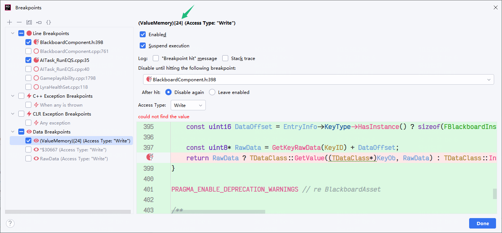

目标：找到黑板值赋值的地方，BTService、Controller、EQS相关蓝图和代码都无法直观找到。


首先来到黑板GetValue的地方，通过条件断点，获取到RawData里的序号，表示这个黑板值的固定位置。这里是153。


```
(*EntryInfo).EntryName.ComparisonIndex.Value==2092997&& ((class UObjectBase &) ((class UObjectBaseUtility &) ((class UObject &) ((class AActor &) ((class AController &) ((class AAIController &) ((class AModularAIController &) (*((class ALyraPlayerBotController *) ((class UObjectBase &) ((class UObjectBaseUtility &) ((class UObject &) ((class UActorComponent &) (*((class UBlackboardComponent *) this)))))).OuterPrivate))))))))).InternalIndex == 94377 
```

然后打一个data breakpoint，直接用RawData和RawData里面的数据都是不行的，IDE找不到，因为这是个临时数据。要找里面的。




通过153找到在ValueMemory的位置，是24。打上data breakpoint。然后运行。


最终可以找到，这个黑板值是在这里被改写的。

