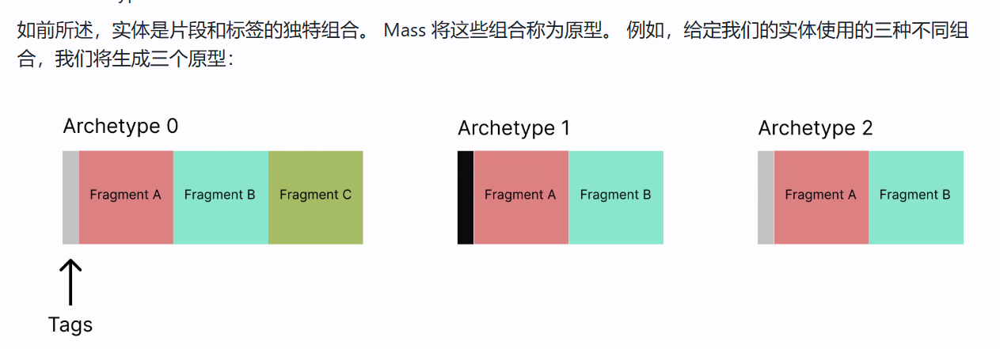
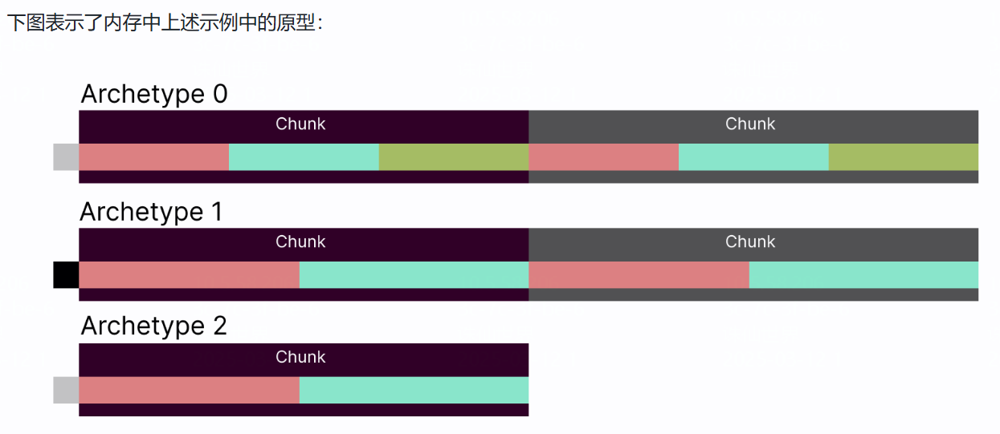
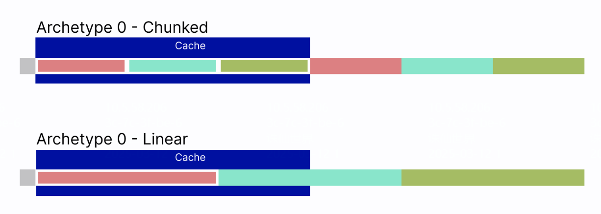

## Entity & Fragment

把每个实体Entity看作学生，每个 Fragment 看作学生的科目成绩，比如：

- **数学成绩**是一个 Fragment 类型。(注：其实数学成绩可以是一个更复杂的类，比如FPawnBaseInfo)
- **英语成绩**是另一个 Fragment 类型。

如果存储所有学生的信息，传统的方式是按学生分组：

```
学生 1：{数学: 90, 英语: 85}
学生 2：{数学: 75, 英语: 95}
学生 3：{数学: 80, 英语: 88}
```

而在 Mass Entity 系统中，它会按科目（Fragment 类型）分组存储：

```
数学成绩数组： [90, 75, 80]  （按学生的顺序排列）
英语成绩数组： [85, 95, 88]
```

这样，如果你需要所有学生的数学成绩，就可以直接访问数学成绩数组，而不需要遍历每个学生。

分组存储的核心思想是：

1. 按 **Fragment 类型** 分组存储数据，每种类型有一个自己的数组。
2. 数据的顺序对应实体的顺序，**通过索引把同一实体的不同数据关联起来**。
3. 这样设计可以**大幅提高性能**，特别是在大规模实体操作中，可以使用SIMD指令。**提高了cache命中率**，数据都在相邻内存上。

## Archetype 的角色

Archetype 就是管理一组学生的成绩（Fragment 类型集合）的容器，它确保每一组学生（每个实体）都有**相同的科目成绩**。

**Archetype 1（`数学 + 英语`）**：

- 它管理的是一组学生，他们都选择了 `数学` 和 `英语`。
- 存储的内容是：
  - 数学成绩：`[90, 75]`（对应学生 1 和 2）
  - 英语成绩：`[85, 95]`（对应学生 1 和 2）
- 这两科的成绩都存储在两个不同的数组中。

```cpp
void* FMassEntityView::GetFragmentPtrChecked(const UScriptStruct& FragmentType) const
{
	checkSlow(Archetype && EntityHandle.IsValid());
	const int32 FragmentIndex = Archetype->GetFragmentIndexChecked(&FragmentType);
	return Archetype->GetFragmentData(FragmentIndex, EntityHandle);
}

	FORCEINLINE void* GetFragmentData(const int32 FragmentIndex, const FMassRawEntityInChunkData EntityIndex) const
	{
		return FragmentConfigs[FragmentIndex].GetFragmentData(EntityIndex.ChunkRawMemory, EntityIndex.IndexWithinChunk);
	}
```







By having this pseudo-[struct-of-arrays](https://en.wikipedia.org/wiki/AoS_and_SoA#Structure_of_arrays) data layout divided in multiple chunks, we are allowing a great number of whole-entities to fit in the CPU cache.
通过将这个伪[数组结构](https://en.wikipedia.org/wiki/AoS_and_SoA#Structure_of_arrays)数据布局分成多个块，我们可以将大量整体实体放入 CPU 缓存中。

This is thanks to the chunk partitoning, since without it, we wouldn't have as many whole-entities fit in cache, as the following diagram displays:
这要归功于块分区，因为如果没有它，我们就不会在缓存中容纳那么多的完整实体，如下图所示：

In the above example, the Chunked Archetype gets whole-entities in cache, while the Linear Archetype gets all the *A Fragments* in cache, but cannot fit each fragment of an entity.
在上面的例子中，分块原型在缓存中获取整个实体，而线性原型在缓存中获取所有*A 片段*，但无法容纳实体的每个片段。

The Linear approach would be fast if we would only access the *A Fragment* when iterating entities, however, this is almost never the case. Usually, when we iterate entities we tend to access multiple fragments, so it is convenient to have them all in cache, which is what the chunk partitioning provides.
如果我们在迭代实体时只访问*A 片段*，那么线性方法会很快，然而，这种情况几乎从来不会发生。通常，当我们迭代实体时，我们倾向于访问多个片段，因此将它们全部放在缓存中很方便，这就是块分区所提供的。

The chunk size (`UE::Mass::ChunkSize`) has been conveniently set based on next-gen cache sizes (128 bytes per line and 1024 cache lines). This means that archetypes with more bits of fragment data will contain less entities per chunk.
块大小 ( `UE::Mass::ChunkSize` ) 已根据下一代缓存大小（每行 128 字节和 1024 个缓存行）方便地设置。这意味着具有更多片段数据位的原型将包含更少的每个块实体。

**Note:** It is relevant to note that a cache miss would be produced every time we want to access a fragment that isn't on cache for a given entity.
**注意：**值得注意的是，每次我们想要访问不在给定实体的缓存中的片段时，都会产生缓存未命中。

## 为什么不能缓存 `FMassEntityView`

`FMassEntityView` 是动态生成的，意味着它是根据当前的实体状态（学生选择的科目、成绩等）**实时计算**的。它并不存储实际的数据，而是提供一个对数据的访问接口。因此，缓存它意味着你可能会在未来的某一时刻访问到一个过时的视图，导致错误的数据访问。