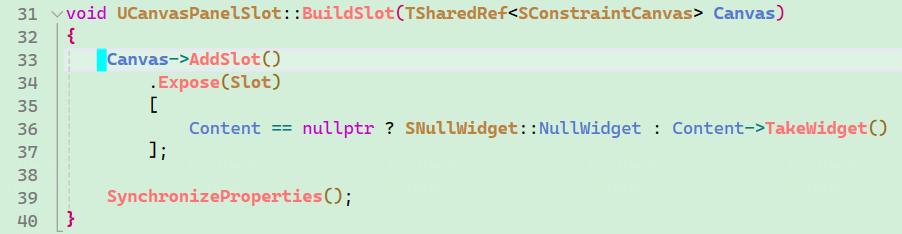

用户创建的UMG通常是userwidget的子类。

UMG可以组装：

1. 自定义的UMG（还是userwidget子类）。
2. botton/image等，类型是UImage、USizeBox等，直接或间接继承UWidget。
3. 比较复杂的纯C++类，UXXX，该C++类可以继承如UPanelWidget等。

U版Widget里通常会组装S版Widget，这些简单的不再赘述。

下面看几个关键的函数：

1 首先从蓝图或lua传来MyUserWidget。

​		UCanvasPanelSlot* ChildSlot = MyParentCanvas->AddChildToCanvas(MyUserWidget);

2 假设MyUserWidget会被添加到一个MyParentCanvas上面，它会构建一个slot（和MyUserWidget同级，parent是MyParentCanvas）。

3 这个slot会去找MyParentCanvas的SCanvas添加slot，并创建swidget。

4 这里构建了SCanvas的slot（MakeUnique<FSlot>()），并且会调MyUserWidget的takewidet（为了创建swidget）。

5 记住这后面几个函数，因为UI的递归层层组织，他们会经常调用。

6 MyWidget是swidget，如果失效（应该是隔段时间被gc了），会来这RebuildWidget，比如openmap。

7 RebuildWidget毕竟是uwidget的方法，会具体到子类去调用。下面是到userwidget去调，比如这里是mapwidget，再进入roowidget->takewidget就可能进入fullscreenbg，如果mapwidget的roowidget是fullscreenbg的话。而如果这里不是userwidget而是其他子类，就看其他子类具体的RebuildWidget内容，可能在这产生多层递归调用。

8 整个过程的myuserwidget是从一开始就传过来的，这是因为它是从蓝图或lua通过createwidget创建好的。
