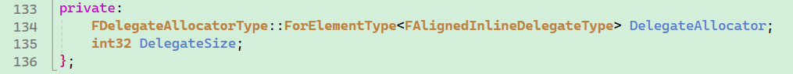

UE5的委托大量使用，主要是为了代码逻辑上的解耦，和设计模式的观察者（订阅-通知）模式是相似的。

这里只讨论多播委托，因为单播更简单。

1 首先是通过宏定义FOnMyDelegate委托类的声明。

Inner.cpp

​		DECLARE_MULTICAST_DELEGATE_FiveParams(FOnMyDelegate, int32, int32, ...)

2 去到宏定义查看。

3 发现其实是一个TMulticastDelegate的定义。

3 简单通过单播看一下这个模板类的定义。

4 其实关键的内容在父类（FDelegateBase）里面。

5 DelegateAllocator是实际的委托实际内存空间。

6 在Outer中注册Outer需要响应的函数到Inner。

Outer.cpp

​		Inner->OnMyDelegate.AddUObject(this, &ThisClass::MyOuterFunc);

7 当Inner触发通知时。

Inner.cpp

​		OnMyDelegate.Broadcast(param1, param2, ...);

8 Inner中的OnMyDelegate会Broadcast，for循环遍历身上所有的OuterClass和OuterFunc，依次去执行。

9 具体某个OuterClass和OuterFunc的执行，可通过MethodPtr调试看到信息。

10 MyOuterFunc被执行。