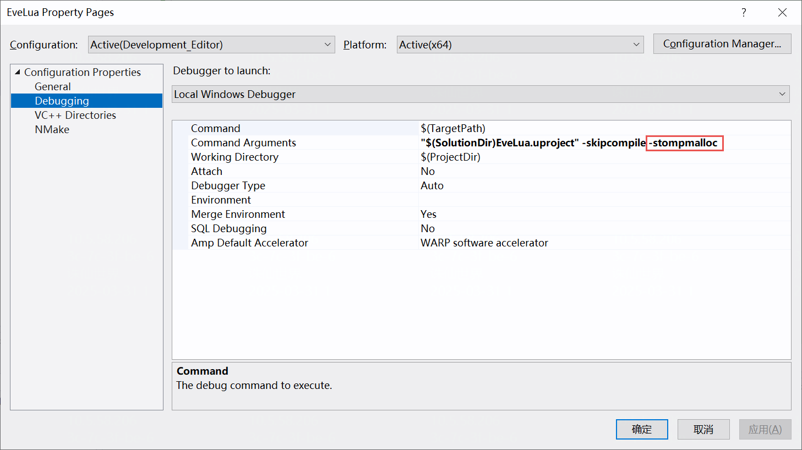
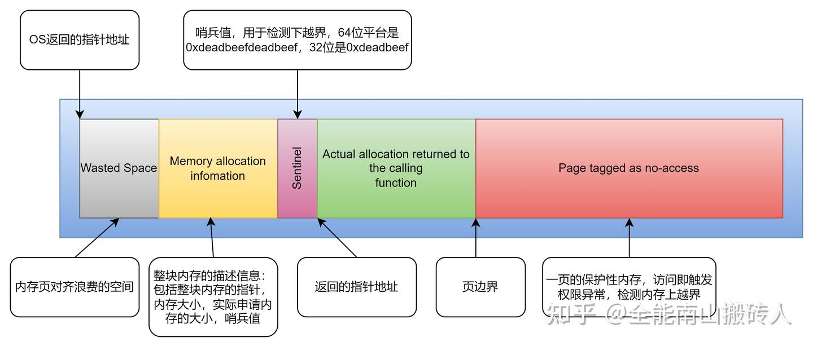
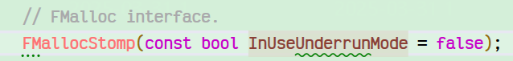
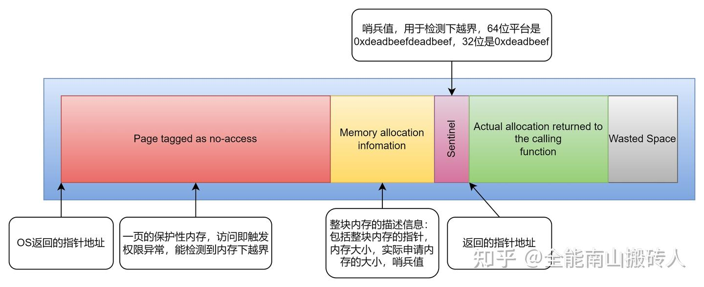

bStompMalloc是Unreal Engine提供的一个强大的内存调试工具，可以帮助开发者检测常见的内存错误，如越界访问和释放后使用等问题。

#### 基本概念

1. **Overrun(上溢出)**: 读写分配内存块后面的区域
2. **Underrun(下溢出)**: 读写分配内存块前面的区域
3. **Use-after-free(释放后使用)**: 在内存释放后继续访问它

#### 开启选项

在命令行参数上，补充-stompmalloc即可开启



#### 示例代码1：上越界

```cpp
void AEveLuaActor::BeginPlay()
{
	Super::BeginPlay();

	// 测试1: 内存上溢出(overrun)
	TestMemoryOverrun();
}

void AEveLuaActor::TestMemoryOverrun()
{
	const size_t NumBytes = 64;
	uint8* TestBytes = new uint8[NumBytes];

	// 故意越界写入 - StompMalloc应能立即捕获
	TestBytes[NumBytes + 128] = 1; // 上溢出

	delete[] TestBytes;
}
```



（此图引用知乎）

对于上越界问题，stompmalloc比较擅长，在劫持UE原来使用的Malloc的基础上，会在分配内存后段插入一个page，用于检测内存是否立即遭到破坏。经过测试：

1）如果不开启-stompmalloc，启动游戏，则当执行到`TestBytes[NumBytes + 128] = 1;`时，代码大概率不会出现任何异常，如果继续执行，后续可能会出现crash，可能直到游戏进程结束也不会，并且每次crash，都在不同的地方。符合预期。

2）当开启-stompmalloc后，基本上每次执行到`TestBytes[NumBytes + 128] = 1;`时，IDE都会立即crash在此处，并显示完整调用栈。

#### 示例代码2：下越界

```cpp
void AEveLuaActor::TestMemoryUnderrun()
{
	const size_t NumBytes = 64;
	uint8* TestBytes = new uint8[NumBytes];

	// 故意下溢出写入 - StompMalloc会在释放时检测到
	TestBytes[-128] = 1; // 下溢出

	delete[] TestBytes;
}
```

相比起上越界，下越界的概率较小，但也可能更致命。对于下越界问题，stompmalloc只会在分配内存前段保留一个哨兵值，因此无法立刻发现异常。如果在内存释放的时候，发现该哨兵值被修改，则能发现下越界问题，但如果恰好未被修改，则也无法发现。

经过测试，开启或不开启-stompmalloc，都可能甚至在程序结束时，也无法发现此处下越界的异常。



但UE提供了一个FMallocStomp的构造参数InUseUnderrunMode，可以通过修改源码的方式，将该参数置为true，此时，可以用排查上越界的方式，排查下越界。



（此图引用知乎）

开启InUseUnderrunMode：待测试验证......

#### 示例3：释放后使用

```cpp
void AEveLuaActor::TestUseAfterFree()
{
	const size_t NumBytes = 64;
	uint8* TestBytes = new uint8[NumBytes];

	delete[] TestBytes;

	// 故意在释放后使用 - StompMalloc应能捕获
	TestBytes[0] = 1; // 释放后使用
}
```

待测试验证......


参考链接：

[UE4 内存越界问题定位 - 知乎](https://zhuanlan.zhihu.com/p/628837536)

[UE StompMalloc排查内存错误 - 知乎](https://zhuanlan.zhihu.com/p/469889117)