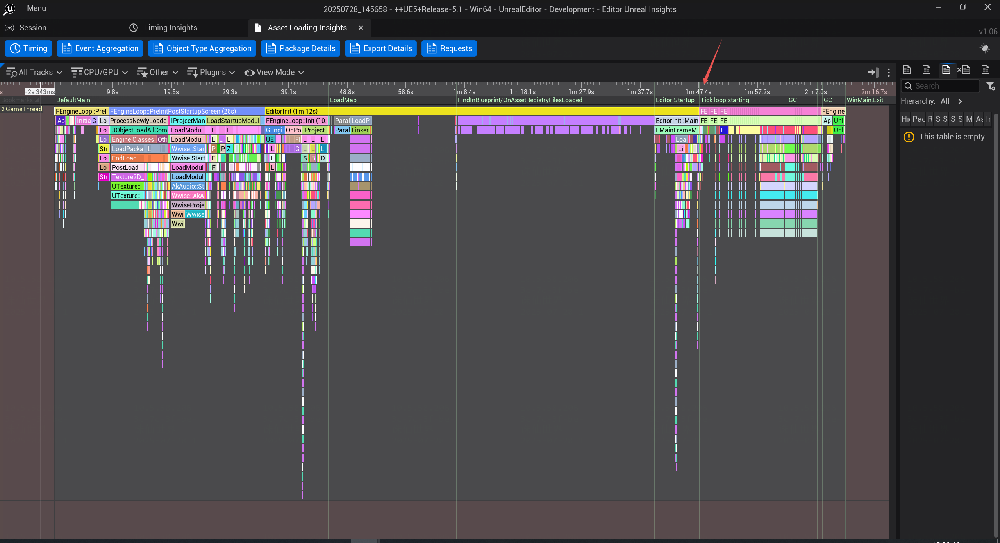
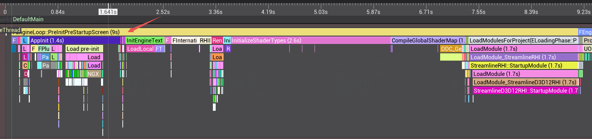
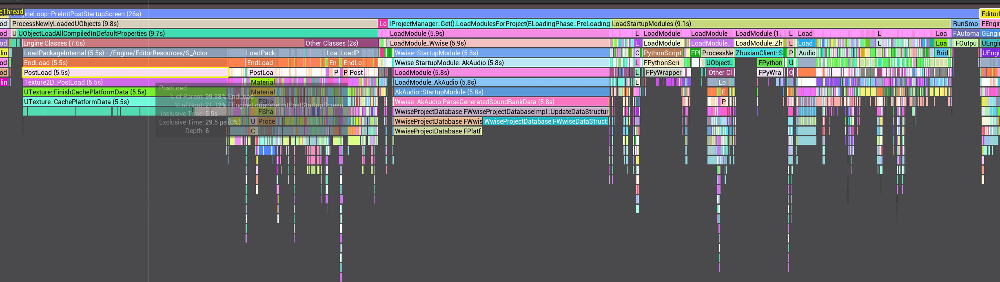
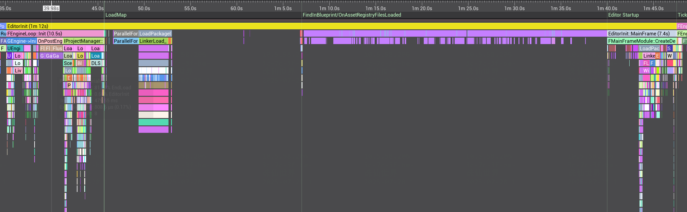
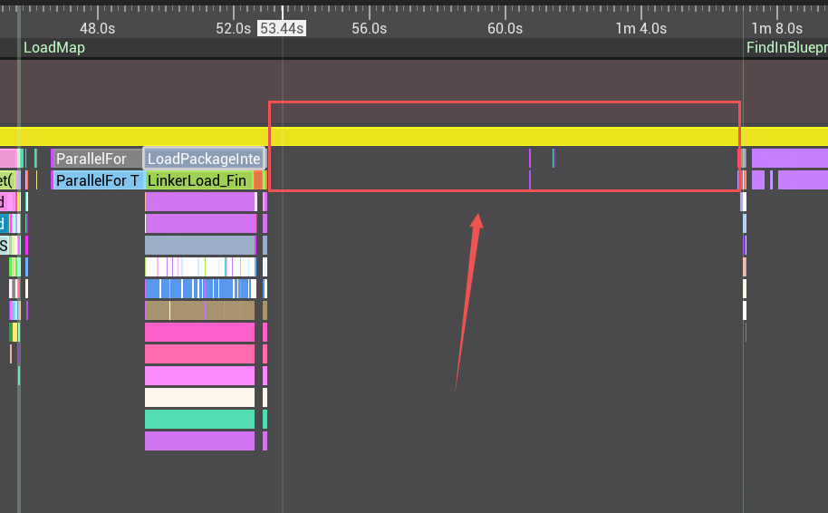
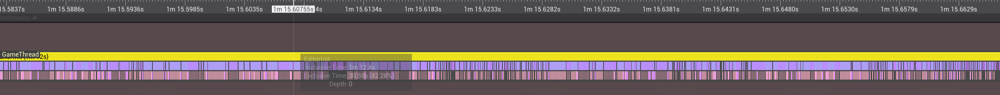
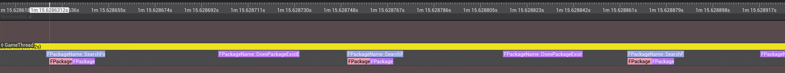

# 1 耗时统计

**开启trace**

start "" "%~dp0\Engine\Binaries\Win64\UnrealEditor" "%~dp0\xxx\xxx.uproject" -WINDOWED -trace=default,bookmark,loadtime,file -log

**开启trace**

[2025.07.28-06.57.43:561][  0]LogUnrealEdMisc: Loading editor; pre map load, took 45.633

[2025.07.28-06.58.37:946][  0]LogUnrealEdMisc: Total Editor Startup Time, took 100.018

**不开trace**

[2025.07.28-06.50.15:954][  0]LogUnrealEdMisc: Loading editor; pre map load, took 47.027

[2025.07.28-06.51.08:401][  0]LogUnrealEdMisc: Total Editor Startup Time, took 99.473

**结论：**开启trace的情况下启动editor，从log和insights结合看，时间大概在100s+，有时会更长。

不开trace，时间90s+，多次启动平均差不多都是这个值，差距不大，这个是实际启动editor的真实时间。

# 2 trace分析

从trace文件可看出，耗时分为几个部分：

## 1 FEngineLoop::PreInitPreStartupScreen (9s)

这部分看着没什么优化空间。

## 2 FEngineLoop::PreInitPostStartupScreen (26s)

这部分仔细看了下，也不存在优化空间。

## 3 EditorInit (1m 12s)

直接看最后这个加载的部分，1m12s。

## 问题1：这15s在干什么？

提示为LoadMap，以及调用栈为LoadPackageInternal函数，可见在加载StartUp默认地图，和相关的Package。地图本身引用很多资源（蓝图、材质、关卡流、Actor Class），那么就会触发 LoadPackageInternal。

但这15s完全没体现在trace上，可能是因为资源量巨大导致IO瓶颈，因为这可能涉及实打实的大量默认地图的资源加载或解析。

也可能是某个加载相关的子线程完全占用了。

## 问题2：这35s是重点。

FPackageName::DoesPackageExistEx (42.7 µs)

FPackageName::SearchForPackageOnDisk (27 µs)

放大后，全是密密麻麻的资源查找、检查确认相关的操作。

FPackageName::DoesPackageExistEx (42.7 µs)

FPackageName::SearchForPackageOnDisk (27 µs)

放大后，全是密密麻麻的资源查找、检查确认相关的操作。

这部分并非加载资源，而是为了分析蓝图引用是否存在、构建索引等，触发了大量验证路径存在性。

有很多蓝图之间存在：

软引用（例如：变量类型是另一个蓝图类）

自定义宏 / 函数库 / Interface 等交叉依赖

蓝图中出现了字符串路径引用（哪怕没加载）

每当蓝图加载到内存或预处理其 metadata 时，UE 会做如下事：

尝试“找出引用资源是否存在”：

比如 BP_A 里有：

TSubclassOf<ABP_B> BP_BClass;

Editor 启动时可能会：

FPackageName::DoesPackageExistEx(TEXT("/Game/BP/BP_B"))

再确认路径是否真的存在，以构建蓝图引用树。

15s优化空间：更换默认地图，减少不必要资源，禁用非必要插件

35s优化空间：资源量庞大无法避免，精简无用蓝图，拆分某些非必要蓝图到插件，避免上来加载，避免循环依赖。

