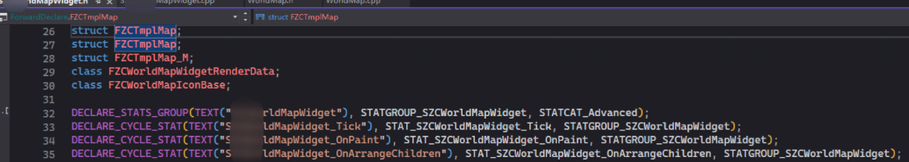
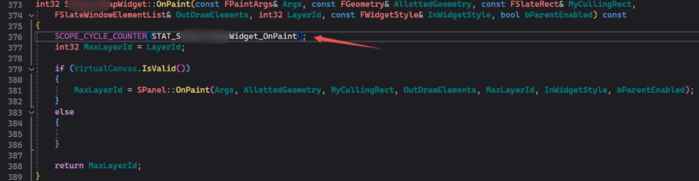
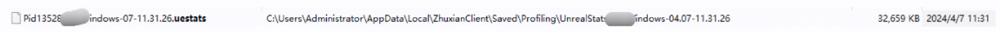
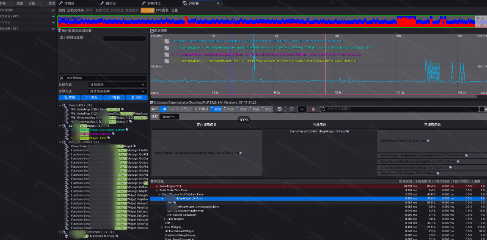

[Stat Commands | Unreal Engine Documentation](https://docs.unrealengine.com/4.26/en-US/TestingAndOptimization/PerformanceAndProfiling/StatCommands/)

## 1 在代码中宏定义性能测试小组

## 2 在需要测试的地方进行打点

## 3 进入游戏，录制trace生成文件

性能trace开始，输入stat startfile。

性能trace结束，输入stat stopfile。

随后，生成了以下文件。

## 4 editor会话前端解析文件

通过editor的会话前端打开后，可以发现如下的数据统计信息：

