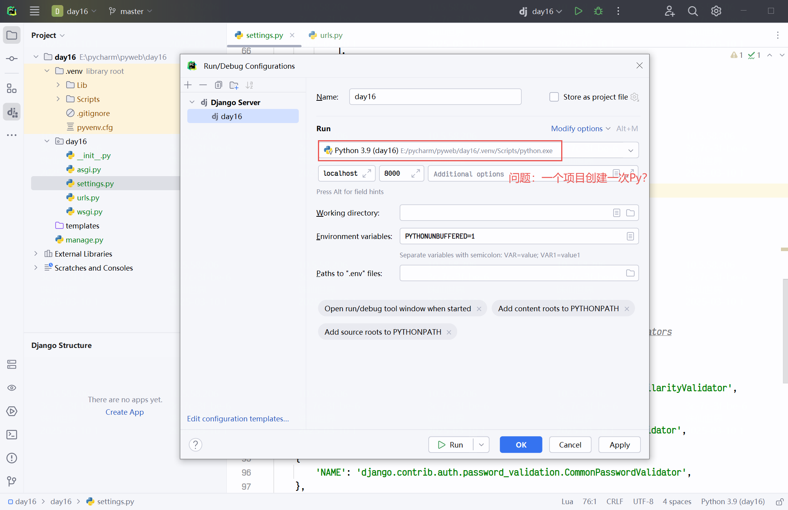
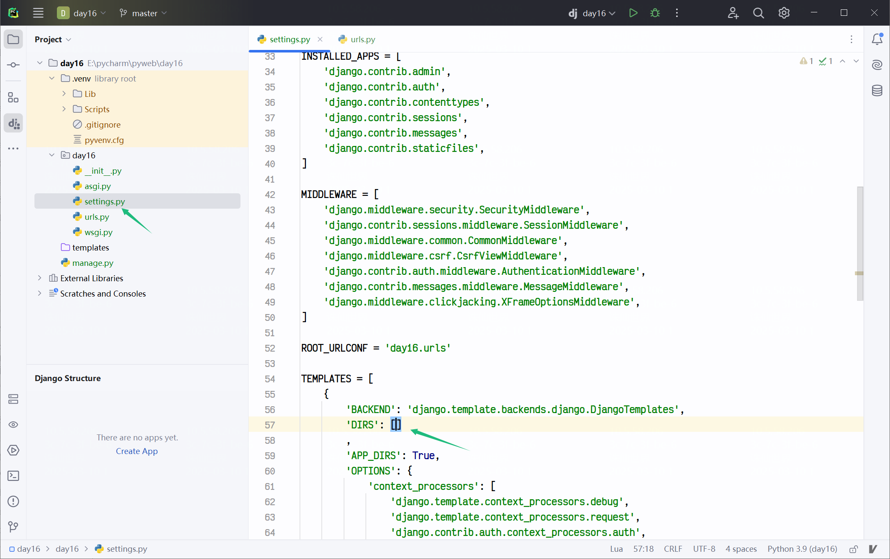
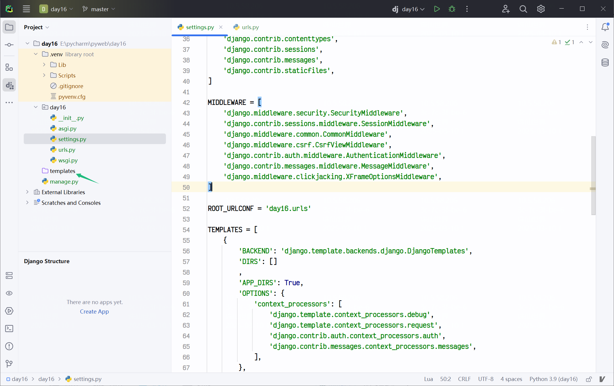
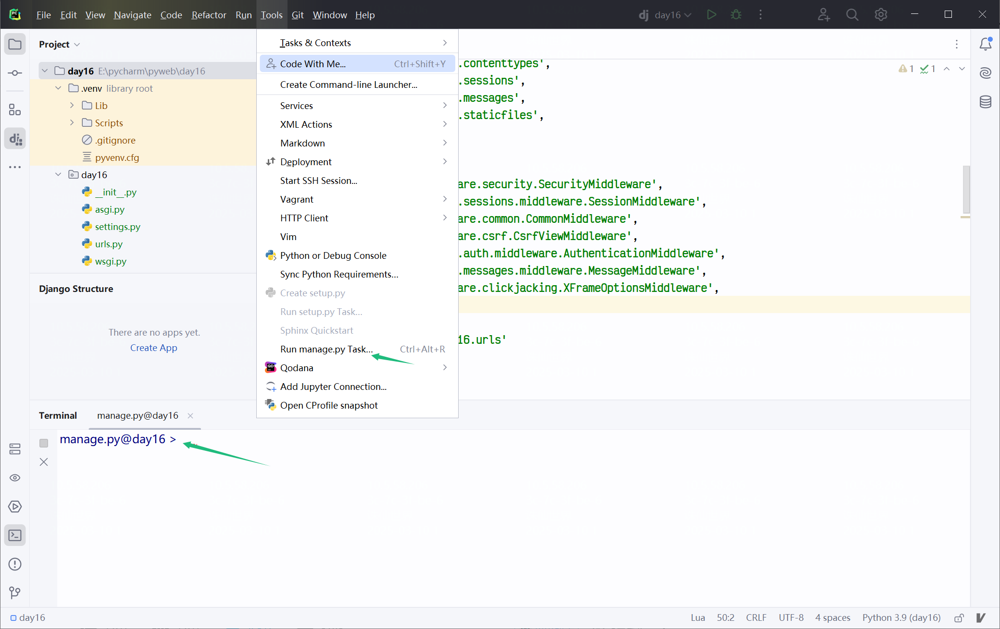
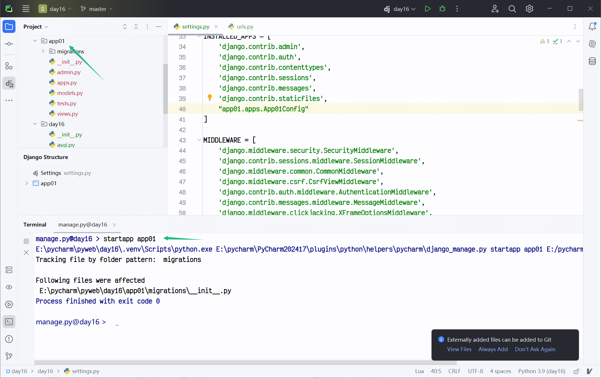
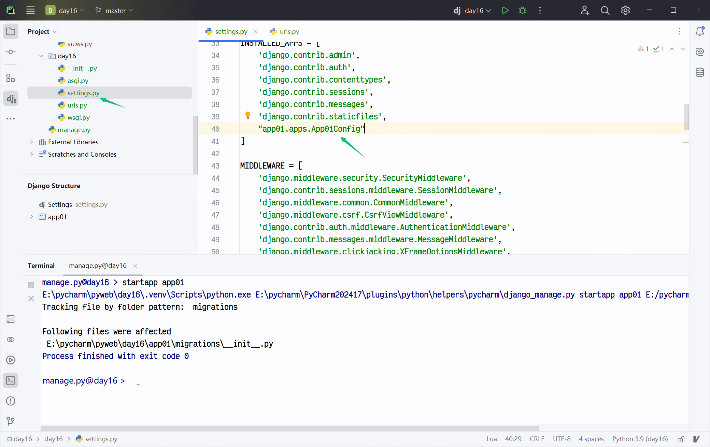
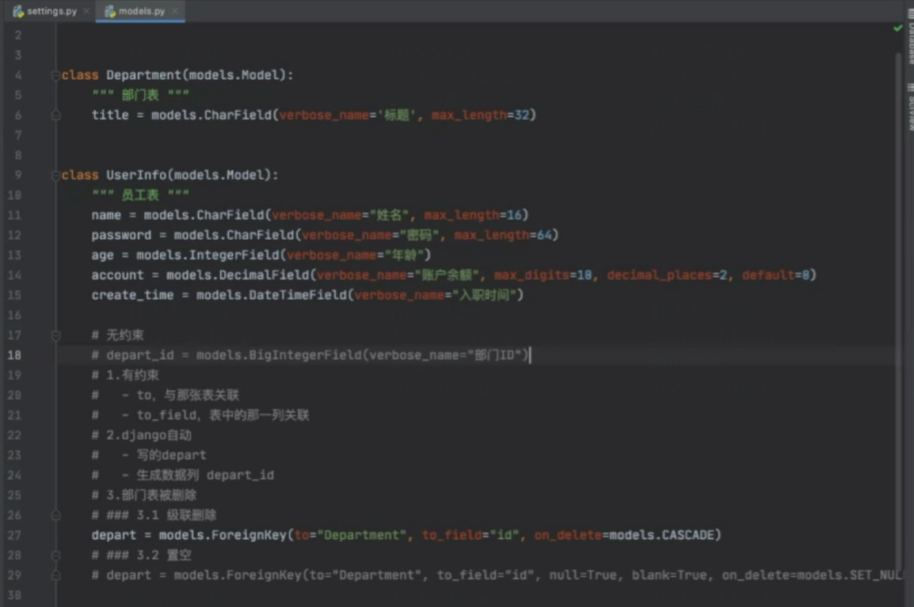
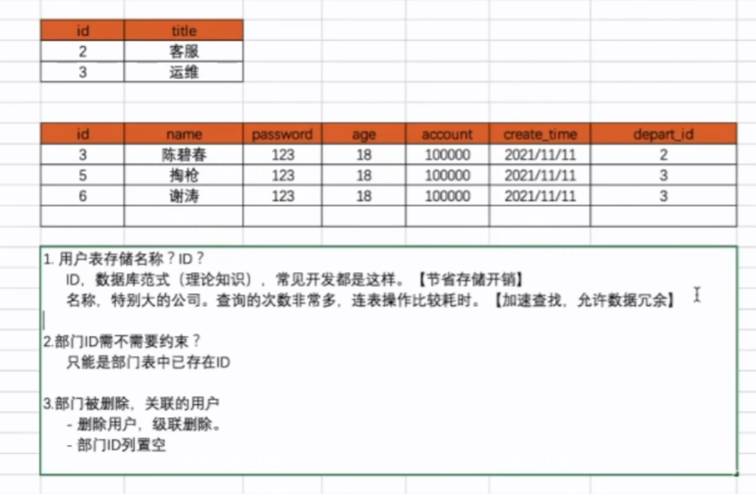

## MySql常规操作

```
E:\pycharm\mysql\mysql-8.0.35-winx64\mysql-8.0.35-winx64\bin>mysqld --initialize --console
2025-03-04T09:07:32.698461Z 0 [System] [MY-013169] [Server] E:\pycharm\mysql\mysql-8.0.35-winx64\mysql-8.0.35-winx64\bin\mysqld.exe (mysqld 8.0.35) initializing of server in progress as process 145048
2025-03-04T09:07:32.714379Z 1 [System] [MY-013576] [InnoDB] InnoDB initialization has started.
2025-03-04T09:07:33.414505Z 1 [System] [MY-013577] [InnoDB] InnoDB initialization has ended.
2025-03-04T09:07:35.298060Z 6 [Note] [MY-010454] [Server] A temporary password is generated for root@localhost: aZB>HTe&f9qY

E:\pycharm\mysql\mysql-8.0.35-winx64\mysql-8.0.35-winx64\bin>mysqld --install
Service successfully installed.

E:\pycharm\mysql\mysql-8.0.35-winx64\mysql-8.0.35-winx64\bin>net start mysql
MySQL 服务正在启动 .
MySQL 服务已经启动成功。

E:\pycharm\mysql\mysql-8.0.35-winx64\mysql-8.0.35-winx64\bin>mysql -u root -p
Enter password: ************
Welcome to the MySQL monitor.  Commands end with ; or \g.
Your MySQL connection id is 8
Server version: 8.0.35

Copyright (c) 2000, 2023, Oracle and/or its affiliates.

Oracle is a registered trademark of Oracle Corporation and/or its
affiliates. Other names may be trademarks of their respective
owners.

Type 'help;' or '\h' for help. Type '\c' to clear the current input statement.

mysql>
```

```
# Django ORM update
(.venv) E:\pycharm\pyweb\mysite2>python manage.py makemigrations
(.venv) E:\pycharm\pyweb\mysite2>python manage.py migrate  
```

```
# 登录 mysql
mysql -u root -p
aZB>HTe&f9qY
```

```
# 新建 mysql 数据库, Django 无法完成这一步
create database gx_day15 DEFAULT CHARSET utf8 COLLATE utf8_general_ci;
```

```
# 展示已有数据库
show databases;

# 使用 gx_day15 数据库
use gx_day15

mysql> show tables;
+----------------------------+
| Tables_in_gx_day15         |
+----------------------------+
| app01_userinfo             |
| auth_group                 |
| auth_group_permissions     |
| auth_permission            |
| auth_user                  |
| auth_user_groups           |
| auth_user_user_permissions |
| django_admin_log           |
| django_content_type        |
| django_migrations          |
| django_session             |
+----------------------------+
11 rows in set (0.00 sec)

mysql> desc app01_userinfo;
+----------+-------------+------+-----+---------+----------------+
| Field    | Type        | Null | Key | Default | Extra          |
+----------+-------------+------+-----+---------+----------------+
| id       | bigint      | NO   | PRI | NULL    | auto_increment |
| name     | varchar(32) | NO   |     | NULL    |                |
| password | varchar(64) | NO   |     | NULL    |                |
| age      | int         | NO   |     | NULL    |                |
+----------+-------------+------+-----+---------+----------------+
4 rows in set (0.01 sec)

mysql> select * from app01_department;
+----+-----------+
| id | title     |
+----+-----------+
|  1 | Market    |
|  2 | RD        |
|  3 | Operation |
+----+-----------+
3 rows in set (0.00 sec)

------------------- clear -------------------
# 往表里插入2条数据(但如果没记错，这操作可以在django里做，只有建表不能在django做)
mysql> insert into app01_department(title) values("ITDepart"),("Marketing");
Query OK, 2 rows affected (0.06 sec)
Records: 2  Duplicates: 0  Warnings: 0

mysql> select * from app01_department;
+----+-----------+
| id | title     |
+----+-----------+
|  1 | ITDepart  |
|  2 | Marketing |
+----+-----------+
2 rows in set (0.00 sec)
```

## Django新项目

确保安装py



settings里删掉默认的DIRS



删除templates文件夹，我们不用



创建app

方法1: 打开terminal，python manage.py startapp app01

方法2: 用Tools里的run manage.py task，这样就相当于执行了python manage.py，然后只需要继续执行startapp app01即可



此时app创建成功



接下来是注册app



然后是在django的models.py里，正式定义表（前提应该是已经在mysql里创建好数据库？）



