今天通过一个简单的龙书D3D12案例，从大体上简单浏览一下整个渲染流程。

## 渲染管线

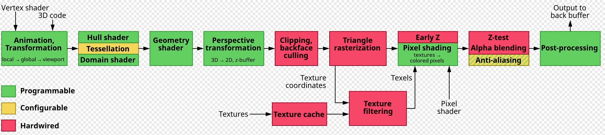

UE5渲染源码的三件事情：1）代码本身；2）用什么样子的参数，哪些输入的数据，数据的格式；3）真正的数据。

## 龙书D3D12基础案例

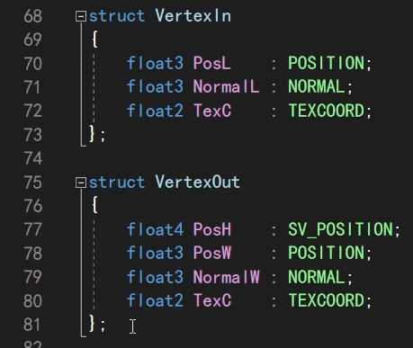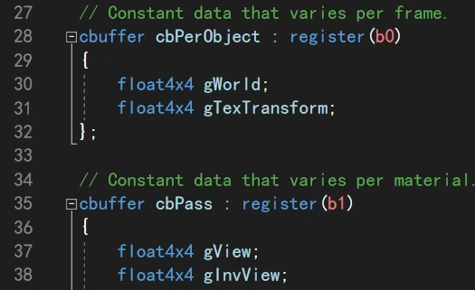

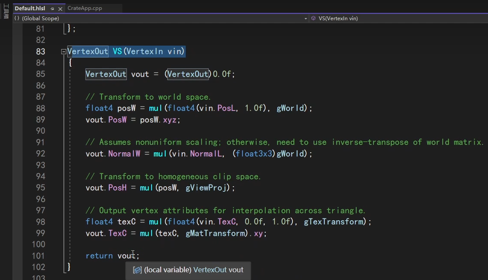

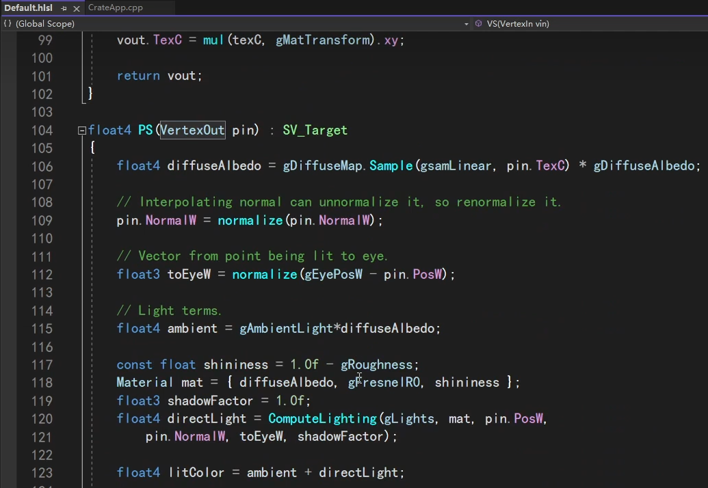

以龙书的D3D12示例Shader代码为例，VS和PS，处理输入，返回输出。

应用到渲染管线，1）把代码编译传进去。2）规定参数格式。3）传入数据。

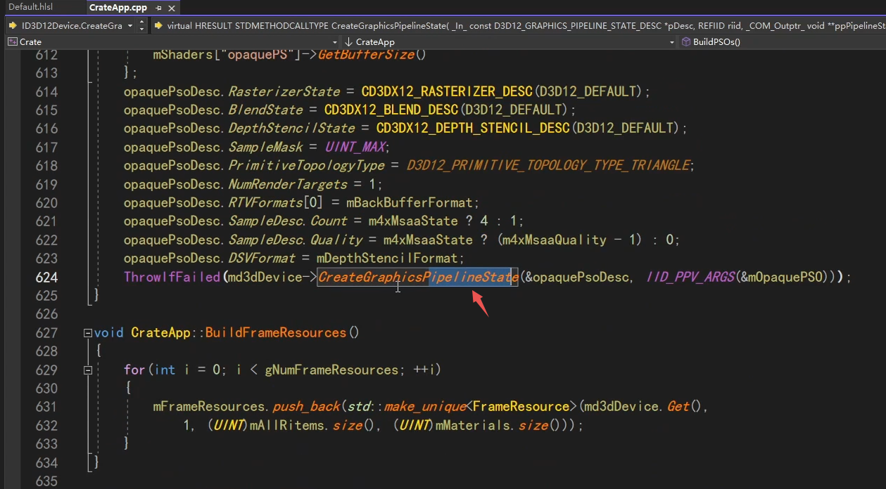

对于D3D12的代码跟参数格式，就是在PipelineState里面。即一个管线的所有状态，包括了整个管线的代码格式，以及某些流程的设置状态。

如果要执行不同的着色器代码，那就按照不同的配置，创建不同的PipelineState，然后到时候决定用哪个pipelinestate。

创建之前，它需要一堆参数。

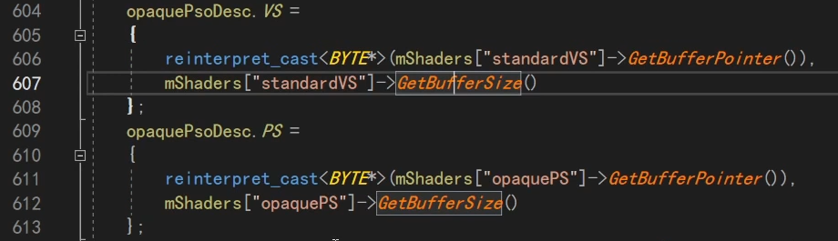

这是把编译好的代码放进去，实际是一段内存。

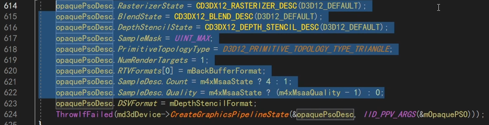

然后是各种状态的设置。

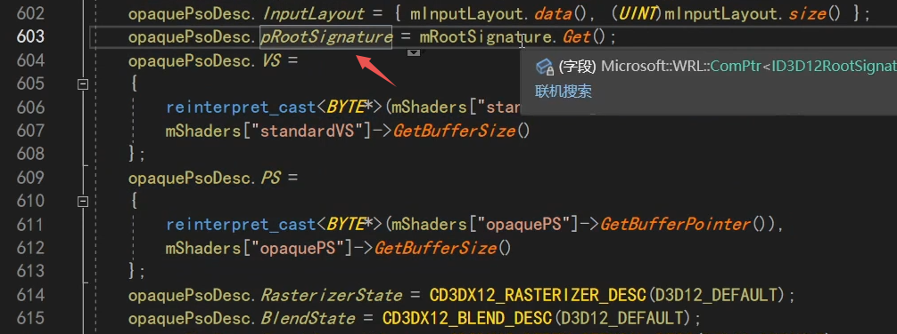

以及根签名，对应了下面代码的一些输入参数格式。先封装成一个根签名再放进来。

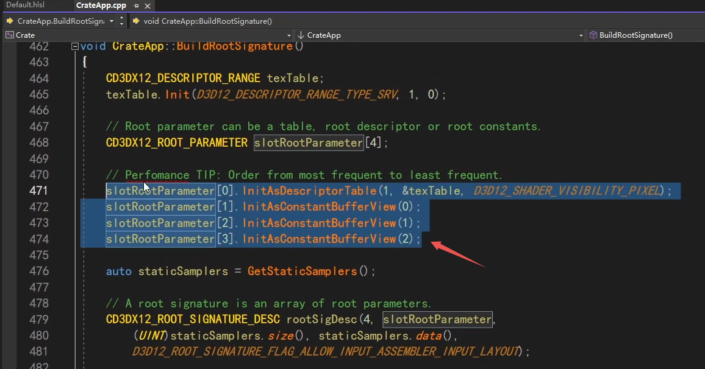

根签名就是设置这些。这里不是传真正的值，只是传参数格式。0是贴图。另外3个是const buffer，是b0 b1 b2。

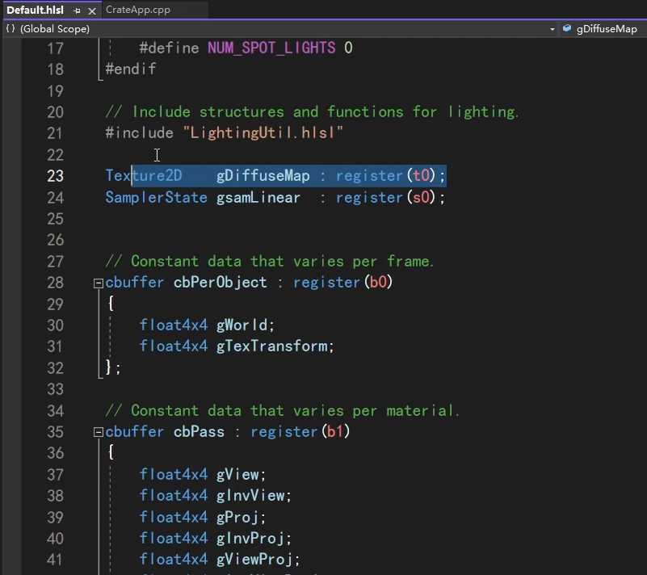

我们的参数有t0, s0, b0, b1, b2。其中s0特殊，在其他地方设置，其他4个，就是上面根签名设置的那4个。

设置完成，然后打包成一个描述。

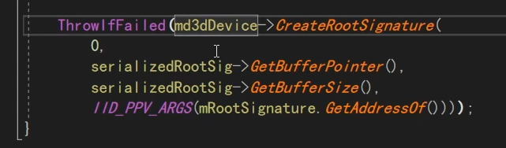

然后用这个描述，去真正创建一个根签名。

所以，根签名虽然它要设置很多东西，但它就是着色器的输入格式，然后要用来生成pipelinestate。

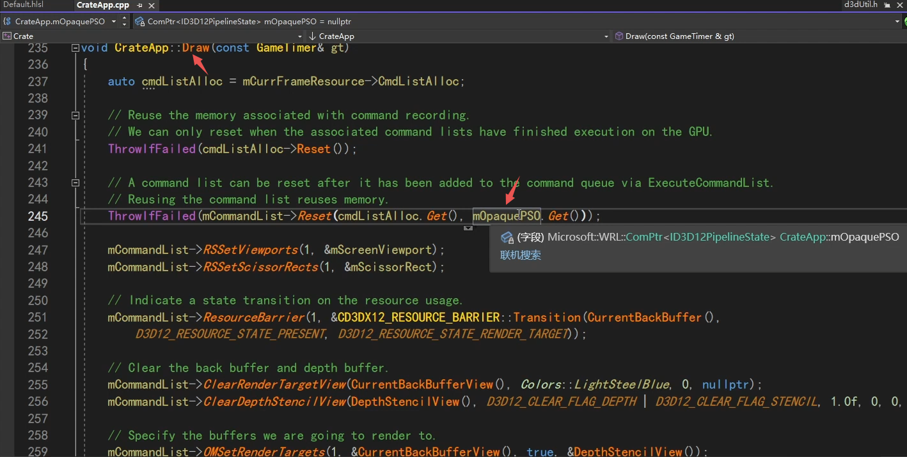

真正去驱动GPU每帧渲染是这个Draw，告诉GPU用我们刚才设置的PSO（pipelinestateobject）。

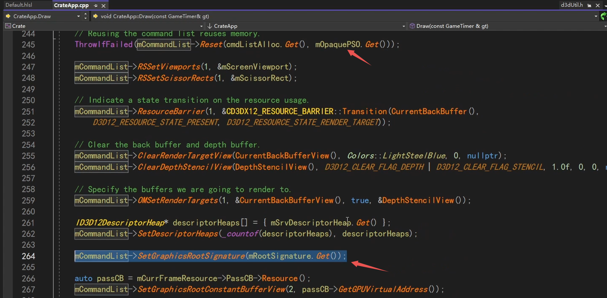

pso和rootsignature，都要设置好。

然后GPU就知道代码在哪里了，代码的格式是怎样子的。

剩下就是把参数传进去。当然中间还要设置很多其他状态，但那些不是重点，按龙书格式了解即可。

那我们要传真正的参数，比如这个float4的浮点数，它真正的参数在哪？

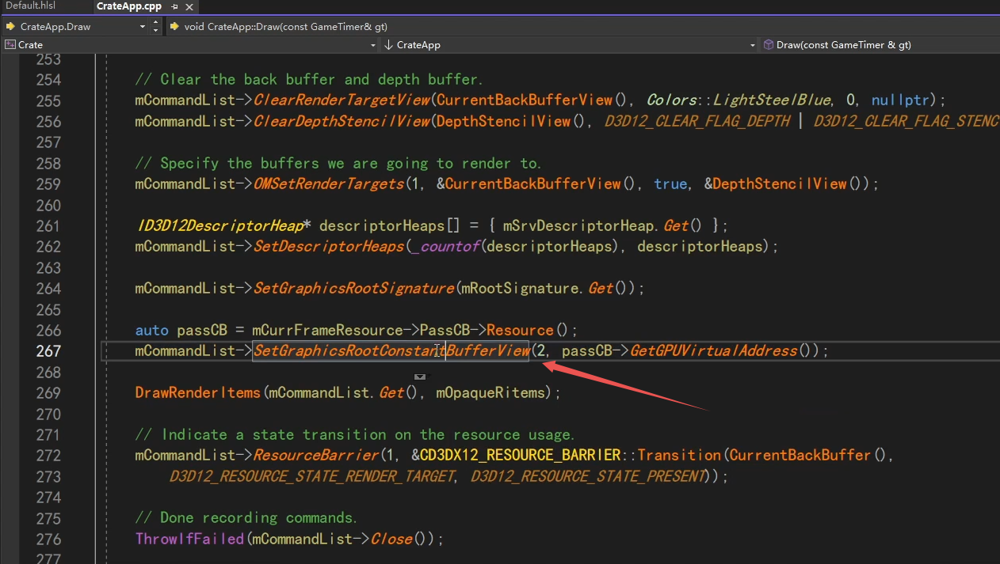

中间有些别的过程，一堆内存传到GPU变成显存，这里是告诉它gpu的虚拟指针。

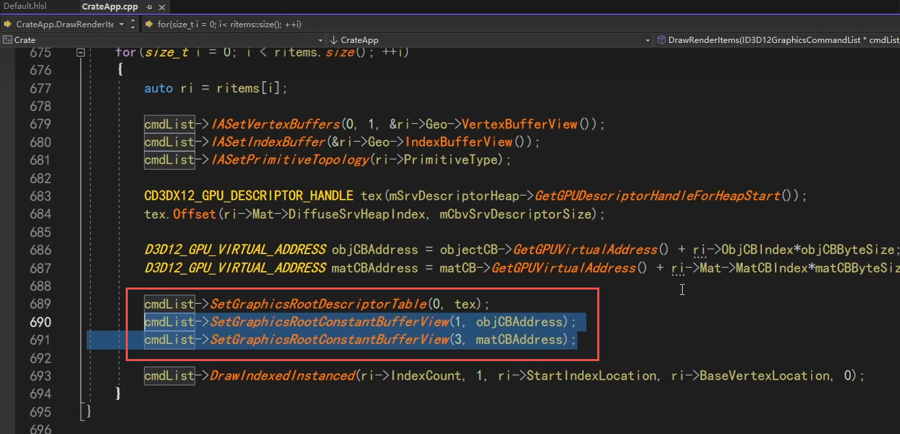

不止上面，还有这里，将t0 b1 b2等参数传进去。

最后就是去执行这个Draw。

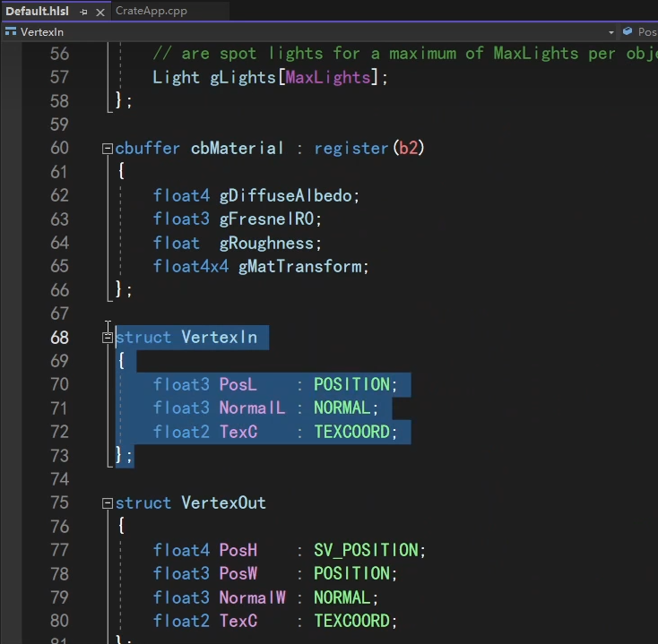

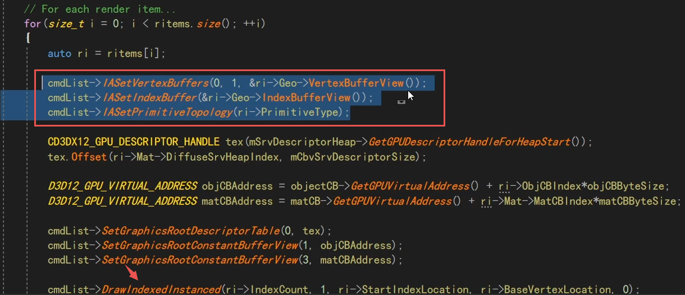

说漏了一个地方，刚才说的是一些全局的参数，还有顶点的属性，也需要传进去。

顶点buffer、索引buffer、三角形类型等。

到此结束，因此我们要看UE渲染的源码，主要就是要关注UE是如何封装这些东西：

各种代码、代码的格式、各种各样的参数、各种各样的设置状态。

所有的参数和设置状态，其实都是一段内存，或者一段显存，就是一个D3D12的Resource资源。

在OpenGL也是同理，把这段内存传进去，OpenGL就会返回一个无符号整数，其实就是一个resourceID。

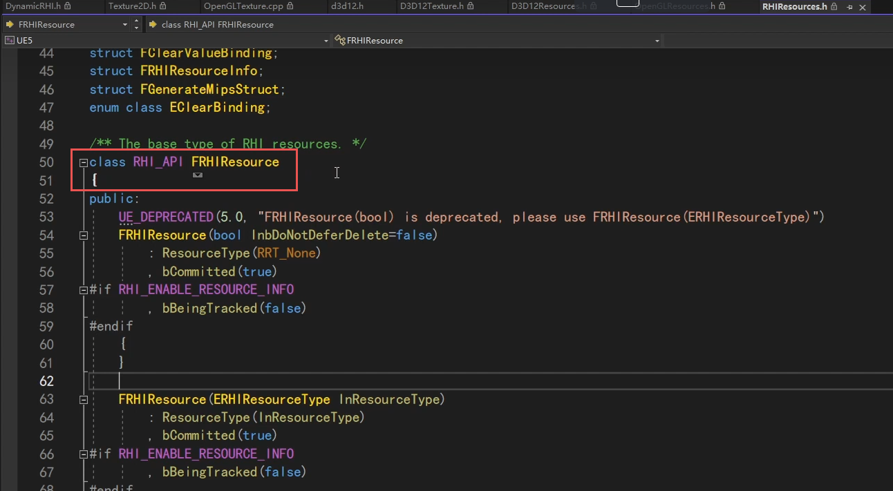

在UE里，所有资源的基类，就是这个FRHIResource，一个抽象的资源。

一个资源，可以是一个buffer，const buffer。在UE里是Uniform Buffer。可以是张贴图，Texture。可以是Sample，或者是一个State状态。

