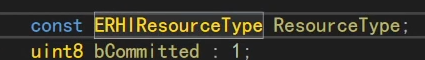
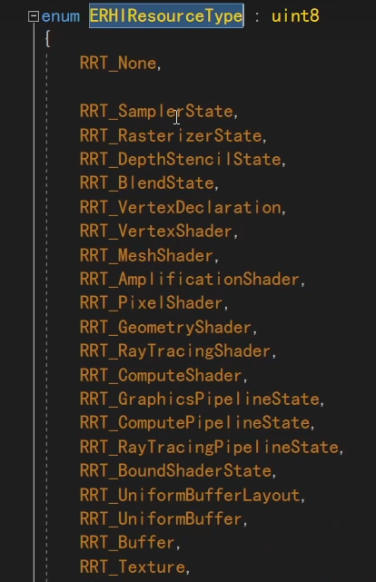
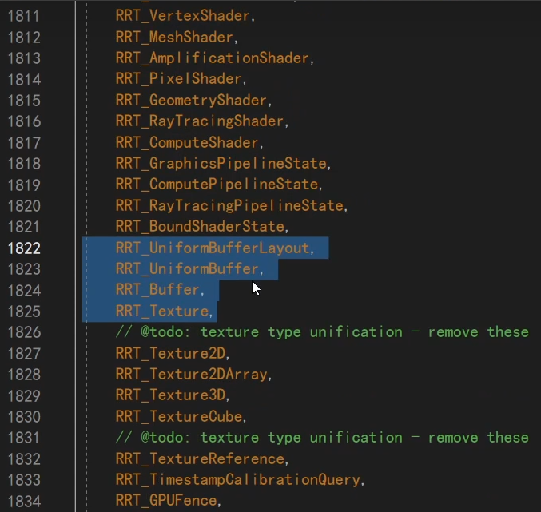
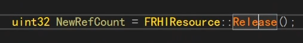
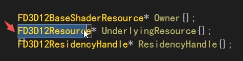
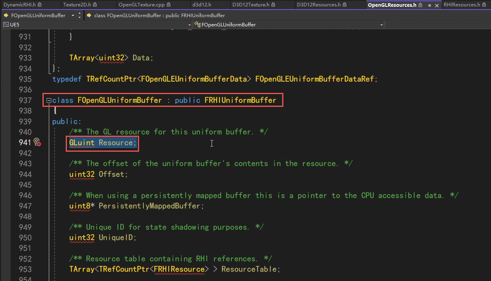

## UE中上层宏观的FRHIResource

在UE里，所有资源的基类，就是这个FRHIResource，一个抽象的资源。

一个资源，可以是一个buffer，const buffer。在UE里是Uniform Buffer。可以是张贴图，Texture。可以是Sample，或者是一个State状态。

基类里没定义太多的操作，有AddRef，Release，还有个原子操作。

从这个枚举可以看到，什么是UE里面的Resource，它包含了很多种东西。我们大致有个了解即可。

这里的每样类型，都是一个抽象的概念，和OGL和D3D12目前是没有联系的。

## 以UniformBuffer为例看封装

我们以一个UniformBuffer为例。它继承自FRHIResource。

但是它这里是一个通用的跨平台的UniformBuffer类，并不是D3D12的，也不是OGL的。

因此这个类里，也没有真正的实现，只是定义了对外的接口。

对外就是这些接口，面对一段UniformBuffer，这些就已经足够了。但UE底层是怎么是真正实现的呢？

是通过继承，比如OGL里面，就会又有一个OGL的UniformBuffer类来继承它。当使用OGL编译的时候，实际上是生成那个OGL版本的子类。D3D12同理。

这个就是D3D12里面，真正的实现。

D3D12里面的一个buffer，实际上在D3D12里面是一个resource。内存上传到GPU后，我们能拿到的实际上是一个D3D12的resource的指针。

就是存在这个成员里。它把D3D12里所有的resource都抽象成一个location。

这个location里面有一个成员变量，又是一个FD3D12Resource。

而这个FD3D12Resource里面，就是真正的D3D12的指针。当然，下面还有一些别的，别它封装了起来，比如GPUVirtualAddress。

所以这是一套继承体系，我们想用什么接口，就在RHI层面定义一个接口，在子类里去实现它。

比如Create、Release一段资源，或者Upload一段内存进去。

OGL同理。

继承FRHIResource的类，非常非常多，比如FRHIShader、FRHIVertexShader、FRHIGraphicsShader、FRHIMeshShader等等。

但是都没什么具体的实现，因为是在RHI的定义，是通用的基类。

另一看一个例子，贴图FRHITexture也是类似，它也间接继承了FRHIResource。

FRHITexture也没具体的实现，但提供了很多接口，可以访问底层的资源。上层逻辑对它进行操作就可以了。

这是OGL上的具体实现。

D3D12也是类似。这里展示了一个它一个特殊的点，多继承，D3D12里面，所有资源都是最下面的这个Resource。

## 以UTexture为例看封装

UTexture是上层给蓝图使用的Texture。封装的目的就是为了不用那么麻烦去写OGL、D3D12的代码。

它提供了更新贴图内存的接口。将大小、格式、真正的内存传入即可。

上述函数的内部，主要就是enqueue到render里去，然后然后调这个RHI的方法。

这个方法是定义在command list里面的。

## FDynamicRHI也是非常重要的基类

一直深入，是到这个DynamicRHI在调用。FDynamicRHI是最最最最最重要的类之一。

这个类里的方法超多，比如常见的图形渲染操作，创建纹理、状态、更新资源、设置Fence、更新贴图等一大半操作，都在此类中。但都没实现。

然后OGL、D3D12会去继承它、实现它。

操作上层，不要在上层写D3D12，否则代码无法跨平台。

这里面都是些纯虚函数。这个类，同样下面有D3D12和OGL的各种各样的子类。

这是D3D12的Dynamic的子类，以及updateTex方法。中间的继承关系有几层。

再一直往里走，就能看到这个，就是D3D12里面，真正纯原生的更新tex的方法了。

OGL同理，也是DymamicRHI的子类。中间间接继承好几层。

最终也是调OGL纯原生的方法。