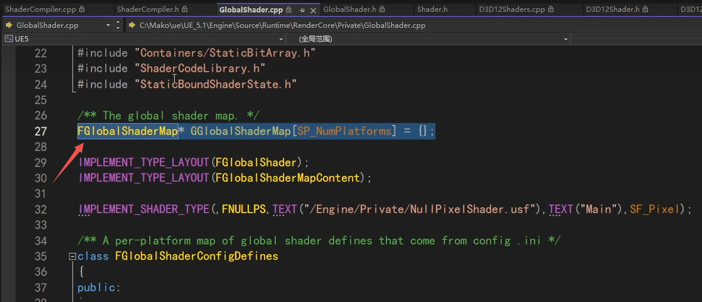
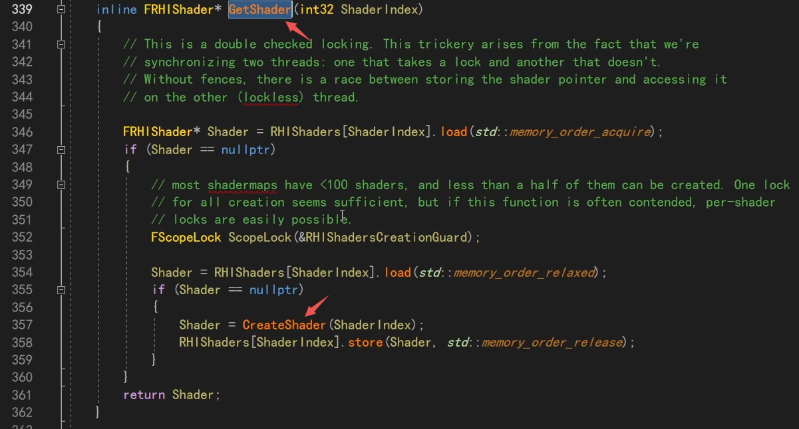
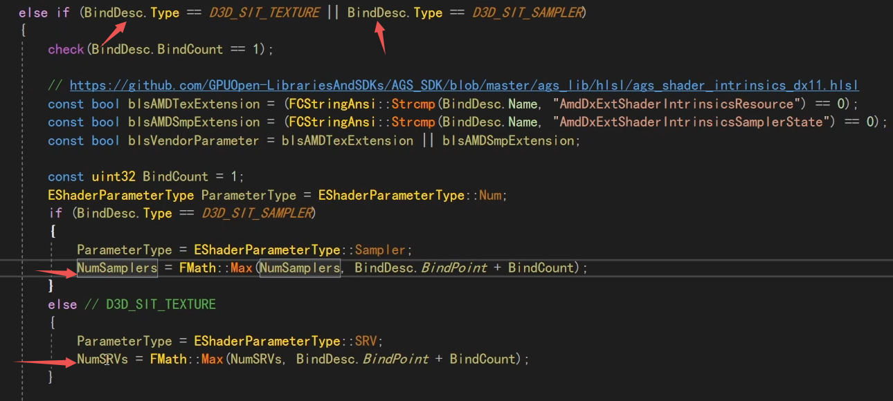
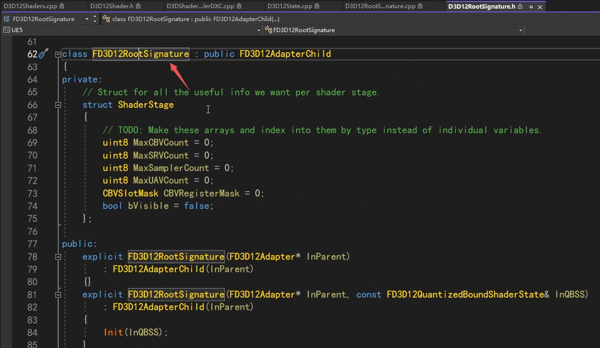
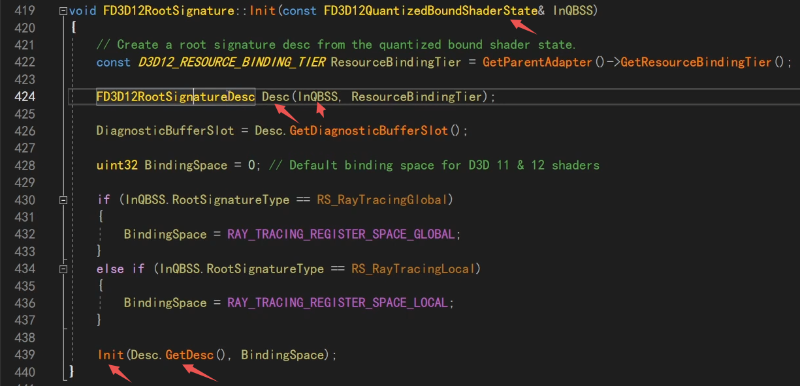
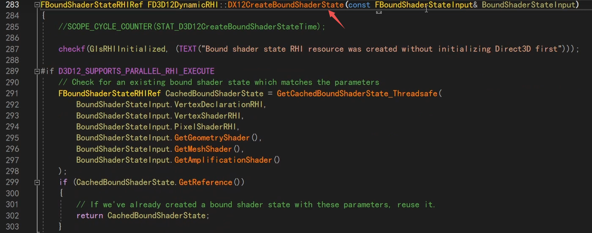
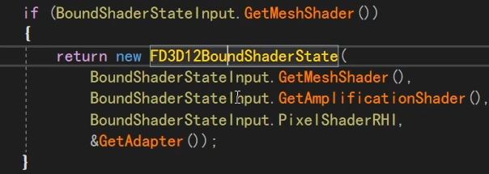
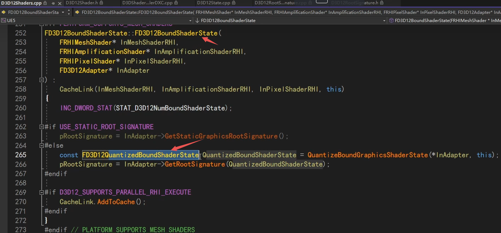
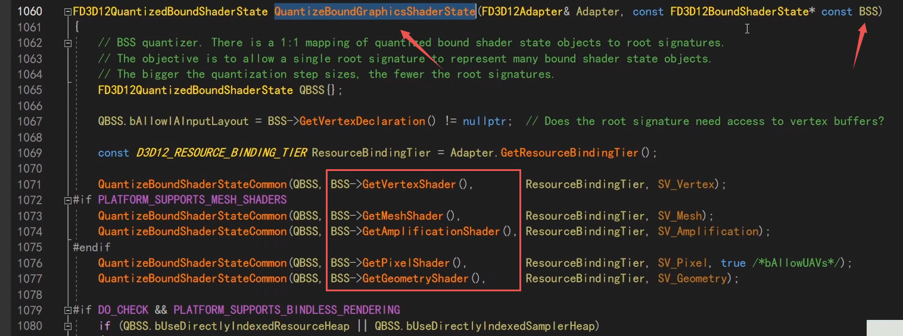

## 从shader的创建开始

## FGlobalShaderMap

首先，这个FGlobalShaderMap管理者所有shader的信息。

## 编译全局shader

引擎初始化的时候，会调这个编译全局shader的函数。

进入到里面，可以看到这个compile有两种模式。

1. 这里的if模式，如果配置了这个变量，那么在一开始，就会编译全部的shader。
2. 否则的话，在某个shader具体使用的时候，会去get，如果get不到，才会开始创建。

继续上面1）模式的7544行，会遍历所有的shader，get不到会触发创建。

一直深入，就会到我们之前讲过的流程，到RHICreateVertexShader这种，再深入就会调具体的入D3D12和OGL的createshader流程。

对于所有的shader，比如这个FD3D12VertexShader，它都会继承这么一个XXXShaderData。

我们之前说要关注里面的Code。但今天，还需要关注另一个变量，就是这个ResourceCounts。

## Shder的Code和FShaderCodePackedResourceCounts

统计当前shader，用了多少个这种参数，比如NumSamplers、NumSRVs、NumCBs、NumUAVs。

这个参数的使用数量，是我们使用根签名时，需要的信息。先记住它FShaderCodePackedResourceCounts。

这个类的信息，是在CreateShader的时候，提取出来的。

前面讲过，UE的这个Code里面不止是code，还有optionaldata，ShaderReader会读取Code+OptionalData，这里FShaderCodePackedResourceCounts就是那段optionalData。

那么这个参数，是怎么来的呢？其实是编译的时候来的。

真正的编译代码在这，比较复杂。我们只关注一个东西。就是一个Shader着色器，它用到的参数是怎么来的？

实际上，DX编译一段代码的时候，会包含所有的信息。不只是一个可执行的bytecode，它会存储这一段着色器代码所包含的所有描述信息。

这是DX本身提供的功能，虽然平时我们写简单的demo没用到，都是手工填的。

但实际上UE引擎，面对各种复杂的着色器，它能够去处理。只要你的shader代码是正确的，很多信息它都能去get出来。

在编译完代码后，就能拿到这些描述、反射信息，就是这些ID3D开头的。

进入到函数内部，实际上就是这个BindDesc，你把它get出来，这个里面就存储着所有Resource变量的信息，通过for循环拿到处理。

比如当Resource是一张贴图时，就通过BindDesc拿到它的NumSamplers、NumSRVs等信息。

这也是通过这里反射的技术拿到的信息，在编译的时候拿完这些NumXXX。

拿到之后，再在下面把它们组装起来，形成刚才前面说的FShaderCodePackedResourceCounts。

然后把他们拼接到代码Code里面去，生成。

这里拼接出来的Code，就会传到后面的RHICreateShaderXXX里面去。所以，那边就拿到了这些数量Num的信息。

所以，创建Shader的时候，就已经把这种每个Shader的数量创建起来了。（所以这种数量到底是啥？）

下一步，我们就到了创建pipelinestate和根签名。

## 根签名

这个就是封装了D3D12的根签名。

它当然包含着，真正的根签名。

看它的构造，里面的Init。这个是shader里面的全部的信息包。就是一个流程里面，对应的所有shader全部的信息。

因为一个根签名，不止对应一个shader，你有顶点着色器、像素着色器，以及其他各种着色器。都会跟一个根签名拼起来。

那么这些shader的信息，会放在这个FD3D12QuantizedBoundShaderState信息包里面。

它会用这些信息，去构建一个Desc（这个desc几乎就已经是真正的那个desc了，这句话？），然后去初始化Init。

它已经构造出那个真正的decs了（也就是这个宏的意思）。

然后用这个真正的desc，拿到blob，然后去调D3D12原始接口的CreateRootSignature。

## FD3D12QuantizedBoundShaderState Shader信息包

## FD3D12RootSignatureDesc

那么重点是这个FD3D12QuantizedBoundShaderState信息包。

我们来看desc的构造函数，它使用信息包作为输入。

这个信息包，就包含了所有shader的参数的信息。

D3D12创建根签名时，就是要先搞一个描述parameter。这里就是根据传入的参数，搞一个for循环，然后每一个去创建一个ROOT_PARAMETER。

这个ROOT_PARAMETER的type在UE中有2种。

要么是descriptor_table，要么是const buffer（CBV）。

比如第一种，这里就用到刚才的数量。因为一个信息里有多个shader，注意创建DescriptorRanges那两行。（这没讲清楚，但在D3D12应该比较常见）。

这是D3D12里面，最熟悉的2个类（虽然我不知道？）。

然后创建这堆数量，并计算参数的数量。

最后这个描述符desc，就用来创建真正的根签名。

## FD3D12QuantizedBoundShaderState 所有shader的信息包

刚说完了desc，我们继续看它是怎么构造出刚才前面，每一个shaderdata的那个数量。

那就需要看pipelinestate，我们跳到**创建pso**。

一路从创建pso深入，到这可以看到这个信息包，就是用来创建根签名用到的参数。

这里红框，就包含了所有shader的信息。

注意shaderdata->resourceCounts，就是最早我们看到shaderdata里面除了code外，重要的信息。

BSS->GetVertexShader，VertexShader都是继承了shaderdata的，就是对shaderdata的封装。（这一段没说太清楚，意会）

**阶段总结**：**所以，在创建PSO pipelinestate的时候，要把整个渲染管线的每一个shader，即vertexshader、meshshader、pixelshader、amplificationshader、greometryshader等，每一个shader他们的参数全部都统计出来。**

然后创建这个**FD3D12QuantizedBoundShaderState**，信息包。

然后用它来创建根签名。

## 总结

1. shader是在初始化的时候，一开始就创建的。（也有那种get时创建的）。
2. shader的参数是怎么来的，编译后，利用DX的反射技术获取出来的，编译代码的时候，可以直接获取到相关的描述，再get到所有的信息。比如每个资源的名字、大小等所有信息。然后那时，就把一个shader所用到的每个参数数量，封装起来，拼接到内存里面去，然后就传到RHICreateShader。RHICreateShader就会把这个信息，存到shader的成员变量里面，然后创建根签名的时候，就会用到它。注意，创建根签名，是一个根签名对应整个流程的所有shader，所以它先会把所有绑定的vs、ps所有的信息，先做一个统计，然后再用来创建根签名。这样，整个渲染管线所有的东西，就创建完毕了。
3. 今天继续是补充基础，后续将怎么用渲染命令，去构建一个完整的pass。
