## 从shader的创建开始

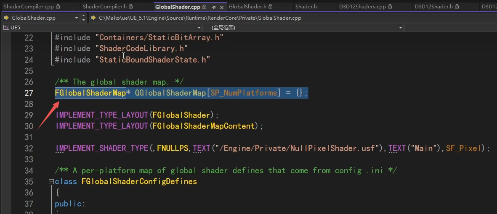

## FGlobalShaderMap

首先，这个FGlobalShaderMap管理者所有shader的信息。

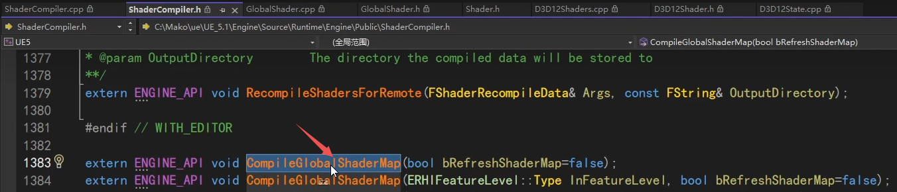

## 编译全局shader

引擎初始化的时候，会调这个编译全局shader的函数。

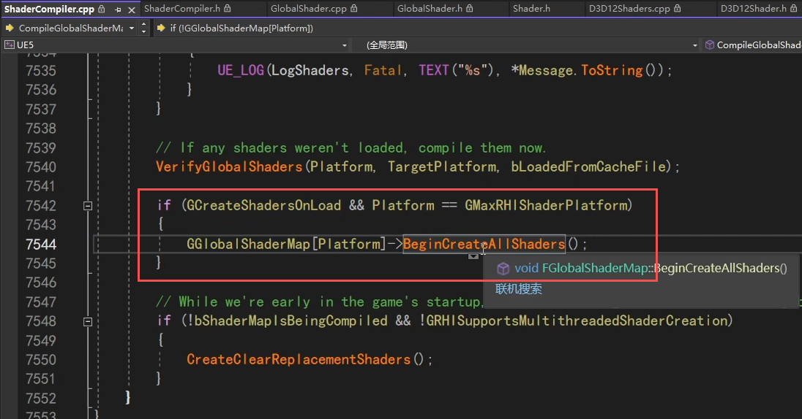

进入到里面，可以看到这个compile有两种模式。

1. 这里的if模式，如果配置了这个变量，那么在一开始，就会编译全部的shader。
2. 否则的话，在某个shader具体使用的时候，会去get，如果get不到，才会开始创建。

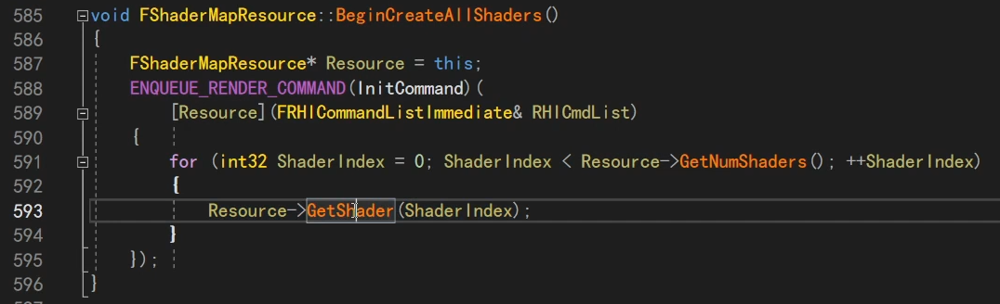

继续上面1）模式的7544行，会遍历所有的shader，get不到会触发创建。

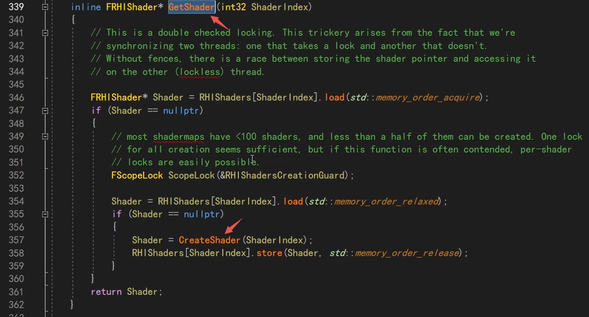

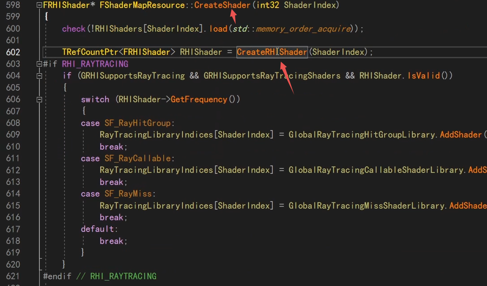

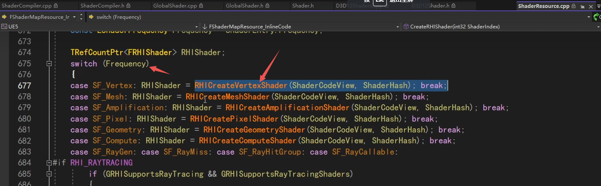

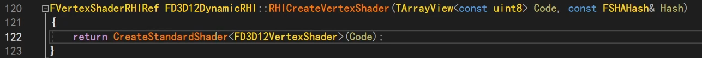

一直深入，就会到我们之前讲过的流程，到RHICreateVertexShader这种，再深入就会调具体的入D3D12和OGL的createshader流程。

对于所有的shader，比如这个FD3D12VertexShader，它都会继承这么一个XXXShaderData。

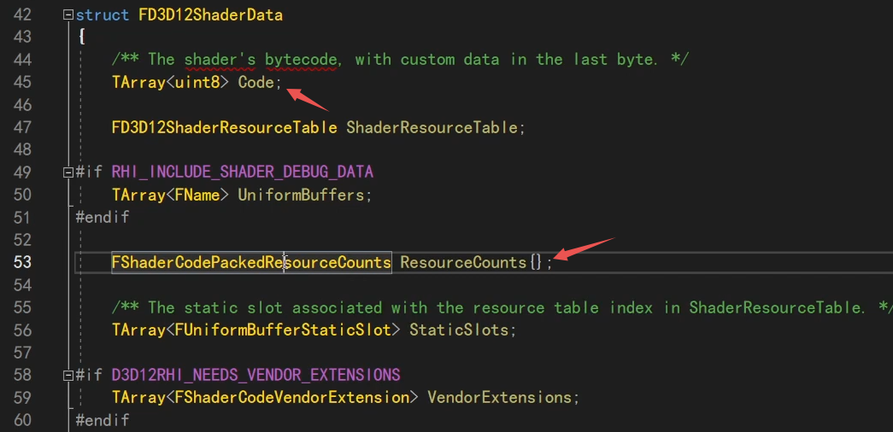

我们之前说要关注里面的Code。但今天，还需要关注另一个变量，就是这个ResourceCounts。

## Shder的Code和FShaderCodePackedResourceCounts

统计当前shader，用了多少个这种参数，比如NumSamplers、NumSRVs、NumCBs、NumUAVs。

这个参数的使用数量，是我们使用根签名时，需要的信息。先记住它FShaderCodePackedResourceCounts。

这个类的信息，是在CreateShader的时候，提取出来的。

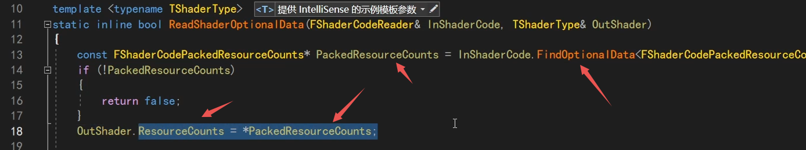

前面讲过，UE的这个Code里面不止是code，还有optionaldata，ShaderReader会读取Code+OptionalData，这里FShaderCodePackedResourceCounts就是那段optionalData。

那么这个参数，是怎么来的呢？其实是编译的时候来的。

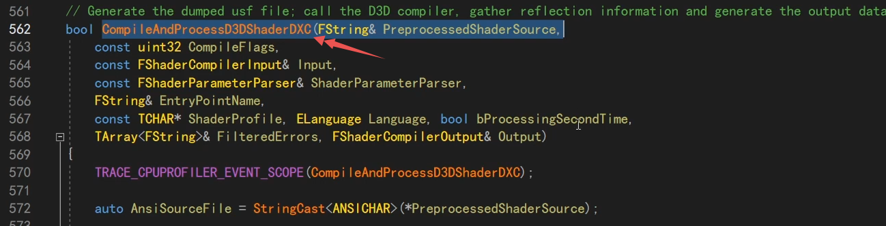

真正的编译代码在这，比较复杂。我们只关注一个东西。就是一个Shader着色器，它用到的参数是怎么来的？

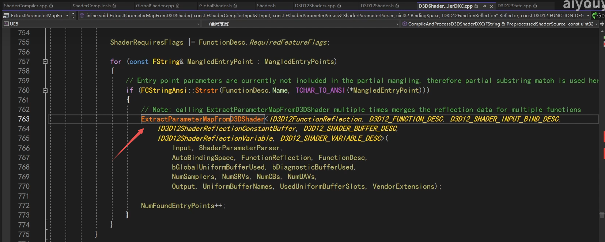

实际上，DX编译一段代码的时候，会包含所有的信息。不只是一个可执行的bytecode，它会存储这一段着色器代码所包含的所有描述信息。

这是DX本身提供的功能，虽然平时我们写简单的demo没用到，都是手工填的。

但实际上UE引擎，面对各种复杂的着色器，它能够去处理。只要你的shader代码是正确的，很多信息它都能去get出来。

在编译完代码后，就能拿到这些描述、反射信息，就是这些ID3D开头的。

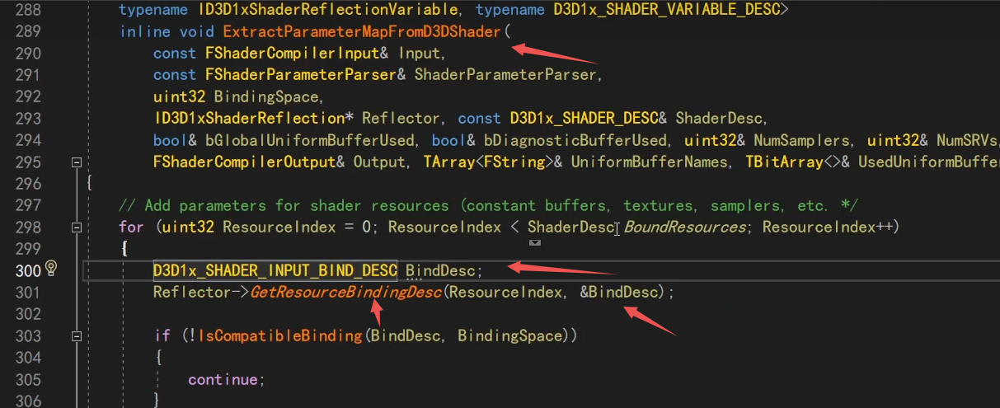

进入到函数内部，实际上就是这个BindDesc，你把它get出来，这个里面就存储着所有Resource变量的信息，通过for循环拿到处理。

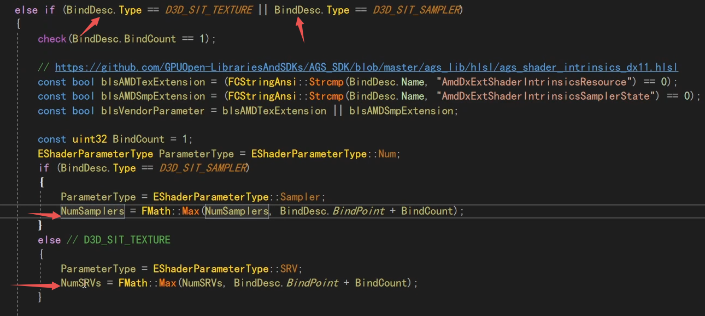

比如当Resource是一张贴图时，就通过BindDesc拿到它的NumSamplers、NumSRVs等信息。

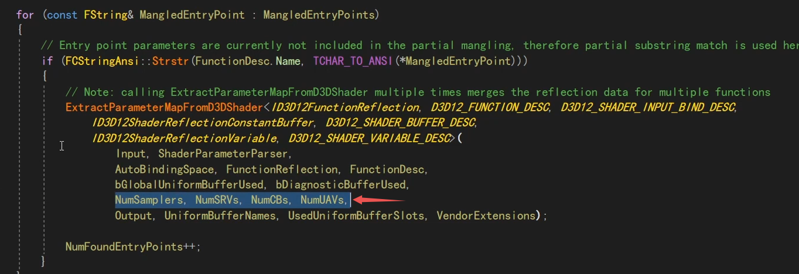

这也是通过这里反射的技术拿到的信息，在编译的时候拿完这些NumXXX。

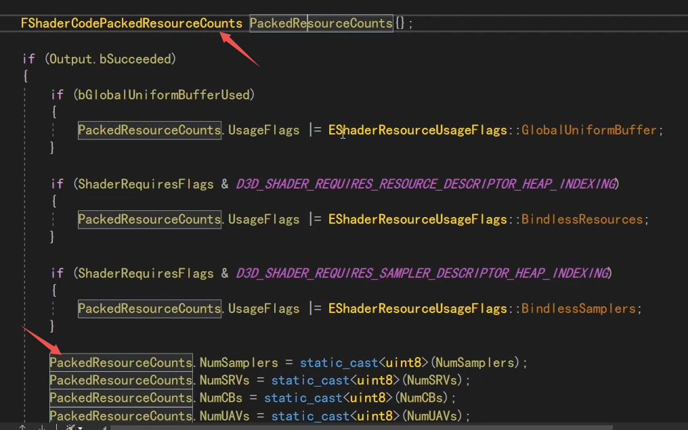

拿到之后，再在下面把它们组装起来，形成刚才前面说的FShaderCodePackedResourceCounts。

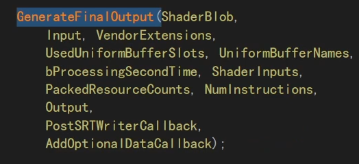

然后把他们拼接到代码Code里面去，生成。

这里拼接出来的Code，就会传到后面的RHICreateShaderXXX里面去。所以，那边就拿到了这些数量Num的信息。

所以，创建Shader的时候，就已经把这种每个Shader的数量创建起来了。（所以这种数量到底是啥？）

下一步，我们就到了创建pipelinestate和根签名。

## 根签名

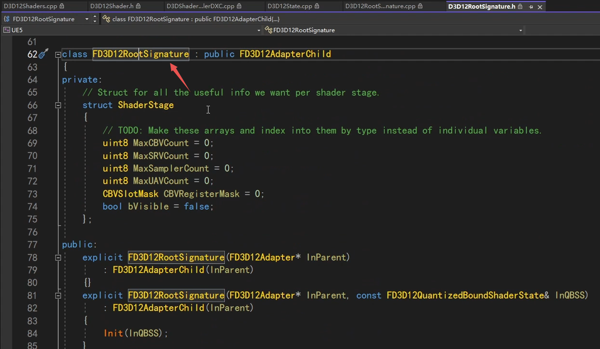

这个就是封装了D3D12的根签名。

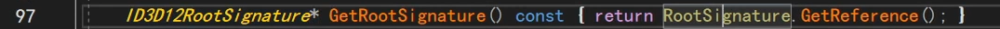

它当然包含着，真正的根签名。

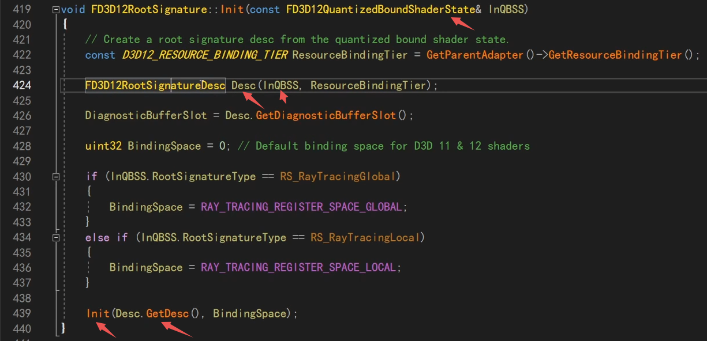

看它的构造，里面的Init。这个是shader里面的全部的信息包。就是一个流程里面，对应的所有shader全部的信息。

因为一个根签名，不止对应一个shader，你有顶点着色器、像素着色器，以及其他各种着色器。都会跟一个根签名拼起来。

那么这些shader的信息，会放在这个FD3D12QuantizedBoundShaderState信息包里面。

它会用这些信息，去构建一个Desc（这个desc几乎就已经是真正的那个desc了，这句话？），然后去初始化Init。

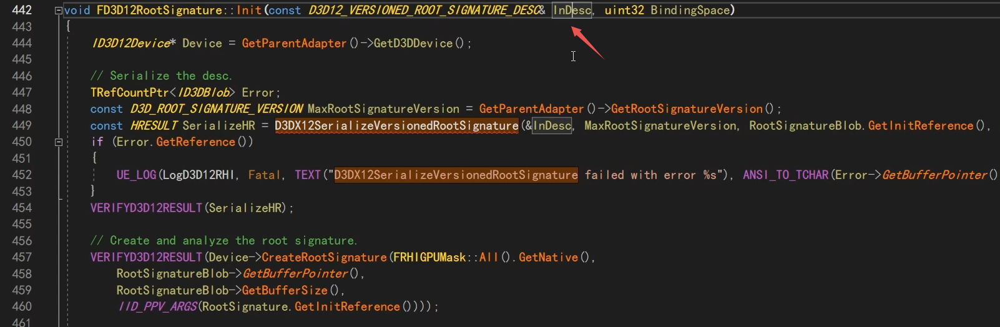

它已经构造出那个真正的decs了（也就是这个宏的意思）。

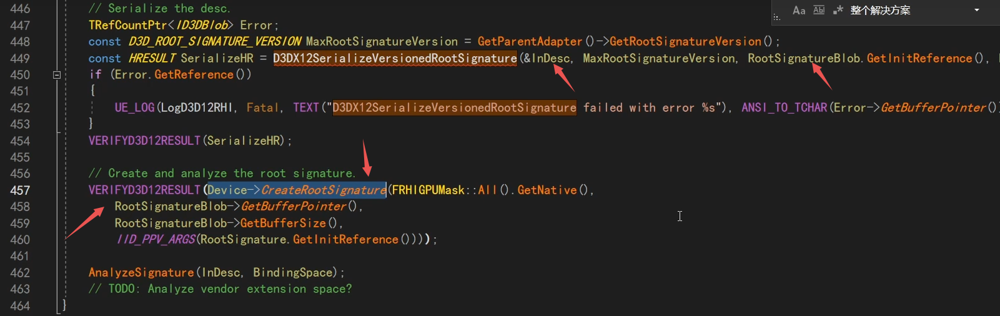

然后用这个真正的desc，拿到blob，然后去调D3D12原始接口的CreateRootSignature。

## FD3D12QuantizedBoundShaderState Shader信息包

## FD3D12RootSignatureDesc

那么重点是这个FD3D12QuantizedBoundShaderState信息包。

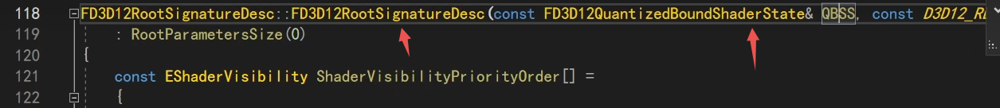

我们来看desc的构造函数，它使用信息包作为输入。

这个信息包，就包含了所有shader的参数的信息。

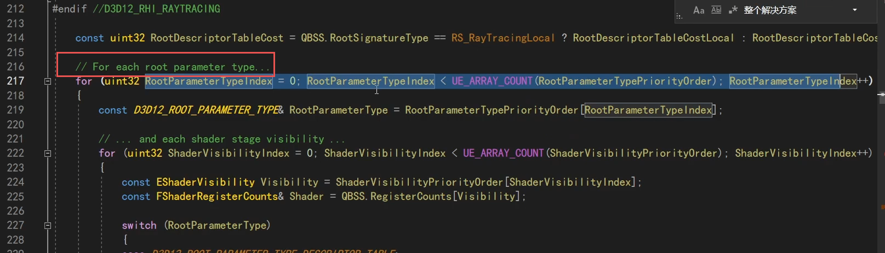

D3D12创建根签名时，就是要先搞一个描述parameter。这里就是根据传入的参数，搞一个for循环，然后每一个去创建一个ROOT_PARAMETER。

这个

ROOT_PARAMETER的type在UE中有2种。

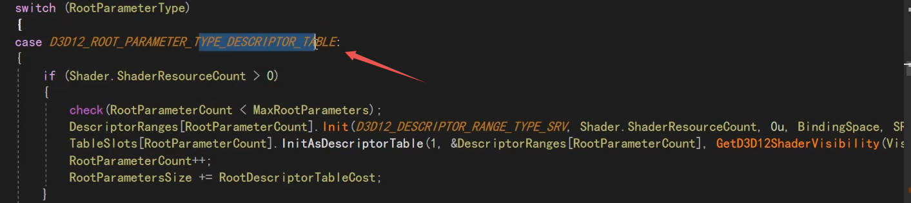

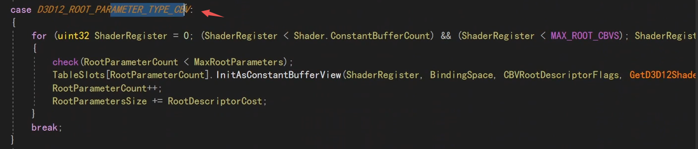

要么是descriptor_table，要么是const buffer（CBV）。

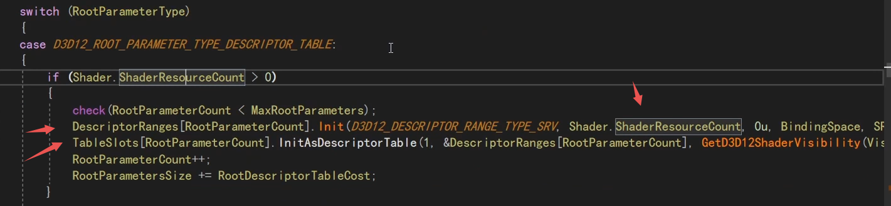

比如第一种，这里就用到刚才的数量。因为一个信息里有多个shader，注意创建DescriptorRanges那两行。（这没讲清楚，但在D3D12应该比较常见）。

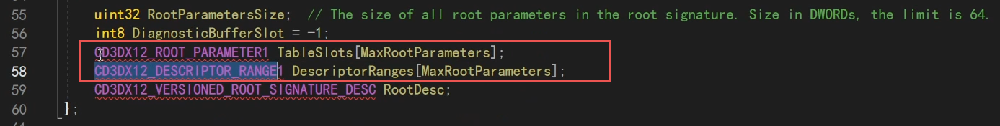

这是D3D12里面，最熟悉的2个类（虽然我不知道？）。

然后创建这堆数量，并计算参数的数量。

最后这个描述符desc，就用来创建真正的根签名。

## FD3D12QuantizedBoundShaderState 所有shader的信息包

刚说完了desc，我们继续看它是怎么构造出刚才前面，每一个shaderdata的那个数量。

那就需要看pipelinestate，我们跳到创建pso。

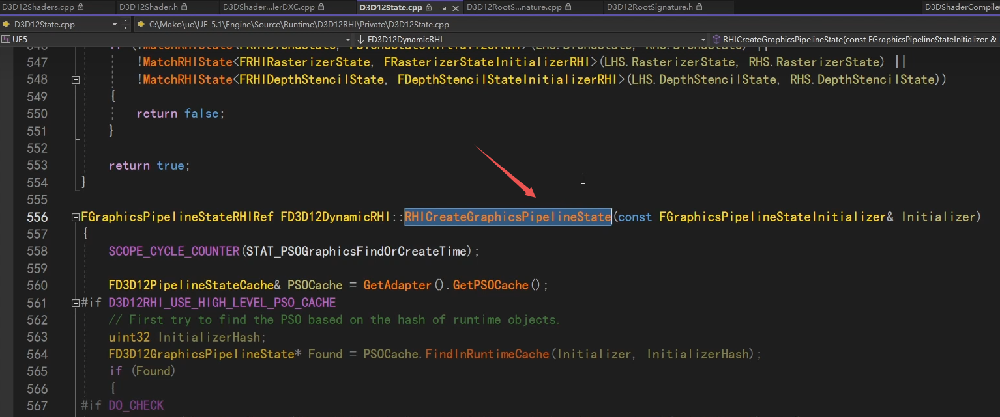

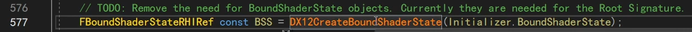

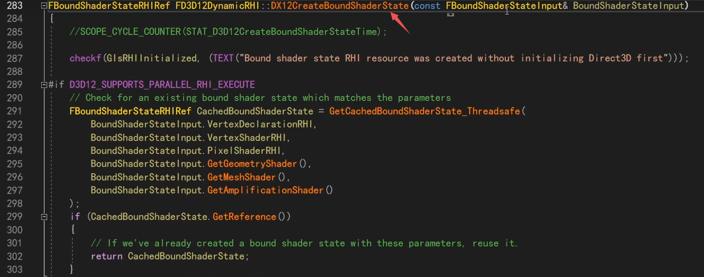

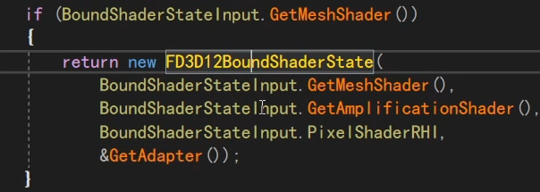

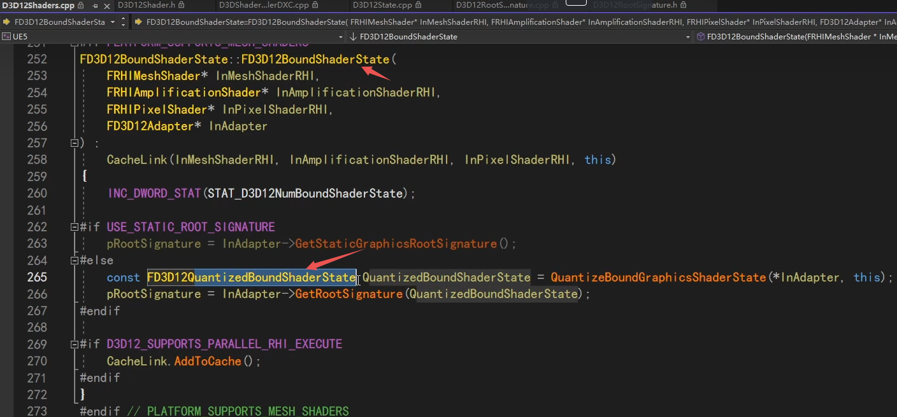

一路从创建pso深入，到这可以看到这个信息包，就是用来创建根签名用到的参数。

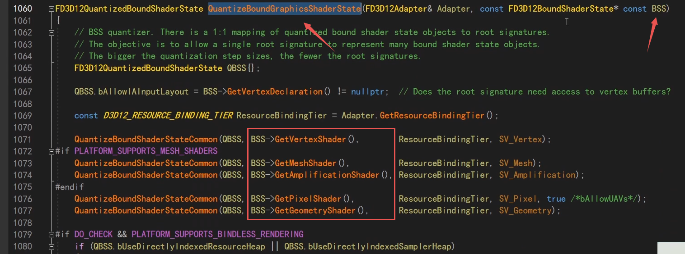

17:36
