今天看渲染命令的封装思路，包括RHI的以及底层D3D12的，RHI的比较简单，重点是D3D12的。

## RHI层面的Command

这是RHI的基类，Next指针是为了形成链表，链接下一个command，下一个command...

另一个虚函数，具体去执行RHIcommand的方法。因为有不同的类型的渲染命令，所以用虚函数。到真正的子函数去执行。

下面马上就可以看到一个辅助子类，模板类，可传一个lambda存起来，执行的之后就执行这个lambda，然后释放。

有它后就可以轻易的把lambda传入，构成一个渲染命令。

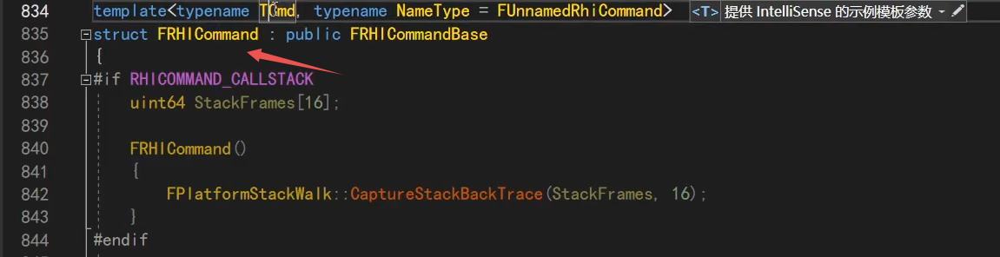

## FRHICommand

此外，还有另一个类FRHICommand继承Base。

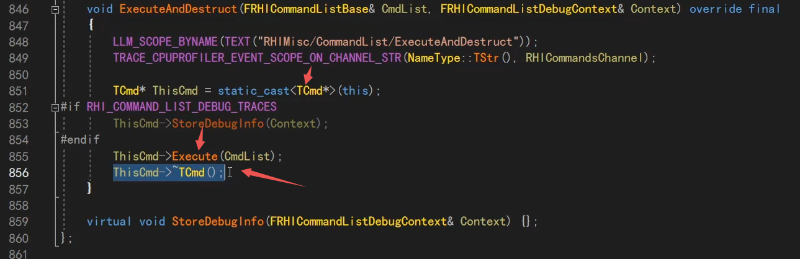

它也是传一个TCmd的模板参数进来，然后Execute。

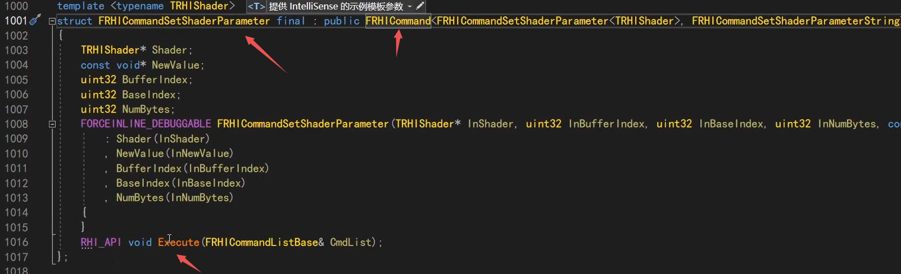

然后我们看具体的，比如这个setshader的类，继承FRHICommand。

它报错了一些必要的参数，比如shader，index等。

然后它主要去实现Execute类。

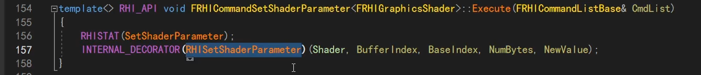

主要就是去调用RHISetShaderParameter。就真正去调到RHI里面的函数，然后就会调到底层具体子类的D3D12、OGL的实现。

在子类中，真正的去触发渲染命令。

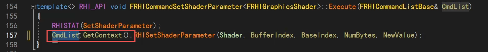

刚才上面的宏展开后是这个。

CmdList是命令的链表，就是开始说的，把command组装成一个链表的那个类。

上下文，你执行一些命令，有时候需要不同的上下文，不同的状态，在不同的地方，用哪个commandlist去调用参数。context里面就是对应的这些信息。

context在D3D12里面，也是有具体的子类去实现的。

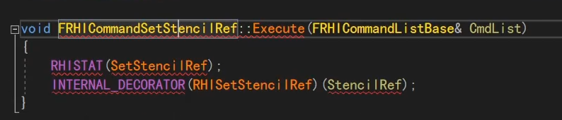

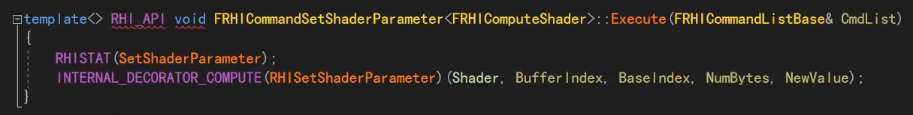

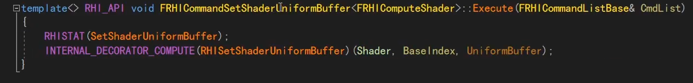

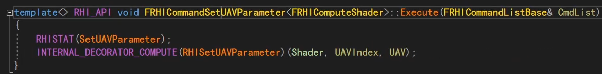

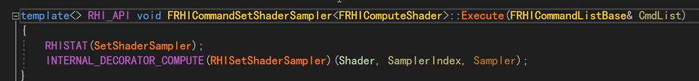

这里面有几百行，各种各样常规的渲染命令，FRHICommandXXX，都作为FRHICommand的子类。

## FRHICommandList命令链表的组装

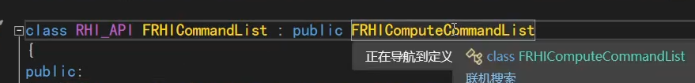

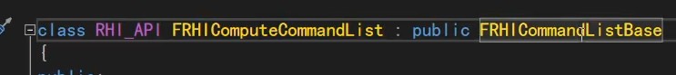

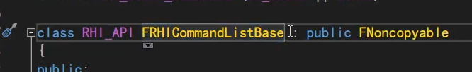

然后我们看FRHICommandList，看到继承最里面的Base，这就是刚才将command组装成链表的类。

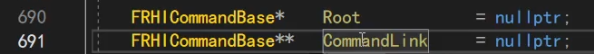

这里我们关注2个成员：

Root是记录整个命令链表的第一个命令。每一个命令都有个Next，最开始我们看到过。

CommandLink是二级指针，是最后一个命令的Next的地址，这是为了添加新的命令用的，添加时set到这个next。

如果没这个指针，那每次添加新命令，就要从root遍历到尾端，就需要遍历一次。

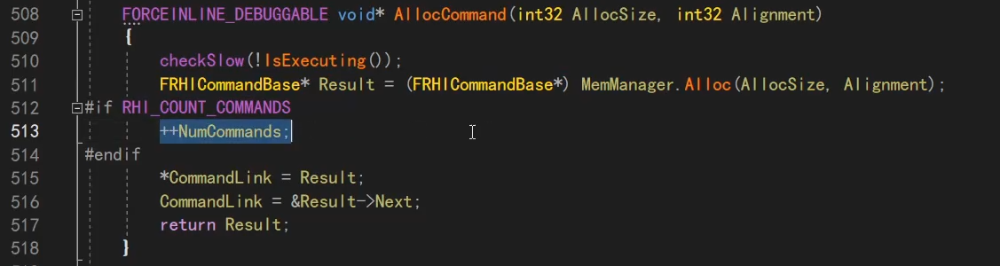

再关注几个关键的方法：

alloccommand，从内存申请命令，然后记录+1。

515、516行，就是在添加新的命令，并通过commandlink链接起来。

调这个函数，自动就串起来了。

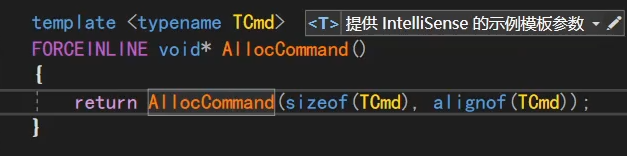

还可以直接传命令，这种形式去申请。

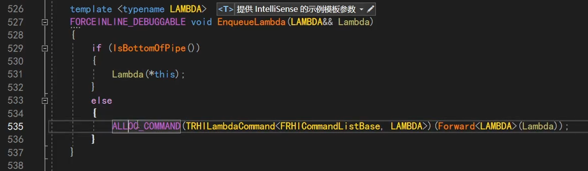

还有这种形式，比如我们常见的EnqueueCommand的之类的。就传入一个lambda，if是立即执行的模式（？），一般走else。

然后去新建一个lambda的模板类，也是命令base的子类（最开始有提到）。

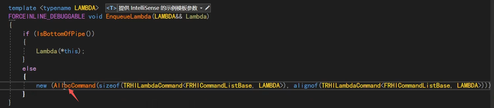

然后这里宏展开也是调AllocCommand。

所以调EnqueueLambda的时候，也是自动就把命令加入了命令链表。但要清楚，GPU还没有执行。

## FRHICommandList命令链表的执行

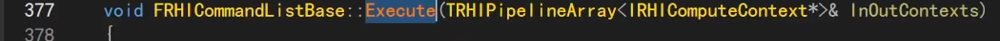

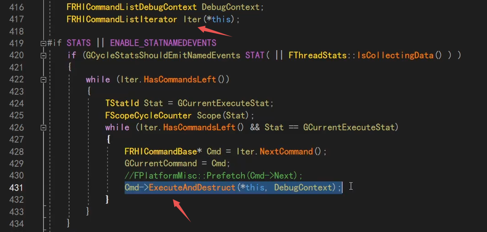

定义了一个迭代器，然后while循环，去不断执行每个命令。

## CommandList命令链表的其他子类 Compute

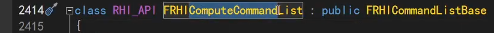

还有些其他的类，继承命令链表Base。比如这个用来定义计算着色器相关接口的类。

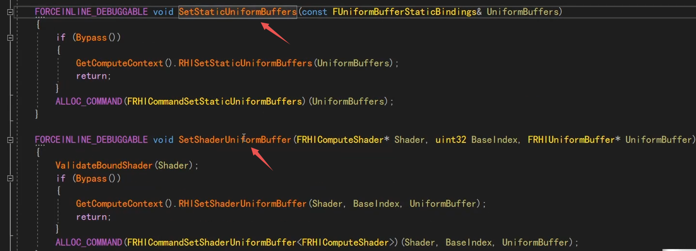

它会加一些常见的接口，比如setuniformbuffer等。

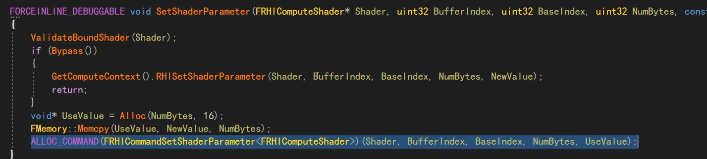再比如它setshaderparameter，也是把命令放到命令链表，而不是真正执行gpu。

真正的触发，还要掉execute。

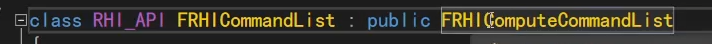

继续看计算的子类，又到了FRHICommandList，它是图形相关的。

而compute一般就不是图形的，而是计算相关的。

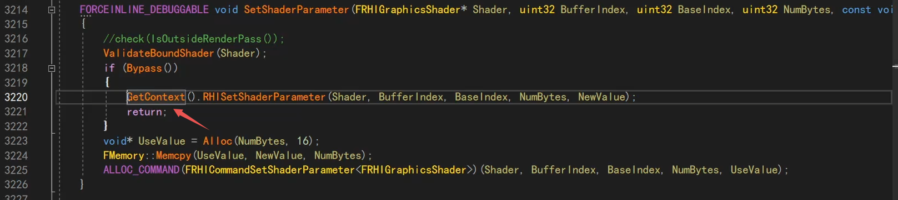

题外话，我们留意到，一般很多函数是通过这个context去调。但我们之前也经常见到dynamic调到。

dynamic：D3D device直接定义对应的操作，和上下文没关联。

context：D3D12的所有操作，都是一个commandlist对应的方法，这种就会通过context去调用。

大部分时候，都是调context里面的接口。

## CommandList命令链表的其他子类 Immediate

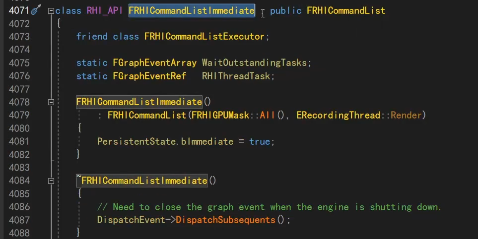

立即执行的类，不是等一下再操作，而是立刻就操作。

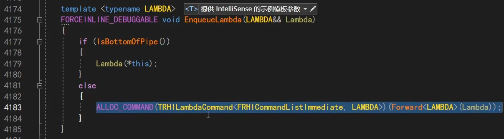

里面也是这些东西。这个EnqueueXXX是最常见的。

## Context相关类

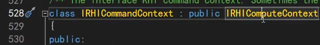

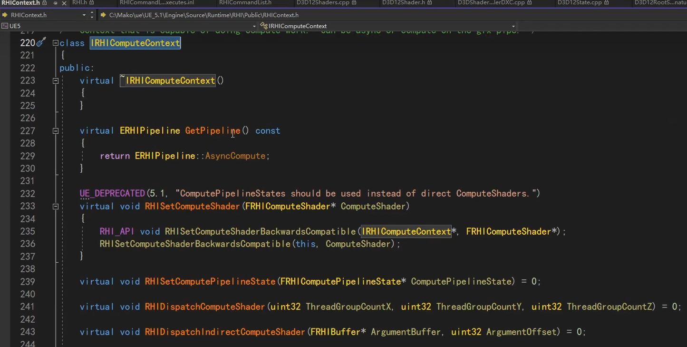

compute就是计算相关的，而非图形相关的。

command就在基础上，定义了更多，都是图像Graphic相关的。

都是一些RHI相关的操作，当然真正的操作都是在D3D12等里面去实现的。

## 阶段总结

RHI层面，本质上来说，所有东西都在commandlist里面，commandlist里面也有一个context，有的是在dynamicRHI里面定义的。

比如create等操作，就是dynamic定义的，因为是和device有关，上下文无关的。比如create一个texture，create一个pipeline state。

但比如设置一个shader的参数，你是去哪个pipielinestate里面去设置哪个commandlist，在D3D12的commandlist里去设置这个，那就是有不同上下文context的。

不管是context，还是dynamic，都收拢在commandlist链表或者说队列里面，记录着所有的command，然后command的子类，就是调用这些方法。

但是这是RHI层面，在D3D12里面，还有一层封装。

下一讲继续。

