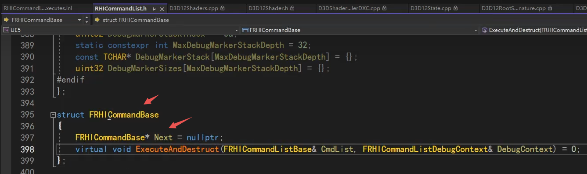
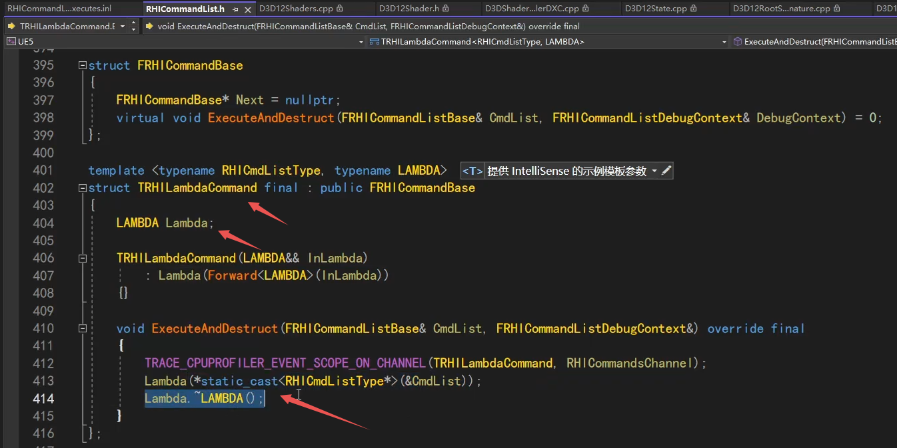

今天看渲染命令的封装思路，包括RHI的以及底层D3D12的，RHI的比较简单，重点是D3D12的。

## RHI层面的Command

这是RHI的基类，Next指针是为了形成链表，链接下一个command，下一个command...

另一个虚函数，具体去执行RHIcommand的方法。因为有不同的类型的渲染命令，所以用虚函数。到真正的子函数去执行。

下面马上就可以看到一个辅助子类，模板类，可传一个lambda存起来，执行的之后就执行这个lambda，然后释放。

有它后就可以轻易的把lambda传入，构成一个渲染命令。

2.11