今天继续渲染命令的封装，D3D12层面的。

## FD3D12Device

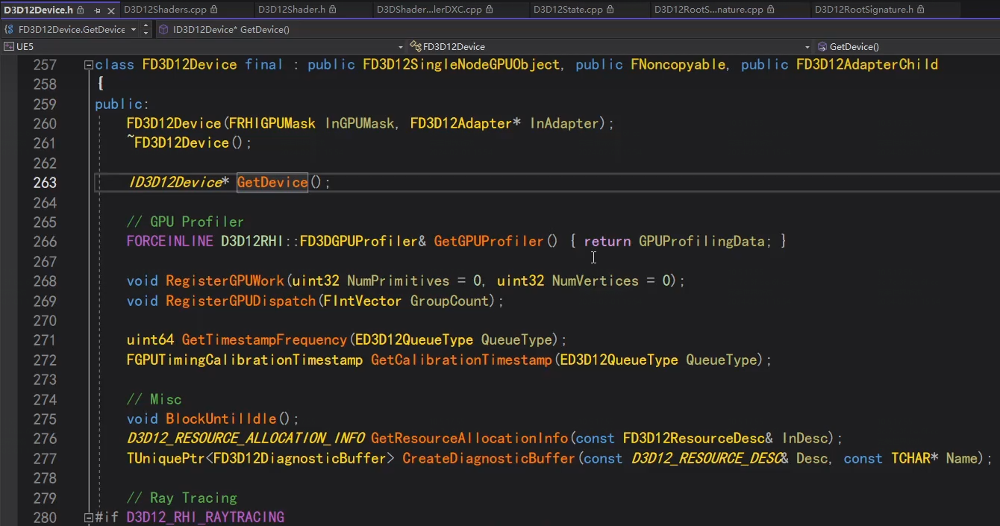

D3D12的一切都从device出发，我们看FD3D12Device，device存在263行的GetDevice里面。

d3d12的一些关键的要素。

commandqueue

commandlist，如设置顶点、索引的buffer，要调commandlist的setvertexbuffer

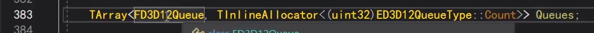

那在FD3D12Device里，就有这个queue。

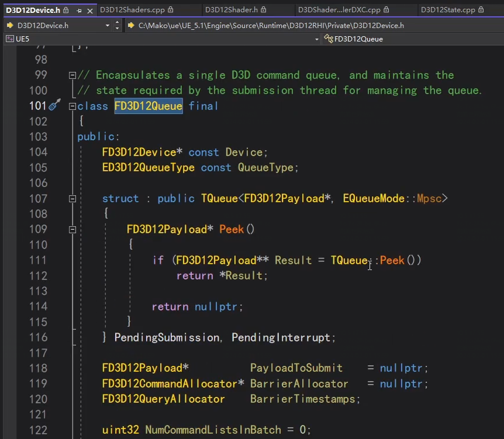

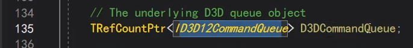

## commandqueue 3种

FD3D12Queue它就是对应封装d3d12的commandqueue。

而FD3D12Device里面的Queues，不是一个queue，而是3个数组，枚举值区分。

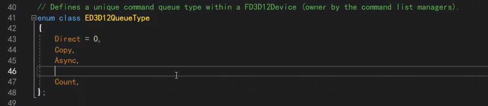

一个device对应3个queue，用来做不同的操作。

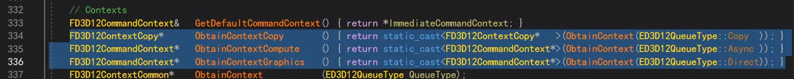

比如上节说的context，不同的操作就有不同的context。

常见很多graphic的操作，都是调Direct。

此外，最上面还有个单独的context，immediate立即执行模式。

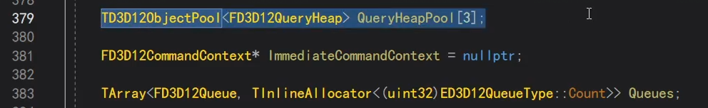

这个heappool也是3个，官方甚至直接就填3了。

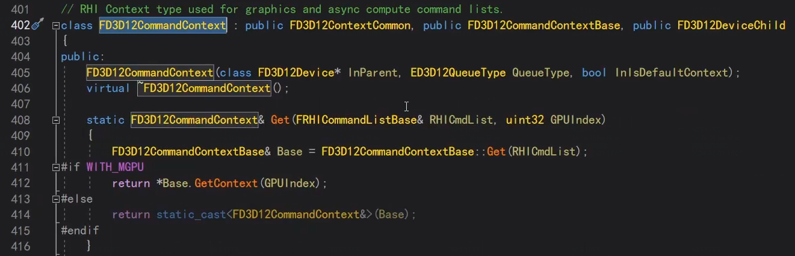

## FD3D12CommandContext

那说到context，我们又来看context的类有什么。

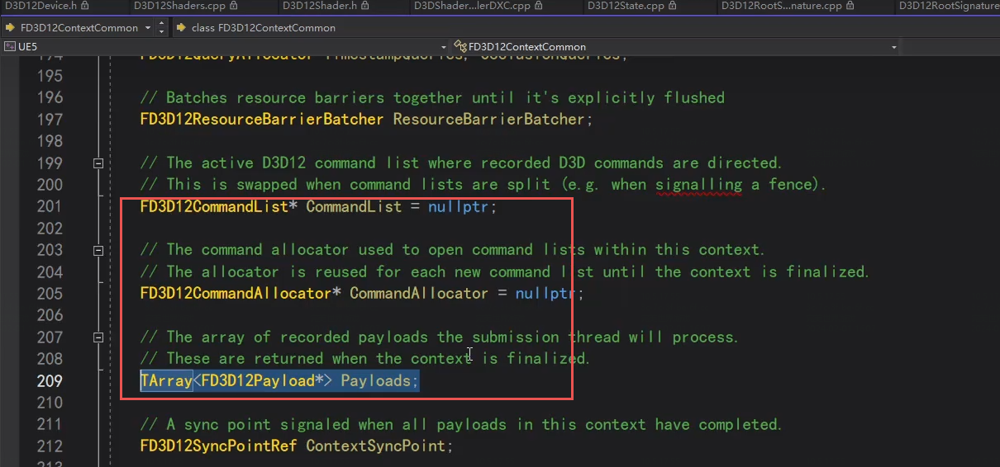

可以看到一个context里面，就对应这一个commandlist，一个commandallocator，一个payloads的数组，一组工作，这个也很重要，稍后再看。

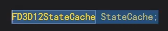

此外，还有个statecache也重要。即使在RHI里面调了execute，也不是立即执行，和这个有关。

## FD3D12Payload

我们先看payload。

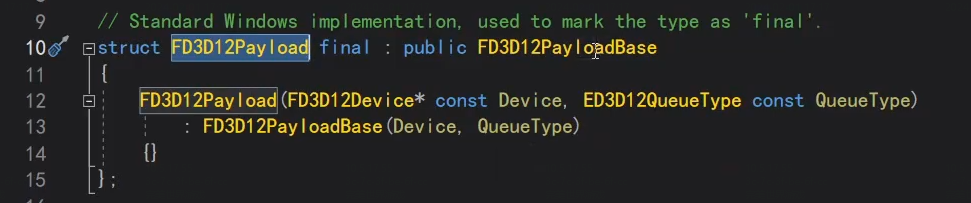

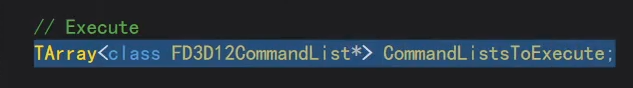

里面有个缓存的链表的数组，是先缓存起来，后面再去执行。

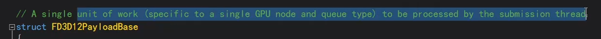

payload就是gou要去执行的一个work。

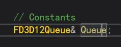

有个queue，到时候去哪个queue执行。

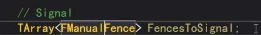

还有些fence，执行命令要等待的操作。

## FD3D12StateCache

再说StateCache。

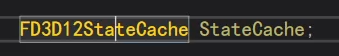

整个渲染管线有很多状态，比如光栅化的状态，stencil的状态。可能反复设置了很多次，但没有立刻执行，而是缓存。

上层很多set状态的操作，底层只是缓存起来，最后一次性设置。

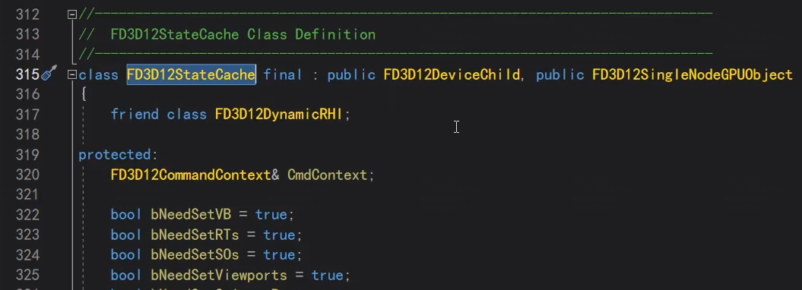

这里缓存了很多信息。

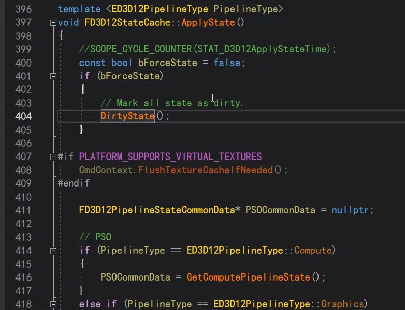

这个apply负责去执行。先标记dirty。

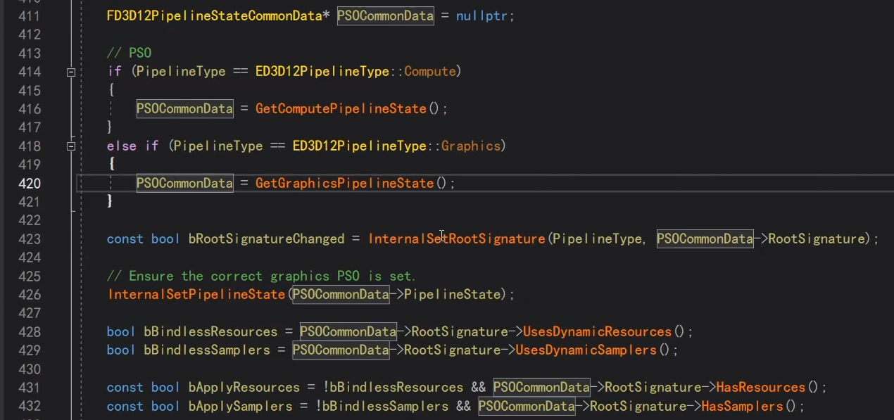

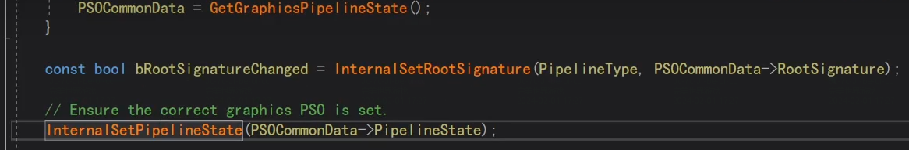

然后拿出compute或graphic信息，然后设置根签名（上次讲了根签名）。

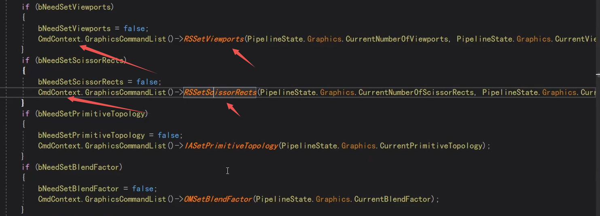

到这取context的commandlist，才是真正去d3d12的commandlist去设置。

这有很多set。

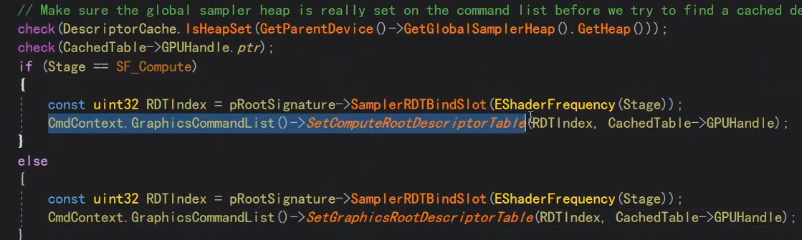

还有这些。

即FD3D12StateCache有2层结构，第一层保存，第二层apply真正去调d3d12实现。

基本上是把渲染管线所有的东西都缓存起来，包括shader、根签名、uniformbuffer，srv......

## 阶段总结

一个d3d的device里面，有3套context，copy async direct，你这个操作是在哪个上下文去执行的。

在一个context里面，就有这些变量，比如statecache。

## d3d12commandcontext

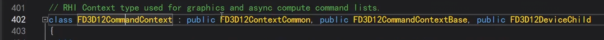

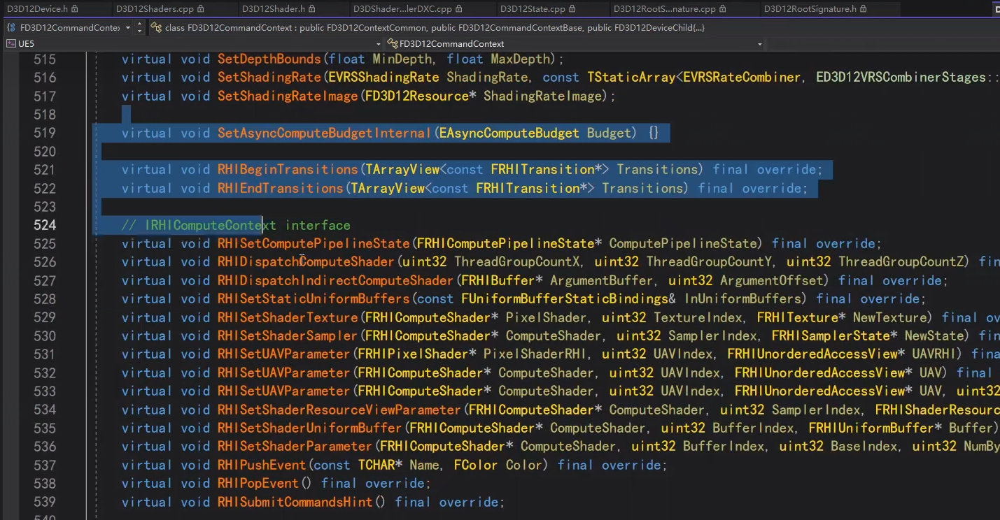

回到d3d12commandcontext这个类，我们说在RHI层面的context，定义了很多操作，在d3d12里面去实现它。就是这一堆。

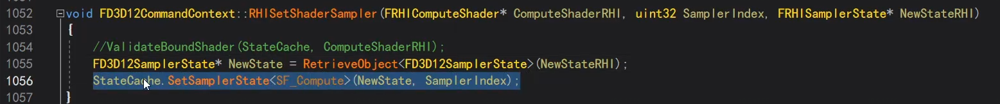

但是我们点进去看，其实d3d12context这的实现，也只是设置到statecache里面。所有操作都是这样。

RHI的角度其实不用管，execute了，就认为执行了。

## RHI提交线程 D3D12真正执行线程

但d3d12里，又设置了一套，因为它是在单独的一个线程去操作的。

RHI渲染render线程：调用了各种RHI的命令，最终提交到D3D12里面缓存了。

而D3D12的那个线程：每一帧去apply一下，去真正的执行。

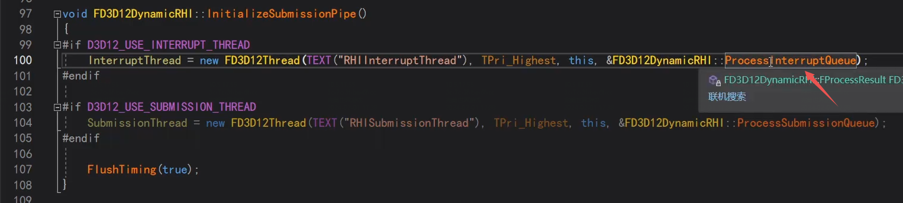

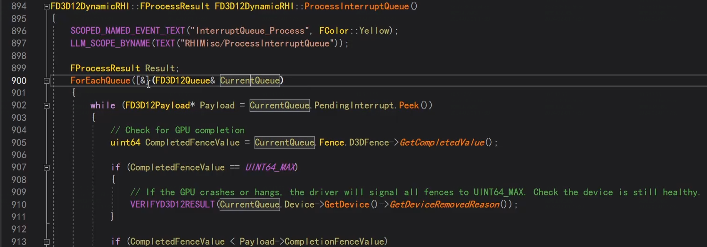

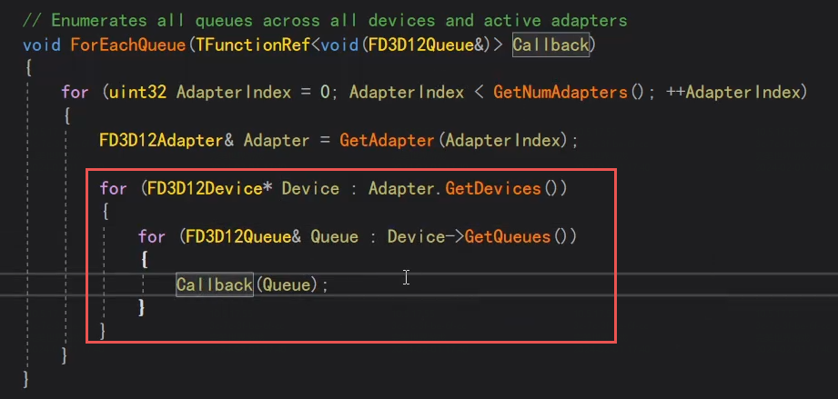

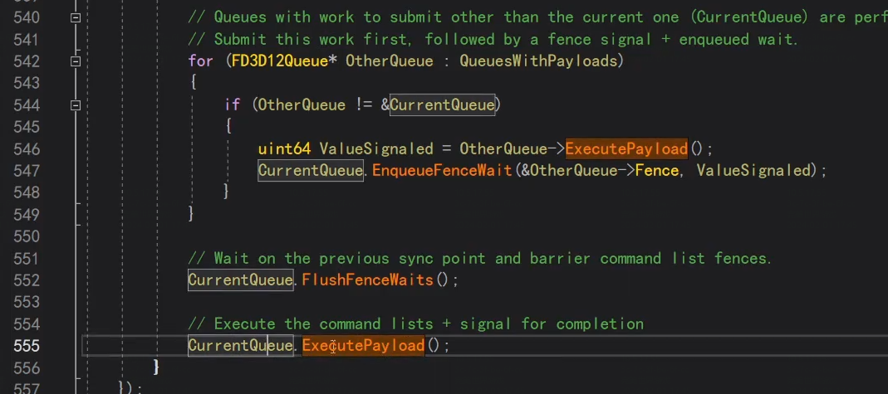

每一帧执行一次process，每次遍历所有device（有多个？），每个device里面有3个queue，然后去执行。

实际上就是去拿出queue里面的payload，我们之前说payload就是组装了一组的commandlist，是一个commandlist数组。

然后去execute这个payload。

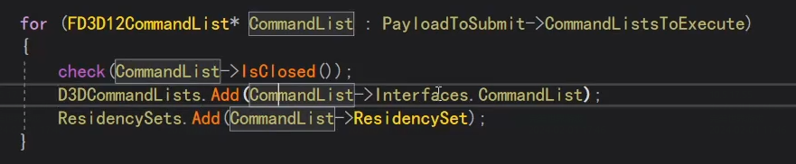

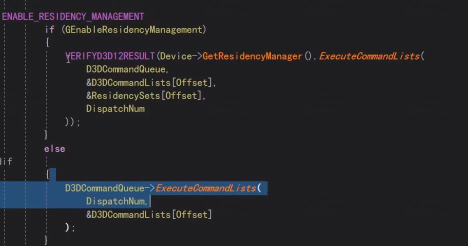

最终一个payload，就是一个commandlist数组，一个for循环取出来取执行。

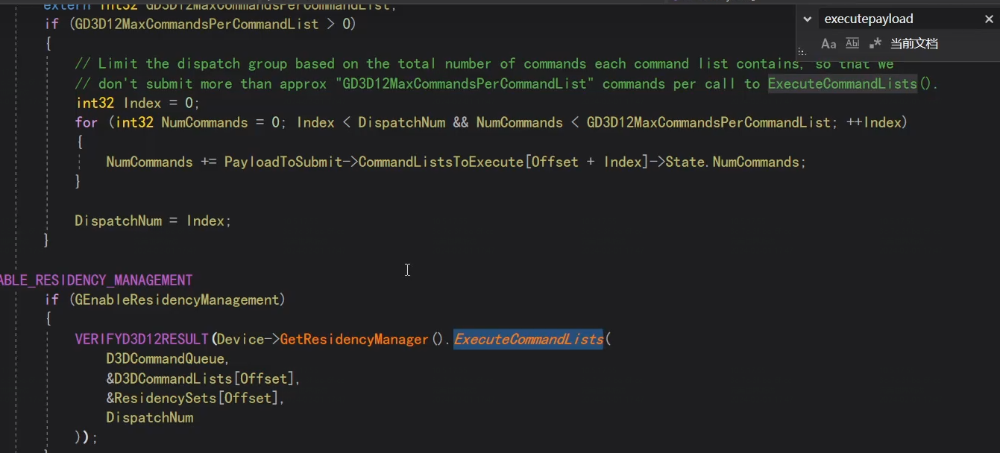

插一句，这里注释说了，如果一次提交的commandlist太长，gpu会不支持，不会一次性执行，会分批次。通过offset记录位置。

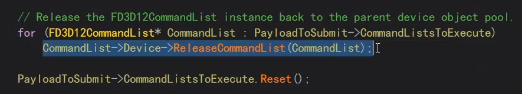

执行完后，会release。

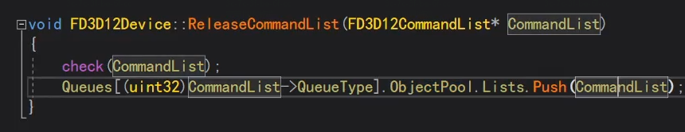

但不是真正的release，而是放回到queue的一个池里。

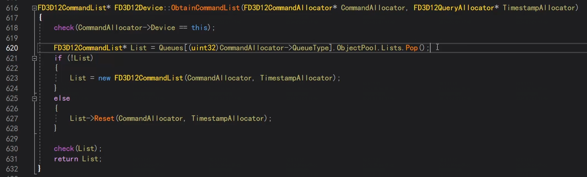

需要新的payload时，重复利用。

## 阶段总结

初始化的时候，新建一个D3D12的真正执行线程，d3d12里，每个device对应3个不同的queue，以及3个不同的context。

RHI渲染线程：当RHI上层去提交setparam时，它只是把commandlist，对应状态存储到context的statecache里。

D3D12真正执行现场：每帧process遍历所有device，遍历每个device里面的3个queue，遍历里面的payload，把payload里面的commandlist数组拿出来，调statecache的apply，一次执行。

这一讲继续是RHI层面和D3D12层面命令的大体思路，后面我们看上层怎么一步一步组装，变成一个渲染的pass，以及多个pass怎么实现渲染的流程。