之前讲了RHI层面和D3D12层面，对渲染命令的封装。今天讲上层逻辑对这块的封装。

把绘制相关的命令，和整个涉及到的相关信息收集起来，形成一个通用的数据结构，然后转换成RHI层面命令的调用。

## FMeshDrawCommand收集场景信息

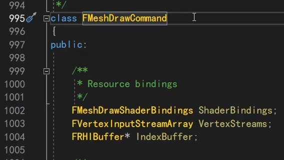

上层主要就是这个类。

主要收集：

整个渲染管线的所有设置，即pipelinestate，光栅化，stencil，vsps着色器等。

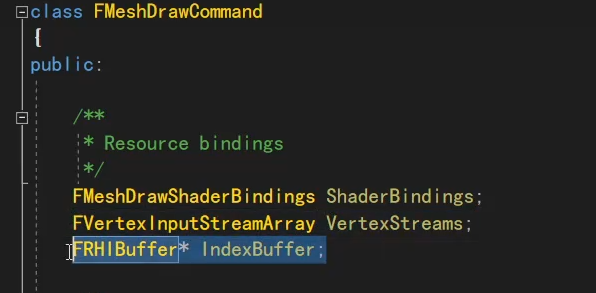

比如这里，着色器相关的shaderbinding，顶点的，索引的。

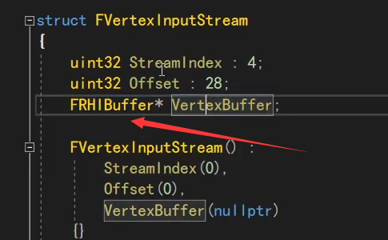

比如从vsbuffer点进去，都是些简单的数据结构，然后就放的RHI的buffer，这就和RHI对应上了。

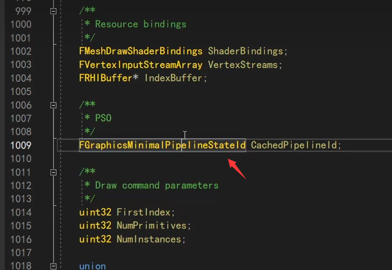

然后这就是pso的所有信息。

下面是一些三角形的信息。

等等......

这个数据结构，FMeshDrawCommand就包含了所有的渲染所需的信息，实际上UE的渲染，一个关卡场景，就是把所有的模型、组件的这些信息收集起来。

包括那些静态、动态模型，都会收集起来生成它。

## 收集好后SubmitDraw

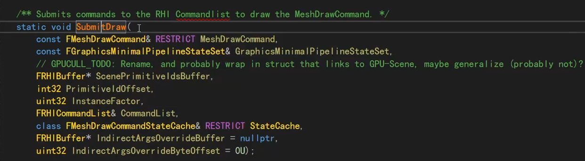

收集了场景所有的信息后，就通过这个submit转译到RHI层面的命令调用。

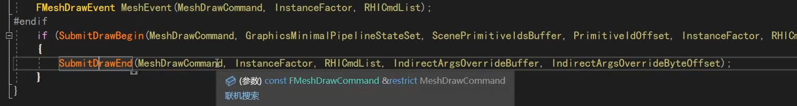

它是个static函数，里面主要就是2步。

begin就是全部设置进去，end就是真正的draw。

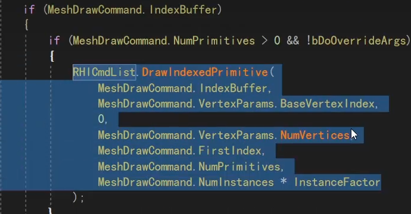

## end是真正的draw

先看end，就直接是调RHI的DrawIndex，这就没什么好说的。

然后begin，就是全部的设置和转换，包括pso，stencil，vs输入、ps，uniformbuffer、sampler、srv、纹理图片texture等。

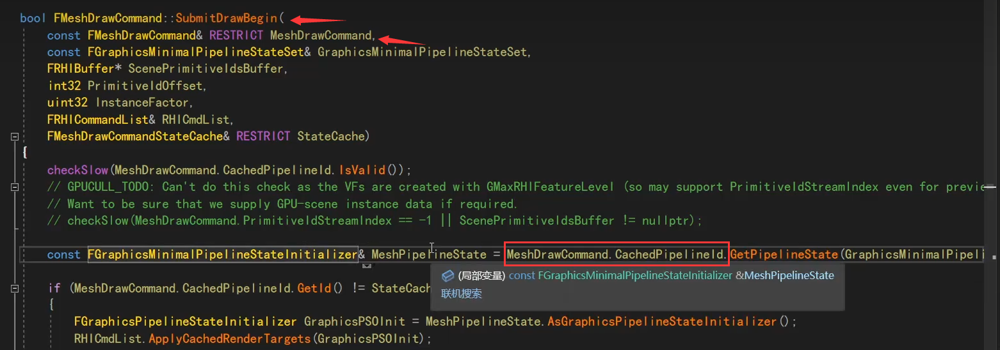

## begin setpso

我们看begin，比如上来就是pso。

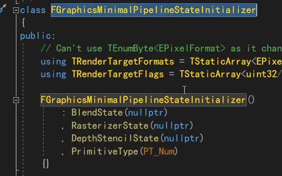

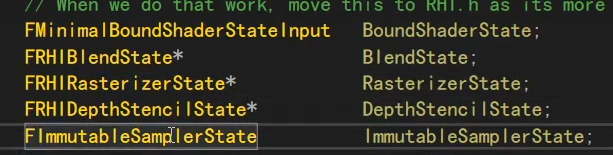

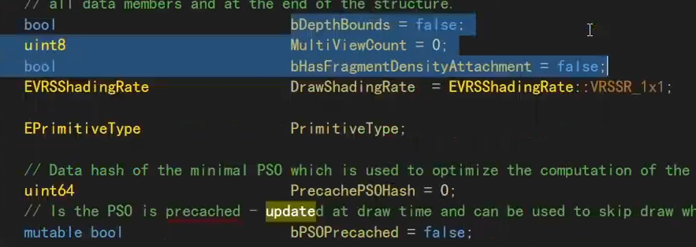

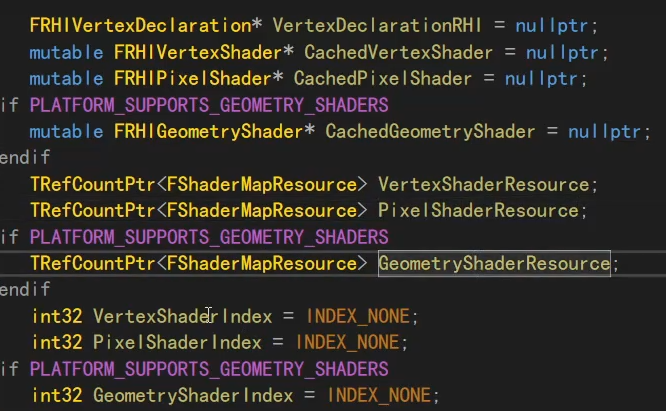

pso里面就包含了这些信息，整个渲染管线的所有的相关的数据。

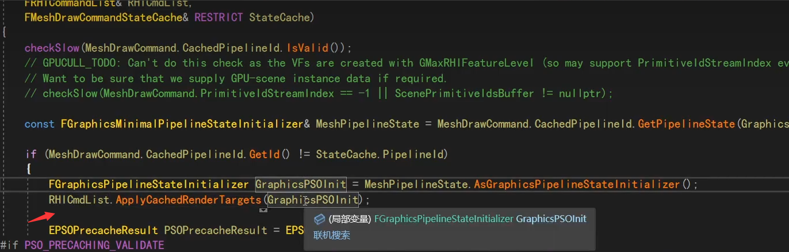

commandlist缓存的信息，填充到pso里面去（？）commandlist当前的一些状态，拿出来。

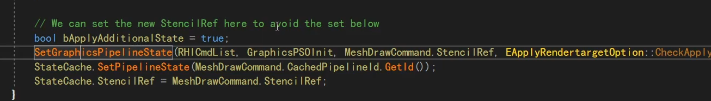

最后就setgraphpipelinestate。这个是在地图渲染里见过的。

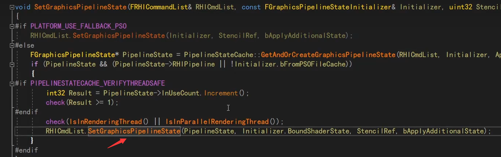

就是调RHI的setpso。

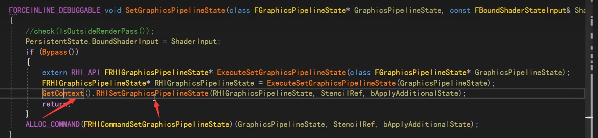

然后就到context的setpso，这就到平台层面的pso了。

## begin set stencil vs等

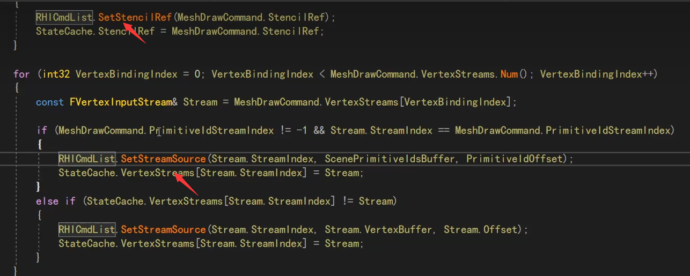

上面set pso是第一步，然后就是stencil，vs数据等，通过set stream source。

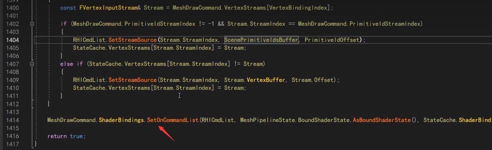

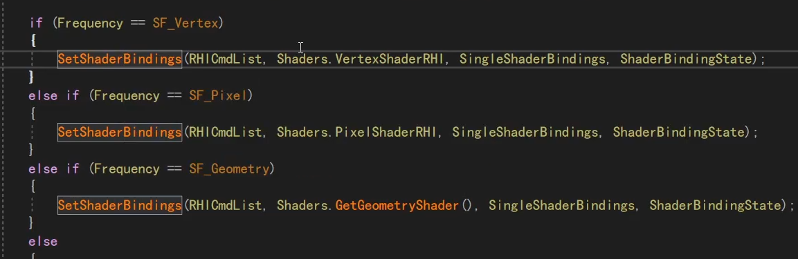

然后最后这个，setoncommandlist，点击去就能看到，和shader相关。

所以一共就是这些，上层把这些收集起来传到RHI，然后RHI层面又有一套传到D3D12，那边又是通过一个上次讲的statecache收集起来，最后一次性执行。

## FMeshDrawCommand怎么来的

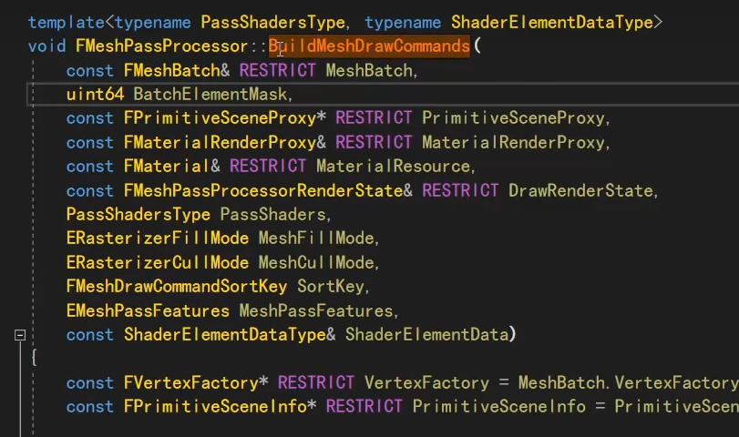

有这么个buildmeshdrawcommand函数，根据收集到的FMeshBatch的数据，这个函数讲其转换成meshdrawcommand。

1. 收集meshbatch。
2. 转换成meshdrawcommand。

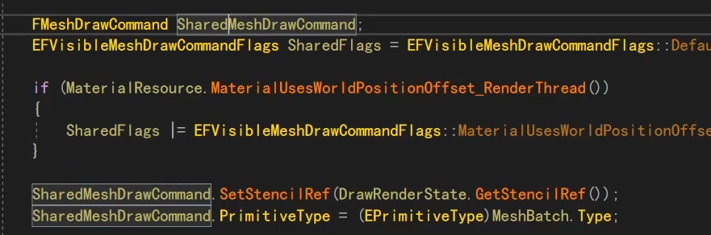

一个mesh可以有很多个command，它先收集公共的。

15.12

