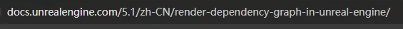
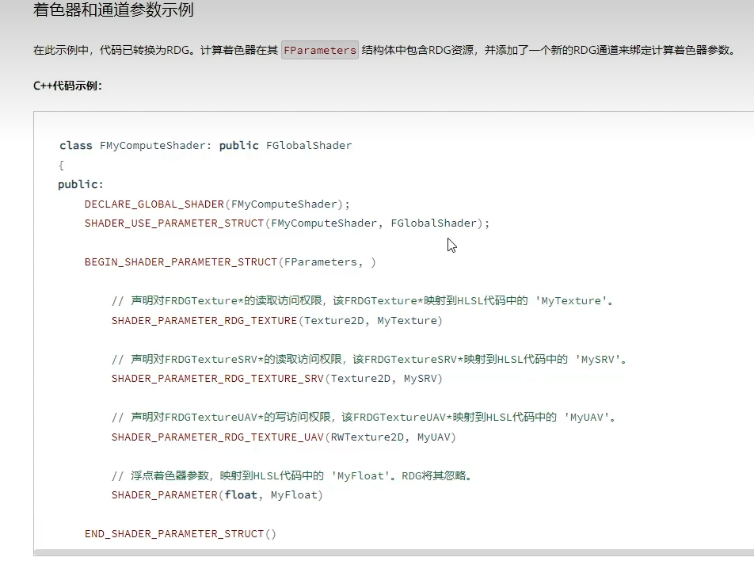
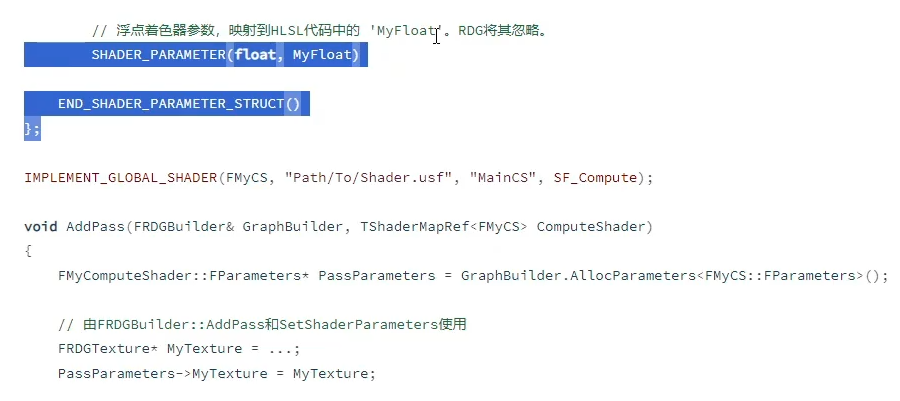
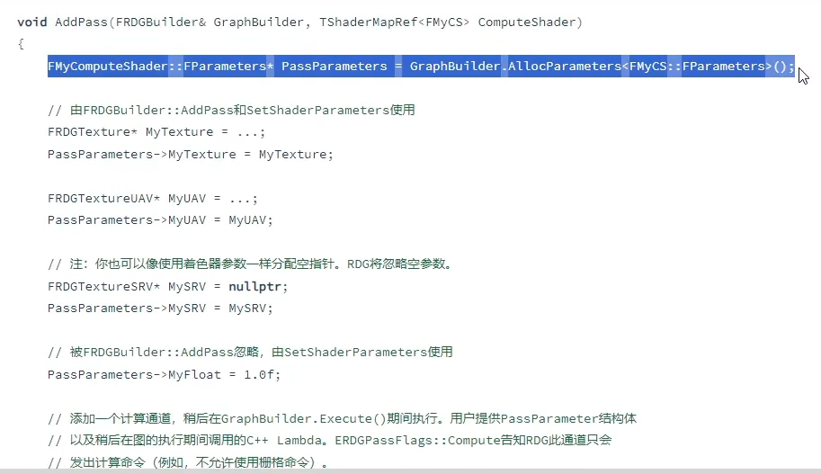
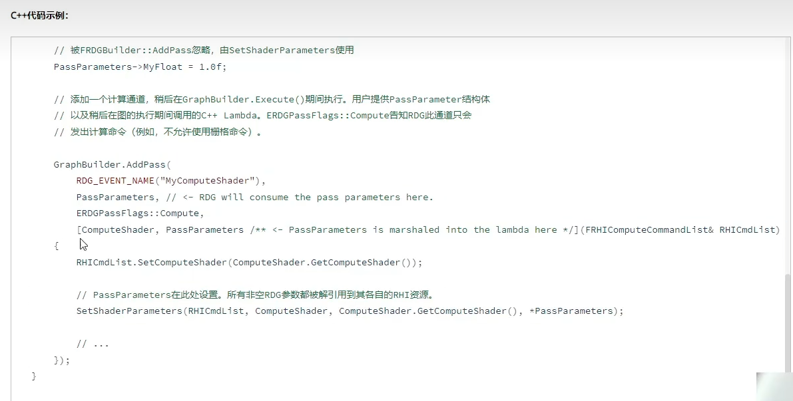

今天讲RDG。它是一个优化的技术。

## PASS的概念

前面讲到，把各种渲染命令组装到一起，多个RHI命令组成到一起，完成某个功能，就形成一个pass。

比如渲染一张深度图，比如复制一张纹理，或者比如进行光照的某个计算。这样的一组RHI的命令，就是一个所谓的pass。

一个完整的渲染，就是由很多个pass去组成。

pass之间是存在依赖的，某个pass的执行可能依赖另一个pass执行。RDG就是统计这种pass和pass间的依赖关系，然后我们就能在这个基础上，做很多优化，做很多异步的计算。

## 具体一个pass举例

**定义shader**

比如写了一个shader，去继承globalshader，实现这个类，定义一些着色器参数，用了IMPLEMENT_GLOBAL_SHADER宏注册等等，最后要去找个合适的地方，调用这个shader的执行。就是所谓的add一个pass。

**AddPass**

就是在某个渲染的地方，去调用这个addpass。

首先，要去构造着色器的参数，然后要去填充这些参数。

然后，就是调addpass，去把这个pass添加进去。

这个pass是去做什么呢？就是做这里addpass传入的那个lambda函数。

但它不是立即执行，而是保存起来，让RDG去分析编译，最后执行，它是延迟执行的。

那么这个过程，就可以有很多优化。

比如：2个pass之间，存在依赖。那它们之间，是否一定要资源的转换呢？按规矩是这样，但有时是不需要的。

比如他俩之间，用到的贴图是一样的，一些标记也是一样的，那么它们之间，就有可能去省下一些屏障barrier的调用，前后就可以直接接起来。

如果按规矩，正常情况下是，你要把一些状态，比如pso，一些资源比如贴图，前面是读或写的状态，后面要把它变成一个rendertarget或者怎么样，那你需要做一些资源的转换，但如果他们不需要这个转换，那直接执行就行，这就是优化。

简单就说这么多，其他可以去看看UE这个官方文档。然后我们看UE代码。

## RDG Pass在UE的代码

08.12