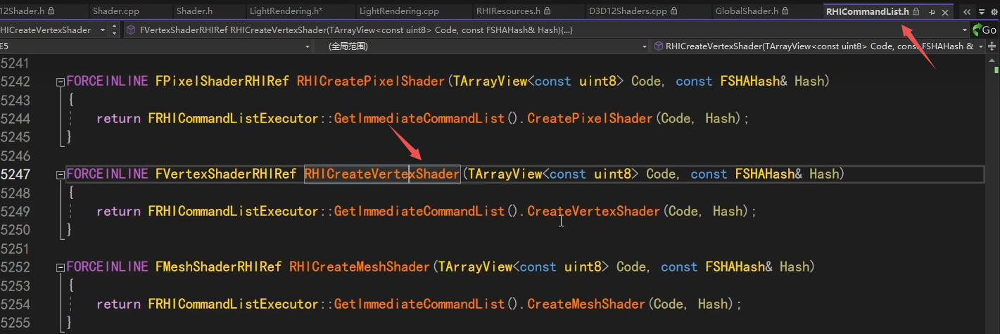

## RHI层面的shader的创建

FRHIShader，继承自FRHIResource。思路也跟之前一样，这个类内容简单。其子类D3D12和OGL会有具体复杂的实现。

这个Frequency枚举，用于定义该Shader是哪个类型。

其子类，可以看到常见的顶点、像素着色器，但在这个层面的类定义依然非常简单。就是一些初始化操作。

以顶点着色气为例，进入到它D3D12的实现，可以看到依然很简单。

其实它的主要内容，是放到多继承的那个FD3D12ShaderData里面的。

## shader最重要的就是它的代码Code

内部将其转换成D3D12的bytecode。

## 怎么创建一个shader呢

就是上面这个函数。

进去后就会发现，也是定义在DynamicRHI里面的，之前说过dynamic里有一大半的渲染基本操作。

实现，会在平台真正的子类去实现。

比如OGL。

## OGL创建shader

进入到OGL的创建shader，先会解析一下Code，因为UE这里的code不是纯代码，还有会带有参数。所以会先用一个Reader解析一下。

这个解析的内部，可以看到Code前半段是代码，后半段是Optional的数据。代码长度=总长-OptionalData长度。

在后面的OptionalData数据段里，提供了根据key去找对应的data。

然后继续刚才的创建shader流程，这里会根据不同平台，对glsl进行转换。

最终层层深入，找到OGL的编译shader的代码。

## D3D12创建Shader

然后看D3D12的shader创建过程，这个就简单很多，因为不涉及到其他平台的转换等操作，比较直接。

当然也有Reader解析代码和额外参数。然后进入initshadercommon，获取到代码Code。这里就直接结束了。为什么看起来没有编译环节？

因为前面提到过，D3D12的shader代码其实主要在FD3D12ShaderData的Code里面，刚才的Init获取了代码，那么在要用的时候直接GetShaderBytecode转换用就行了。

## FShader 上层类

FShader是一个上层的类，它和FRHIShader的关系是什么？

FShader是上层的一个类，FRHIShader相对于自己那套继承体系是上层，但相对于FShader则是底层。有RHI的都是底层。

这个FGlobalShader可能大家比较熟悉，如果自己写了一个hlsl的shader，那通常会写一个类，来继承FGlobalShader。

FGlobalShader是继承自FShader。

通常使用的时候，我们是去自定义一个类继承自FGlobalShader。

按照规定使用下面的两个宏，这里很关键。

然后是下面的BEGIN/END，用宏组装这个Shader对应的参数格式，这很重要。

那么这块是怎么起作用的？参数是怎么收集的？带着这些疑问去看宏的代码。

插播一下，FShader里面这里的排列组合。

它是指HLSL代码里不同分支，不同的编译。在写usf时，也会有这种宏的判断，如果有和没有走不同的分支。

这是UE去实现的一套编译的系统，我们写的usf并不是最终的代码，还会继续进行转换。

有类似上述的大致转换流程。

转换过程中，就会去检测刚才的编译选项，一个usf中有不同的各种各样不同的编译选项，组合起来就是我们刚才说的排列组合permutation。

根据不同的排列组合编译选项，去编译不同的shader，虽然看起来是同一份shader代码。

这个转换过程十分复杂，不必深究，我们知道如果出现刚才的permutation之类的编译选项，则同一份shader代码可能编译出不同的shader就行。

此外，FShader里有GetKey、Type、Frequency等常见的函数。

## FShader的反射

FShader没有像UE其他UObject类的反射，用UPROPERTY就拿到它的反射，而是通过这个DECLARE_TYPE_LAYOUT宏，单独实现的一套反射机制。

比如这里FShader的成员变量。

我们展开DECLARE_TYPE_LAYOUT这个宏，看它如何实现的反射。

它有一个GetTpyeLayout方法，我们看它是如何收集成员变量的信息。

下面的成员变量，加了这个LAYOUT_XXX，就有反射信息，怎么做到的呢？

## 反射是什么？

以这个Bindings的成员变量为例，我要知道这个成员变量的名字，就是字符串"Bindings"，把一个"Bindings"的字符串，和这个成员变量真正的指针Bindings对应起来。然后还有一些其他的信息，存储起来。

那么在其他地方，我就可以像脚本一样，用这个"Bindings"的字符串，我就能get到这个Bindings变量的这个指针，然后获取到它真正的值，这就是反射信息。

我们要去收集这些信息。

我们继续看刚才的宏展开，看这里这个InternalLinkType的模板结构体，它的参数是int。那它有什么特殊之处呢？

我们也把下面的LAYOUT_XXX宏展开，就Bindings的那个。首先是定义了一个Bindinds成员变量本身（962）。

然后定义了一个新的模板类InternalLinkType(965)。参数是固定值，这里宏展开不太准确。

然后它实现了Initialize的方法。这里就是特殊的地方，Initialize里面，会先调Initialize（+1），比如1进来就会先调2。

一直形成一个链式调用，调3、4、5...，一直到最大值，就会去调上面那个默认的模板参数的Initialize定义，就会什么都不做。

链式调用调完之后，就把自己的真正的数据，也加进去。

然后我们看下面这一段，然后构造一个Name="Bindings"的字符串。然后是一些其他信息。

然后是Offset，将指针转换成父类，拿到这个成员变量的位置偏移。

最终达到的目的是：只要拿到FShader的指针，加上这个Offset后，我就拿到了这个Bindings成员变量的地址，再进行到FShaderParameterBindings的内存转换，就能拿到这段内存了。

LayoutField的信息收集，就是收集Name、收集成员变量的指针、收集其他信息。

每一个成员变量的LAYOUT_FIELD都会Counter+1。

跳都宏里，可以看到最后是这样，有一个`__COUNTER__`，这是编译器的一个预定义实现，每写一次就会+1。他就自动实现了+1的功能。

最终就是通过递归链式的调用，把所有成员变量的反射信息收集起来了。

## 自定义FGlobalShader的子类参数收集

通过490附近行的宏，将参数结构定义，并进行参数收集，和上面类似。

将这几个宏依次展开，首先展开BEGIN。

看501行zzApendxxx这个函数，返回一个指针。这个指针是下一个函数的指针。

插播一条，我们写着色器的时候，我们还要写一个对应的这个宏IMPLEMENT_GLOBAL_SHADER，把我们写的类FDerferedLightVS、着色器的代码文件xxx.usf、Vertex入口函数、类型注册到引擎中去。

所谓注册到引擎中去，就是把这些信息放到某个地方。

我们展开IMPLEMENT_GLOBAL_SHADER宏，可以看到，里面最终要的就是，如果写了这个宏，就会去调刚才上面说的InternalLinkType<1>的Initialize方法，然后就会形成链式调用，就会去收集刚才说的所有LAYOUT_XXX成员变量的反射信息，这就和刚才关联起来了。

我们回到刚才说的shader的这几个宏展开，怎么收集参数的问题。

可以看到这几个宏展开后，每个函数一样，但是第一个参数是不一样的，那他是怎么实现链式结构的呢？

原因是，先看最后的这个宏展开（即END那个宏展开的），它是倒序执行，先执行最后一个参数收集（即END宏上面那个宏展开的，540行调用），然后会返回一个上一个函数的指针。

这里是END上面那个宏展开，可以看到Members在收集信息，537行就是成员变量的指针偏移量。收集完后，546行又在调用它的上一个宏的函数。

一直链式调到第一个，就会执行默认的空。

这就是Shader的参数收集信息流程。通过这几个宏，就将FParameters的参数，收集起来了。

比如这里的3个变量，view, fullscreenrectm，geometry的偏移、指针、还有一些名字的信息，就收集起来了。

那自然而然，到时就能拿这份信息去匹配着色器了。

上面分别是把USE和START的宏展开，可以看到START主要是定义FParameters-FTypeInfo结构体的信息，然后有个GetStructMetadata的函数。

当调用Use的时候，就能自动拿到这些信息元数据。

这就是UE中，shader怎么收集参数的过程，利用反射，链式调用来实现。

## 总结

1. RHI层面的Shader，是怎么创建的。
2. 上层逻辑的Shader，是怎么实现了一套反射机制，参数是怎么收集的。

这讲涉及到**shader的创建（代码Code）**，涉及到**参数的收集**。

有了这些shader后，我们**怎么去调用他**，以及**给这些shader传真正的参数值**，**形成一个完整渲染的pass**，那是后面的内容。