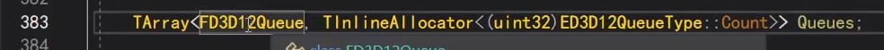

UE5渲染源码的三件事情：1）代码本身；2）用什么样子的参数，哪些输入的数据，数据的格式；3）真正的数据。

首先看UE，RHI层面，以及底层D3D12、OGL层面对渲染流程的封装。

## UE对渲染流程的封装

## FRHIResource

在UE里，所有资源的基类，就是这个FRHIResource，一个抽象的资源。

一个资源，可以是一个buffer，const buffer。在UE里是Uniform Buffer。可以是张贴图，Texture。可以是Sample，或者是一个State状态。

基类里没定义太多的操作。

从这个枚举可以看到，什么是UE里面的Resource，它包含了很多种东西。我们大致有个了解即可。

这里的每样类型，都是一个抽象的概念，和OGL和D3D12目前是没有联系的。

## 以FRHIUniformBuffer为例看封装

我们以一个UniformBuffer为例。它继承自FRHIResource。

但是它这里是一个通用的跨平台的UniformBuffer类，并不是D3D12的，也不是OGL的。

因此这个类里，也没有真正的实现，只是定义了对外的接口。

对外就是这些接口，面对一段UniformBuffer，这些就已经足够了。但UE底层是怎么是真正实现的呢？

是通过继承，比如OGL里面，就会又有一个OGL的UniformBuffer类来继承它。

当使用OGL编译的时候，实际上是生成那个OGL版本的子类。

D3D12同理。

这个就是D3D12里面，真正的实现。

D3D12里面的一个buffer，实际上在D3D12里面是一个resource。

内存上传到GPU后，我们能拿到的实际上是一个D3D12的resource的指针。

就是存在这个成员里。它把D3D12里所有的resource都抽象成一个location。

这个location里面有一个成员变量，又是一个FD3D12Resource。

而这个FD3D12Resource里面，就是真正的D3D12的指针。当然，下面还有一些别的，别它封装了起来，比如GPUVirtualAddress。

所以这是一套继承体系，我们想用什么接口，就在RHI层面定义一个接口，在子类里去实现它。

比如Create、Release一段资源，或者Upload一段内存进去。

OGL同理。

继承FRHIResource的类，非常非常多，比如FRHIShader、FRHIVertexShader、FRHIGraphicsShader、FRHIMeshShader等等。

但是都没什么具体的实现，因为是在RHI的定义，是通用的基类。

## FRHITexture

另一看一个例子，贴图FRHITexture也是类似，它也间接继承了FRHIResource。

FRHITexture也没具体的实现，但提供了很多接口，可以访问底层的资源。上层逻辑对它进行操作就可以了。

这是OGL上的具体实现。

D3D12也是类似。

这里展示了一个它一个特殊的点，多继承，D3D12里面，所有资源都是最下面的这个Resource。

## 以UTexture为例看封装

UTexture是上层给蓝图使用的Texture。

封装的目的就是为了不用那么麻烦去写OGL、D3D12的代码。

它提供了更新贴图内存的接口。将大小、格式、真正的内存传入即可。

上述函数的内部，主要就是enqueue到render里去，然后调这个RHI的方法。

这个方法是定义在command list里面的。

## FDynamicRHI也是非常重要的基类

一直深入，是到这个DynamicRHI在调用。FDynamicRHI是最重要的类之一。

这个类里的方法超多，比如常见的图形渲染操作，创建纹理、状态、更新资源、设置Fence、更新贴图等一大半操作，都在此类中。但都没实现。

然后OGL、D3D12会去继承它、实现它。

操作上层，不要在上层写D3D12，否则代码无法跨平台。

这里面都是些纯虚函数。这个类，同样下面有D3D12和OGL的各种各样的子类。

这是D3D12的Dynamic的子类，以及updateTex方法。

中间的继承关系有几层。

再一直往里走，就能看到这个，就是D3D12里面，真正纯原生的更新tex的方法了。

OGL同理，也是DymamicRHI的子类。中间间接继承好几层。

最终也是调OGL纯原生的方法。

接着看shader的创建，利用特殊的反射收集shader参数。

## 阶段小结

1. UE渲染封装了一套继承体系，上层---RHI抽象层---D3D/OGL底层。

## RHI层面的shader

FRHIShader，继承自FRHIResource。

思路也跟之前一样，这个类内容简单。

其子类D3D12和OGL会有具体复杂的实现。

这个Frequency枚举，用于定义该Shader是哪个类型。

其子类，可以看到常见的顶点、像素着色器。

但在这个层面的类定义依然非常简单，就是一些初始化操作。

以顶点着色器为例，进入到它D3D12的实现，可以看到依然很简单。

其实它的主要内容，是放到多继承的那个FD3D12ShaderData里面的。

## FD3D12ShaderData最重要的就是它的代码Code

内部将其转换成D3D12的bytecode。

## shader的创建

就是上面这个函数。

进去后就会发现，也是定义在DynamicRHI里面的。

之前说过dynamic里有一大半的渲染基本操作。

实现，会在平台真正的子类去实现。

比如OGL。

## OGL创建shader

进入到OGL的创建shader，先会解析一下Code。

因为UE这里的code不是纯代码，还有会带有参数。

所以会先用一个Reader解析一下。

这个解析的内部，可以看到Code前半段是代码，后半段是Optional的数据。

代码长度=总长-OptionalData长度。

在后面的OptionalData数据段里，提供了根据key去找对应的data。

然后继续刚才的创建shader流程，这里会根据不同平台，对glsl进行转换。

最终层层深入，找到了OGL的编译shader的代码。

这就是OGL创建shader的流程。

## D3D12创建Shader

然后看D3D12的shader创建过程，这个就简单很多，因为不涉及到其他平台的转换等操作，比较直接。

当然也有Reader解析代码和额外参数。然后进入initshadercommon，获取到代码Code。

这里就直接结束了。为什么看起来没有编译环节？

因为前面提到过，D3D12的shader代码其实主要在FD3D12ShaderData的Code里面，刚才的Init获取了代码，那么在要用的时候直接GetShaderBytecode转换用就行了。

## 上层类FShader

FShader是一个上层的类，它和FRHIShader的关系是什么？

FShader是上层的一个类，FRHIShader相对于自己那套继承体系是上层，但相对于FShader则是底层。有RHI的都是底层。

即FShader---->FRHIShader---->FD3DDynamicRHIxxx。

FShader里有提供GetKey、Type、Frequency等常见的接口。

## FGlobalShader继承FShader

这个FGlobalShader可能大家比较熟悉，如果自己写了一个hlsl的shader，那通常会写一个类，来继承FGlobalShader。

M地图的Shader就是继承自FGlobalShader。

FGlobalShader是继承自FShader。

通常使用的时候，我们是去自定义一个类继承自FGlobalShader。

按照规定使用下面的两个宏，这里很关键。

然后是下面的BEGIN/END，用宏组装这个Shader对应的参数格式，这很重要。

那么这块是怎么起作用的？参数是怎么收集的？带着这些疑问去看宏的代码。

## FShader的反射收集参数

FShader没有像UE其他UObject类的反射，用UPROPERTY就拿到它的反射。

而是通过这个DECLARE_TYPE_LAYOUT宏，单独实现的一套反射。

比如这里FShader的成员变量。

展开DECLARE_TYPE_LAYOUT这个宏，看它如何实现的反射。

它有一个GetTpyeLayout方法，看它是如何收集成员变量的信息。

下面的成员变量，加了这个LAYOUT_XXX，就有反射信息，怎么做到的呢？

以这个Bindings的成员变量为例，我要知道这个成员变量的名字，就是字符串"Bindings"。

把一个"Bindings"的字符串，和这个成员变量真正的指针Bindings对应起来。然后还有一些其他的信息，存储起来。

那么在其他地方，我就可以像脚本一样，用这个"Bindings"的字符串，我就能get到这个Bindings变量的这个指针，然后获取到它真正的值，这就是反射信息。

我们要去收集这些信息。

我们继续看刚才的宏展开，看这里这个InternalLinkType的模板结构体，它的参数是int。那它有什么特殊之处呢？

也把下面的LAYOUT_XXX宏展开，就Bindings的那个。

首先是定义了一个Bindinds成员变量本身（962）。

然后定义了一个新的模板类InternalLinkType(965)。参数是固定值，这里宏展开不太准确。

然后它实现了Initialize的方法。这里就是特殊的地方，Initialize里面，会先调Initialize（+1），比如1进来就会先调2。

一直形成一个链式调用，调3、4、5...，一直到最大值，就会去调上面那个默认的模板参数的Initialize定义，就会什么都不做。

链式调用调完之后，就把自己的真正的数据，也加进去。

然后看下面这一段，然后构造一个Name="Bindings"的字符串。然后是一些其他信息。

然后是Offset，将指针转换成父类，拿到这个成员变量的位置偏移。

最终达到的目的是：只要拿到FShader的指针，加上这个Offset后，我就拿到了这个Bindings成员变量的地址。

再进行到FShaderParameterBindings的内存转换，就能拿到这段内存了。

LayoutField的信息收集，就是收集Name、收集成员变量的指针、收集其他信息。

每一个成员变量的LAYOUT_FIELD都会Counter+1。

跳都宏里，可以看到最后是这样，有一个`__COUNTER__`，这是编译器的一个预定义实现，每写一次就会+1。他就自动实现了+1的功能。

最终就是通过递归链式的调用，把所有成员变量的反射信息收集起来了。

## IMPLEMENT_GLOBAL_SHADER

我们写着色器的时候，要写一个对应的这个宏IMPLEMENT_GLOBAL_SHADER。

把我们写的类FDerferedLightVS、着色器的代码文件xxx.usf、Vertex入口函数、类型注册到引擎中去。

所谓注册到引擎中去，就是把这些信息放到某个地方。

我们展开IMPLEMENT_GLOBAL_SHADER宏，可以看到，里面最终要的就是，如果写了这个宏，就会去调刚才上面说的InternalLinkType<1>的Initialize方法，然后就会形成链式调用，就会去收集刚才说的所有LAYOUT_XXX成员变量的反射信息，这就和刚才关联起来了。

## 自定义FGlobalShader的子类参数收集

通过490附近行的宏，将参数结构定义，并进行参数收集，和上面类似。

将这几个宏依次展开，首先展开BEGIN。

看501行zzApendxxx这个函数，返回一个指针。

这个指针是下一个函数的指针。

我们回到刚才说的shader的这几个宏展开，怎么收集参数的问题。

可以看到这几个宏展开后，每个函数一样，但是第一个参数是不一样的，那他是怎么实现链式结构的呢？

原因是，先看最后的这个宏展开（即END那个宏展开的），它是倒序执行，先执行最后一个参数收集（即END宏上面那个宏展开的，540行调用），然后会返回一个上一个函数的指针。

这里是END上面那个宏展开，可以看到Members在收集信息，537行就是成员变量的指针偏移量。收集完后，546行又在调用它的上一个宏的函数。

一直链式调到第一个，就会执行默认的空。

这就是Shader的参数收集信息流程。通过这几个宏，就将FParameters的参数，收集起来了。

比如这里的3个变量，view, fullscreenrectm，geometry的偏移、指针、还有一些名字的信息，就收集起来了。

那自然而然，到时就能拿这份信息去匹配着色器了。

## 阶段小结

1. RHI层面的Shader，是怎么创建的。
2. 上层逻辑的Shader，是怎么实现了一套反射机制，参数是怎么收集的。

## shader的创建&shaderdata的code&resourceCounts（参数数量）

首先，这个FGlobalShaderMap管理着所有shader的信息。

引擎初始化的时候，会调这个编译全局shader的函数。

进入到里面，可以看到这个compile有两种模式。

1. 这里的if模式，如果配置了这个变量，那么在一开始，就会编译全部的shader。
2. 否则的话，在某个shader具体使用的时候，会去get，如果get不到，才会开始创建。

继续上面1）模式的7544行，会遍历所有的shader，get不到会触发创建。

一直深入，就会到我们之前讲过的流程，到RHICreateVertexShader这种，再深入就会调具体的入D3D12和OGL的createshader流程。

对于所有的shader，比如这个FD3D12VertexShader，它都会继承这么一个XXXShaderData。

我们之前说要关注里面的Code。

但还需要关注另一个变量，就是这个ResourceCounts。

## Shader的Code和FShaderCodePackedResourceCounts

统计当前shader，用了多少个这种参数，比如NumSamplers、NumSRVs、NumCBs、NumUAVs。

这个参数的使用数量，是我们使用根签名时，需要的信息。

先记住它FShaderCodePackedResourceCounts。

这个类的信息，是在CreateShader的时候，提取出来的。

前面讲过，UE的这个Code里面不止是code，还有optionaldata。

ShaderReader会读取Code+OptionalData，这里FShaderCodePackedResourceCounts就是那段optionalData。

那么这个参数，是怎么来的呢？其实是编译的时候来的。

真正的编译代码在这，比较复杂。

我们只关注一个东西。就是一个Shader着色器，它用到的参数是怎么来的？

实际上，DX编译一段代码的时候，会包含所有的信息。不只是一个可执行的bytecode，它会存储这一段着色器代码所包含的所有描述信息。

这是DX本身提供的功能，虽然平时我们写简单的demo没用到，都是手工填的。

但实际上UE引擎，面对各种复杂的着色器，它能够去处理。只要你的shader代码是正确的，很多信息它都能去get出来。

在编译完代码后，就能拿到这些描述、反射信息，就是这些ID3D开头的。

进入到函数内部，实际上就是这个BindDesc，把它get出来。

这个里面就存储着所有Resource变量的信息，通过for循环拿到处理。

比如当Resource是一张贴图时，就通过BindDesc拿到它的NumSamplers、NumSRVs等信息。

这也是通过这里反射拿到的信息，在编译的时候拿完这些NumXXX。

拿到之后，再在下面把它们组装起来，形成刚才前面说的FShaderCodePackedResourceCounts。

然后把他们拼接到代码Code里面去，生成。

这里拼接出来的Code，就会传到后面的RHICreateShaderXXX里面去。

所以，那边就拿到了这些数量Num的信息。

所以，创建Shader的时候，就已经把这种每个Shader的参数数量创建起来了。

## PipelineState & 根签名

这个就是封装了D3D12的根签名。

它当然包含着，真正的根签名。

看它的构造，里面的Init。这个是shader里面的全部的信息包。就是一个流程里面，对应的所有shader全部的信息。

因为一个根签名，不止对应一个shader，你有顶点着色器、像素着色器，以及其他各种着色器。都会跟一个根签名拼起来。

那么这些shader的信息，会放在这个FD3D12QuantizedBoundShaderState信息包里面。

它会用这些信息，去构建一个Desc（这个desc几乎就已经是真正的那个desc了），然后去初始化Init。

它已经构造出那个真正的decs了（也就是这个宏的意思）。

然后用这个真正的desc，拿到blob，然后去调D3D12原始接口的CreateRootSignature。

## 创建Pso

FD3D12QuantizedBoundShaderState Shader信息包。

FD3D12RootSignatureDesc 根签名描述符。

这是2个和根签名、pso相关的数据类，我们跳过。

跳到**创建pso**。

在创建PSO pipelinestate的时候，要把整个渲染管线的每一个shader，即vertexshader、meshshader、pixelshader、amplificationshader、greometryshader等，每一个shader他们的参数全部都统计出来。

会创建这个**FD3D12QuantizedBoundShaderState**，信息包。

用它来创建根签名。

## 阶段小结

1. shader是在初始化的时候，一开始就创建的。（也有那种get时创建的）。
2. shader的参数是怎么来的？编译后，利用DX的反射技术获取出来的，编译代码的时候，可以直接获取到相关的描述，再get到所有的信息。比如每个资源的名字、大小等所有信息。然后那时，就把一个shader所用到的每个参数数量，封装起来，拼接到内存里面去，然后就传到RHICreateShader。RHICreateShader就会把这个信息，存到shader的一个成员变量里面，然后创建根签名的时候，就会用到它。注意，创建根签名，是一个根签名对应整个流程的所有shader，所以它先会把所有绑定的vs、ps所有的信息，先做一个统计，然后再用来创建根签名。这样，整个渲染管线所有的东西，就创建完毕了。

今天看渲染命令的封装思路，包括RHI的以及底层D3D12的，RHI的比较简单，重点是D3D12的。

## RHI层面的Command

这是RHI的基类，Next指针是为了形成链表，链接下一个command，下一个command...

另一个虚函数，具体去执行RHIcommand的方法。因为有不同的类型的渲染命令，所以用虚函数。到真正的子函数去执行。

下面马上就可以看到一个辅助子类，模板类，可传一个lambda存起来，执行的之后就执行这个lambda，然后释放。

有它后就可以轻易的把lambda传入，构成一个渲染命令。

## FRHICommand

此外，还有另一个类FRHICommand继承Base。

它也是传一个TCmd的模板参数进来，然后Execute。

然后我们看具体的，比如这个setshader的类，继承FRHICommand。

然后它主要去实现Execute类。

Execute实现，主要就是去调用RHISetShaderParameter。就真正去调到RHI里面的函数，然后就会调到底层具体子类的D3D12、OGL的实现。

在子类中，真正的去触发渲染命令。

刚才上面的宏展开后是这个。

CmdList是命令的链表，就是开始说的，把command组装成一个链表的那个类。

Context上下文，你执行一些命令，有时候需要不同的上下文，不同的状态，在不同的地方，用哪个commandlist去调用参数。context里面就是对应的这些信息。

context在D3D12里面，也是有具体的子类去实现的。

这里面有几百行，各种各样常规的渲染命令，FRHICommandXXX，都作为FRHICommand的子类。

## FRHICommandList命令链表

然后我们看FRHICommandList，看到继承最里面的Base，这就是刚才将command组装成链表的类。

这里我们关注2个成员：

Root是记录整个命令链表的第一个命令。每一个命令都有个Next，最开始我们看到过。

CommandLink是二级指针，是最后一个命令的Next的地址，这是为了添加新的命令用的，添加时set到这个next。

如果没这个指针，那每次添加新命令，就要从root遍历到尾端，就需要遍历一次。

再关注几个关键的方法：

alloccommand，从内存申请命令，然后记录+1。

515、516行，就是在添加新的命令，并通过commandlink链接起来。

调这个函数，自动就串起来了。

还可以直接传命令，这种形式去申请。

还有这种形式，比如我们常见的EnqueueCommand的之类的。就传入一个lambda，if是立即执行的模式，一般走else。

然后去新建一个lambda的模板类，也是命令base的子类（最开始有提到）。

然后这里宏展开也是调AllocCommand。

所以调EnqueueLambda的时候，也是自动就把命令加入了命令链表。

但要清楚，GPU还没有执行。

FRHICommandList命令链表的执行。

定义了一个迭代器，然后while循环，去不断执行每个命令。

## Context & dynamic

一般很多函数是通过这个context去调。但我们之前也经常见到dynamic调到。

dynamic：D3D device直接定义对应的操作，和上下文没关联。

context：D3D12的所有操作，都是一个commandlist对应的方法，这种就会通过context去调用。

大部分时候，都是调context里面的接口。

RHI层面，本质上来说，所有东西都在commandlist里面。

commandlist里面也有一个context，有的是在dynamicRHI里面定义的。

比如create等操作，就是dynamic定义的，因为是和device有关，上下文无关的。比如create一个texture，create一个pipeline state。

但比如设置一个shader的参数，去哪个pipielinestate里面去设置哪个commandlist，在D3D12的commandlist里去设置这个，那就是有不同上下文context的。

不管是context，还是dynamic，都收拢在commandlist链表或者说队列里面，记录着所有的command，然后command的子类，就是调用这些方法。

但是这是RHI层面，在D3D12里面，还有一层封装。

## 阶段总结

1. command组成commandlist链表。
2. command支持传入lambda执行。很多都是UE自己的内部类去传，去执行。外部也可以ENQUEUE。
3. commandlist可以alloccommand，也可以直接enqueue，都会自动拼接command。
4. 但执行是在Execute里面。

继续看渲染命令的封装，D3D12层面的。

## FD3D12Device

D3D12的一切都从device出发，我们看FD3D12Device，device存在263行的GetDevice里面。

关键要素：commandqueue，是commandlist的执行者。

commandlist，如设置顶点、索引的buffer，要调commandlist的setvertexbuffer。

那在FD3D12Device里，就有这个queue。

## commandqueue 3种

FD3D12Queue它就是对应封装d3d12的commandqueue。

而FD3D12Device里面的Queues，不是一个queue，而是3个数组，枚举值区分。

一个device对应3个queue，用来做不同的操作。

比如上节说的context，不同的操作就有不同的context。

FD3D12Device里存着FD3D12CommandContext。

常见很多graphic的操作，都是调Direct。

此外，最上面还有个单独的context，immediate立即执行模式。

## FD3D12CommandContext

那说到context，我们又来看context的类有什么。

可以看到一个context里面，就对应这一个commandlist，一个commandallocator，一个**payloads**的数组，一组工作，这个也很重要，稍后再看。

此外，还有个**statecache**也重要。

即使在RHI里面调了execute，也不是立即执行，和这个有关。

## FD3D12Payload

我们先看payload。

里面有个缓存的链表的数组，是先缓存起来，后面再去执行。

payload就是gpu要去执行的一个work。

有个queue，到时候去哪个queue执行。

还有些fence，执行命令要等待的操作。

## FD3D12StateCache

再说StateCache。

整个渲染管线有很多状态，比如光栅化的状态，stencil的状态。可能反复设置了很多次，但没有立刻执行，而是缓存。

上层很多set状态的操作，底层只是缓存起来，最后一次性设置。

这里缓存了很多信息。

这个apply负责去执行。先标记dirty。

然后拿出compute或graphic信息，然后设置根签名（上次讲了根签名）。

到这取context的commandlist，才是真正去d3d12的commandlist去设置。

这有很多set。

还有这些。

即FD3D12StateCache有2层结构，第一层保存，第二层apply真正去调d3d12实现。

基本上是把渲染管线所有的东西都缓存起来，包括shader、根签名、uniformbuffer，srv......

## 阶段总结

1. 一个d3d的device里面，有3套queue，3套context，copy async direct，决定操作是在哪个上下文去执行的。

2. 在一个context里面，有payload（gpu要执行的一组工作），有statecache（RHI层面设置的全部命令，缓存在这里）。

## D3D12CommandContext

回到d3d12commandcontext这个类，我们说在RHI层面的context，定义了很多操作，在d3d12里面去实现它。就是这一堆。

但是我们点进去看，其实d3d12context这的实现，也只是设置到statecache里面。所有操作都是这样。

RHI的角度其实不用管，execute了，就认为执行了。

## RHI提交线程 D3D12真正执行线程

但d3d12里，又设置了一套，因为它是在单独的一个线程去操作的。

RHI渲染render线程：调用了各种RHI的命令，最终提交到D3D12里面缓存了。

而D3D12的那个线程：每一帧去apply一下，去真正的执行。

每一帧执行一次process，每次遍历所有device，每个device里面有3个queue，然后去执行。

实际上就是去拿出queue里面的payload，我们之前说payload就是组装了一组的commandlist，是一个commandlist数组。

然后去execute这个payload。

最终一个payload，就是一个commandlist数组，一个for循环取出来取执行。

插一句，这里注释说了，如果一次提交的commandlist太长，gpu会不支持，不会一次性执行，会分批次。通过offset记录位置。

执行完后，会release。

但不是真正的release，而是放回到queue的一个池里。

需要新的payload时，重复利用。

## 阶段总结

1. FD3D12DynamicRHI初始化的时候，会新建一个D3D12的真正执行线程，d3d12里，每个device对应3个不同的queue，以及3个不同的context。

2. RHI渲染线程：当RHI上层去提交setparam时，它只是把commandlist，对应状态存储到context的statecache里。

3. D3D12真正执行现场：每帧process遍历所有device，遍历每个device里面的3个queue，遍历里面的payload，把payload里面的commandlist数组拿出来，调statecache的apply，一次执行。

