在UE里，所有资源的基类，就是这个FRHIResource，一个抽象的资源。

一个资源，可以是一个buffer，const buffer。在UE里是Uniform Buffer。可以是张贴图，Texture。可以是Sample，或者是一个State状态。

基类里没定义太多的操作，有AddRef，Release，还有个原子操作。

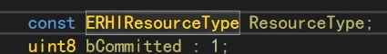

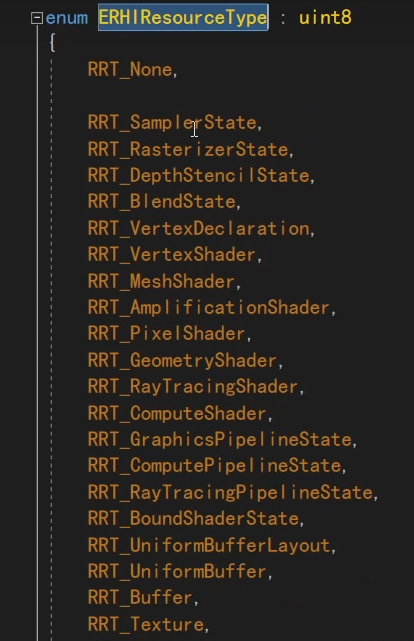

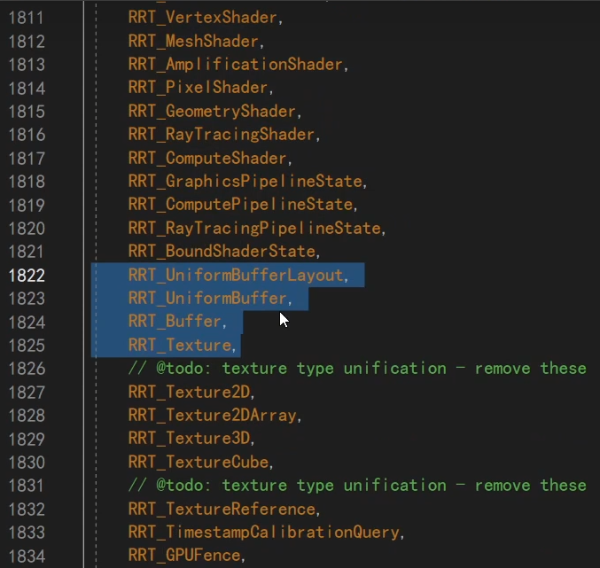

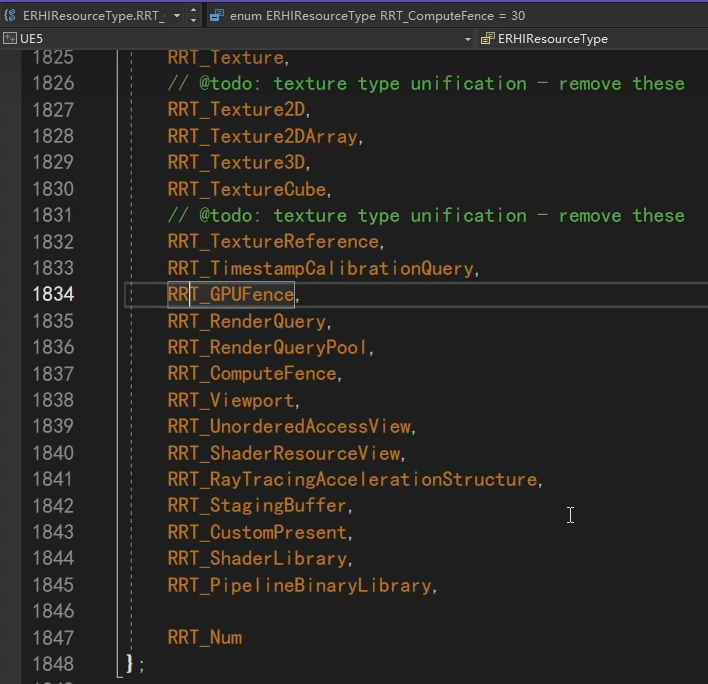

从这个枚举可以看到，什么是UE里面的Resource，它包含了很多种东西。我们大致有个了解即可。

这里的每样类型，都是一个抽象的概念，和OGL和D3D12目前是没有联系的。

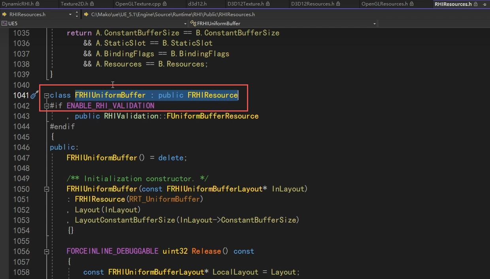

我们以一个UniformBuffer为例。它继承自FRHIResource。

但是它这里是一个通用的跨平台的UniformBuffer类，并不是D3D12的，也不是OGL的。

因此这个类里，也没有真正的实现，只是定义了对外的接口。

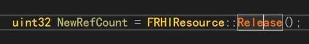

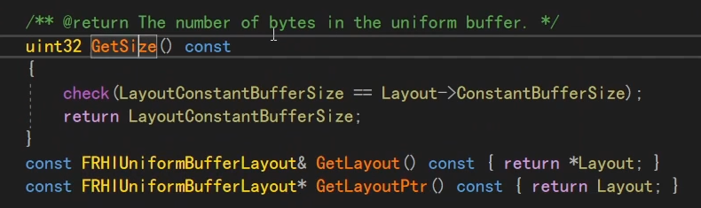

对外就是这些接口，面对一段UniformBuffer，这些就已经足够了。但UE底层是怎么是真正实现的呢？

是通过继承，比如OGL里面，就会又有一个OGL的UniformBuffer类来继承它。当使用OGL编译的时候，实际上是生成那个OGL版本的子类。D3D12同理。

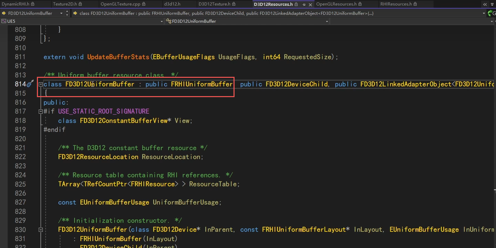

这个就是D3D12里面，真正的实现。

D3D12里面的一个buffer，实际上在D3D12里面是一个resource。内存上传到GPU后，我们能拿到的实际上是一个D3D12的resource的指针。

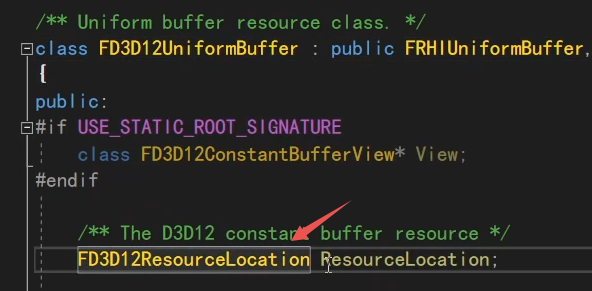

就是存在这个成员里。它把D3D12里所有的resource都抽象成一个location。

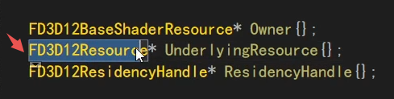

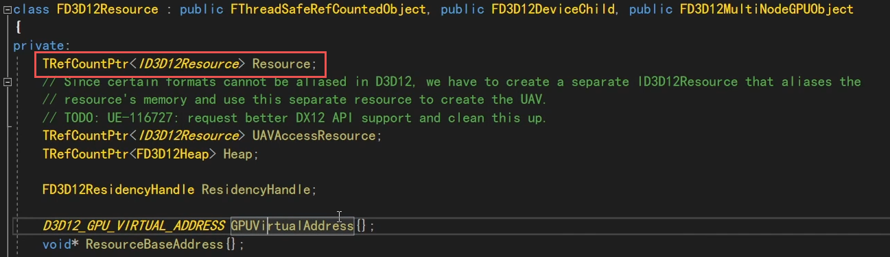

这个location里面有一个成员变量，又是一个FD3D12Resource。

而这个FD3D12Resource里面，就是真正的D3D12的指针。当然，下面还有一些别的，别它封装了起来，比如GPUVirtualAddress。

所以这是一套继承体系，我们想用什么接口，就在RHI层面定义一个接口，在子类里去实现它。

比如Create、Release一段资源，或者Upload一段内存进去。

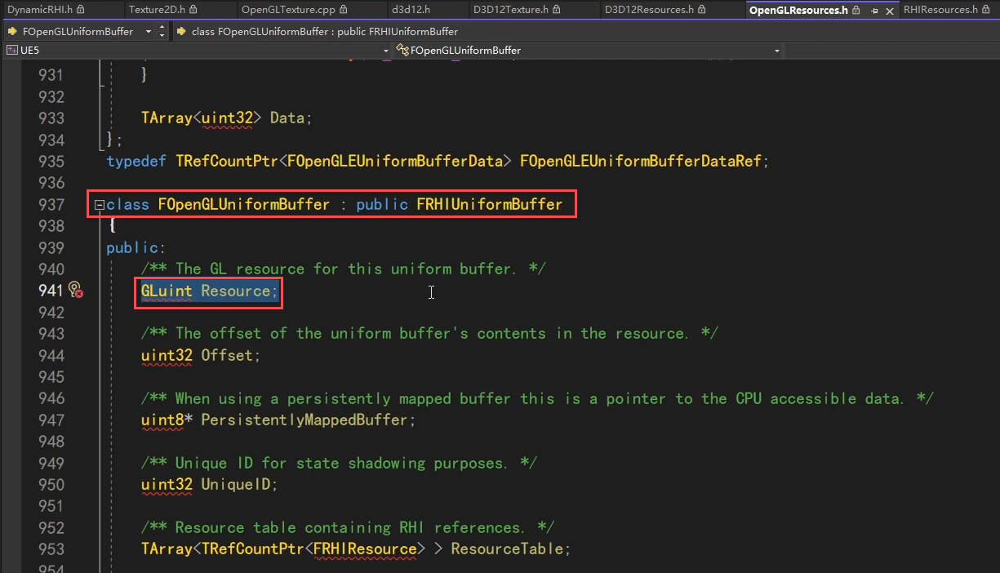

OGL同理。

继承FRHIResource的类，非常非常多。