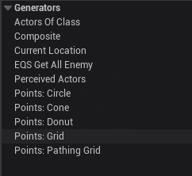

EQS 中常见的 Generator 类型及其简单作用：

------

### 1. **Actors Of Class**

- **作用**：基于指定类别的 Actor 生成查询点。
- **示例**：生成所有敌人的位置点。

### 2. **Composite**

- **作用**：组合多个 Generator 的结果。
- **示例**：将 Grid 和 Actors 的生成点合并。

### 3. **Current Location**

- **作用**：生成当前查询者（Querier）的位置点。
- **示例**：生成 AI 角色当前位置的点。

### 4. **EQS Get All Enemy**

- **作用**：生成所有敌人的位置点（通常是特定于项目的自定义 Generator）。
- **示例**：生成所有敌对角色的位置。

### 5. **Perceived Actors**

- **作用**：基于感知系统（AI Perception）检测到的 Actor 生成查询点。
- **示例**：生成 AI 角色感知到的敌人或目标的位置。

### 6. **Points: Circle**

- **作用**：在圆形范围内生成查询点。
- **示例**：生成以某个点为中心、指定半径的圆形区域内的点。

### 7. **Points: Cone**

- **作用**：在锥形范围内生成查询点。
- **示例**：生成以某个方向为中心、指定角度的锥形区域内的点。

### 8. **Points: Donut**

- **作用**：在环形（圆环）范围内生成查询点。
- **示例**：生成内径和外径之间的环形区域内的点。

### 9. **Points: Grid**

- **作用**：在网格范围内生成查询点。
- **示例**：生成指定大小和间距的网格区域内的点。

### 10. **Points: Pathing Grid**

- **作用**：在导航网格（NavMesh）上生成查询点。
- **示例**：生成导航网格上的点，确保生成的点是可到达的。

------

### 总结

这些 Generator 的作用可以简单概括为：

- **Actors Of Class**：基于特定类别的 Actor 生成点。
- **Composite**：组合多个 Generator 的结果。
- **Current Location**：生成查询者的当前位置。
- **EQS Get All Enemy**：生成所有敌人的位置。
- **Perceived Actors**：基于感知系统生成点。
- **Points: Circle**：生成圆形区域内的点。
- **Points: Cone**：生成锥形区域内的点。
- **Points: Donut**：生成环形区域内的点。
- **Points: Grid**：生成网格区域内的点。
- **Points: Pathing Grid**：生成导航网格上的点。